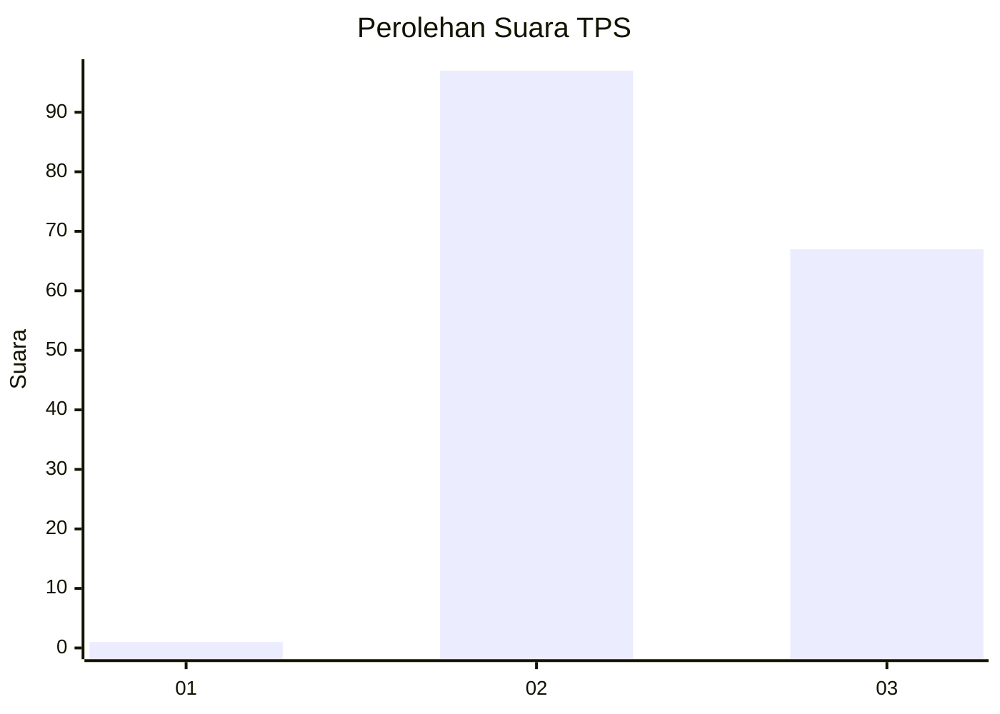
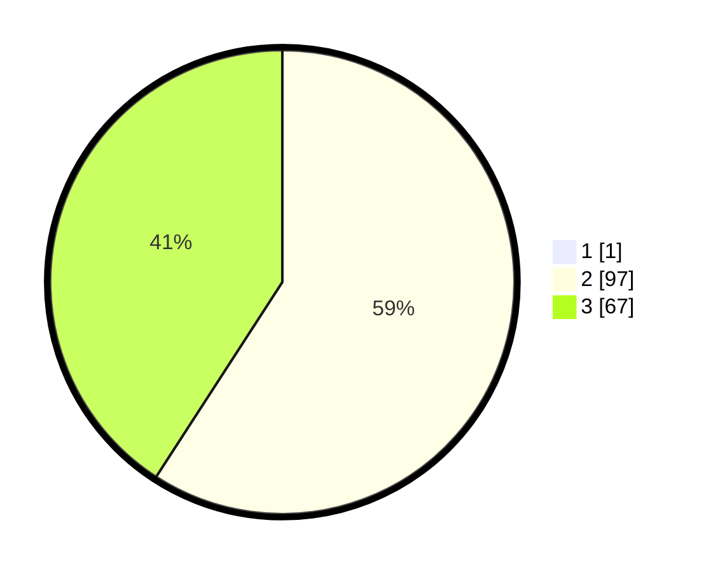

# Hasil

## Grafik

## Tabel

| No. | Nama Paslon    | Suara | Suara (raw) | Persentase |
|:--- |:-------------- | -----:| -----------:| ----------:|
| 1   | ANIES MUHAIMIN | 1     | [1][p-1]    | 0,61       |
| 2   | PRABOWO GIBRAN | 97    | [97][p-2]   | 58,79      |
| 3   | GANJAR MAHFUD  | 67    | [67][p-3]   | 40,61      |

[p-1]: https://github.com/gigit-pemilu/pemilu-2024-52-nusa-tenggara-barat/blob/main/pilpres/hitung-suara/sub/52-nusa-tenggara-barat/sub/01-lombok-barat/sub/01-gerung/sub/1001-gerung-utara/sub/001-tps/sub/paslon-1.txt
[p-2]: https://github.com/gigit-pemilu/pemilu-2024-52-nusa-tenggara-barat/blob/main/pilpres/hitung-suara/sub/52-nusa-tenggara-barat/sub/01-lombok-barat/sub/01-gerung/sub/1001-gerung-utara/sub/001-tps/sub/paslon-2.txt
[p-3]: https://github.com/gigit-pemilu/pemilu-2024-52-nusa-tenggara-barat/blob/main/pilpres/hitung-suara/sub/52-nusa-tenggara-barat/sub/01-lombok-barat/sub/01-gerung/sub/1001-gerung-utara/sub/001-tps/sub/paslon-3.txt

## Foto C Plano

https://sirekap-obj-formc.kpu.go.id/c496/pemilu/ppwp/52/01/01/10/01/5201011001001-20240214-194643--293e43fd-9d60-41a2-8ed4-d6e38450d6de.jpg

https://sirekap-obj-formc.kpu.go.id/c496/pemilu/ppwp/52/01/01/10/01/5201011001001-20240214-194651--fab45eff-8247-4a6b-a1fa-8bc05111ece6.jpg

https://sirekap-obj-formc.kpu.go.id/c496/pemilu/ppwp/52/01/01/10/01/5201011001001-20240216-020220--eda8f7b0-854d-475b-a5bc-cbbf3758495a.jpg

## Metadata

| Key        | Value               |
| ---------- | ------------------- |
| Time Stamp | 2024-02-16 02:30:27 |

