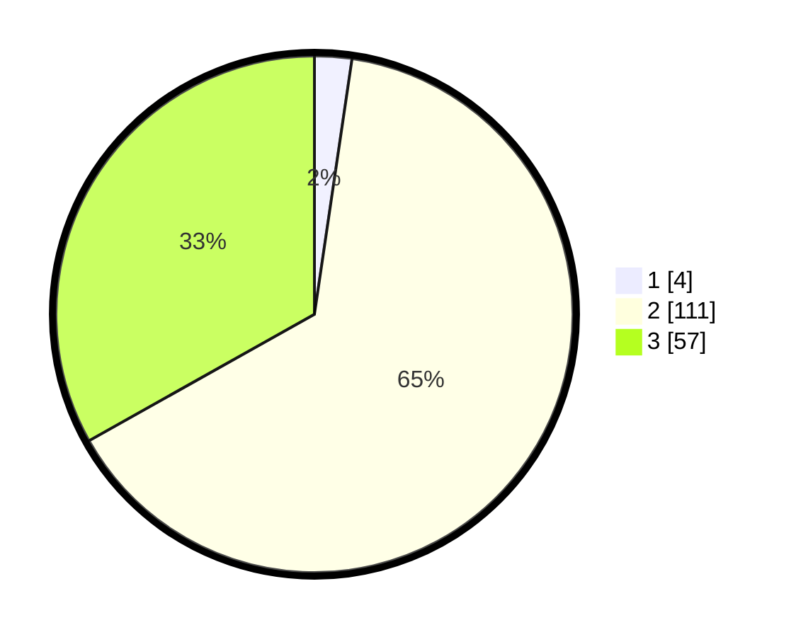

# Hasil

## Grafik

## Tabel

| No. | Nama Paslon    | Suara | Suara (raw) | Persentase |
|:--- |:-------------- | -----:| -----------:| ----------:|
| 1   | ANIES MUHAIMIN | 4     | [4][p-1]    | 2,33       |
| 2   | PRABOWO GIBRAN | 111   | [111][p-2]  | 64,53      |
| 3   | GANJAR MAHFUD  | 57    | [57][p-3]   | 33,14      |

[p-1]: https://github.com/gigit-pemilu/pemilu-2024-52-nusa-tenggara-barat/blob/main/pilpres/hitung-suara/sub/52-nusa-tenggara-barat/sub/01-lombok-barat/sub/01-gerung/sub/1001-gerung-utara/sub/002-tps/sub/paslon-1.txt
[p-2]: https://github.com/gigit-pemilu/pemilu-2024-52-nusa-tenggara-barat/blob/main/pilpres/hitung-suara/sub/52-nusa-tenggara-barat/sub/01-lombok-barat/sub/01-gerung/sub/1001-gerung-utara/sub/002-tps/sub/paslon-2.txt
[p-3]: https://github.com/gigit-pemilu/pemilu-2024-52-nusa-tenggara-barat/blob/main/pilpres/hitung-suara/sub/52-nusa-tenggara-barat/sub/01-lombok-barat/sub/01-gerung/sub/1001-gerung-utara/sub/002-tps/sub/paslon-3.txt

## Foto C Plano

https://sirekap-obj-formc.kpu.go.id/7cee/pemilu/ppwp/52/01/01/10/01/5201011001002-20240216-004835--df32229e-7114-42ff-be76-b962ed0792a6.jpg

https://sirekap-obj-formc.kpu.go.id/7cee/pemilu/ppwp/52/01/01/10/01/5201011001002-20240216-004837--1b134b70-2aa7-419f-b817-aa2a6f5d5d36.jpg

https://sirekap-obj-formc.kpu.go.id/7cee/pemilu/ppwp/52/01/01/10/01/5201011001002-20240216-004837--8355a340-b62b-4aa4-b2d8-6ba80ffe2b04.jpg

## Metadata

| Key        | Value               |
| ---------- | ------------------- |
| Time Stamp | 2024-02-16 21:01:00 |

## DATA PEMILIH TETAP

Jumlah pemilih dalam DPT: **192**.
 * L: **88**.
 * P: **104**.

## DATA PENGGUNA HAK PILIH

Jumlah pengguna hak pilih dalam DPT: **172**.
 * L: **78**.
 * P: **94**.

Jumlah pengguna hak pilih dalam DPTb: **0**.
 * L: **0**.
 * P: **0**.

Jumlah pengguna hak pilih dalam DPK: **3**.
 * L: **2**.
 * P: **1**.

Jumlah pengguna hak pilih: **175**.
 * L: **80**.
 * P: **95**.

## JUMLAH SUARA SAH DAN TIDAK SAH

JUMLAH SELURUH SUARA SAH: **172**.

JUMLAH SUARA TIDAK SAH: **3**.

JUMLAH SELURUH SUARA SAH DAN SUARA TIDAK SAH: **175**.

