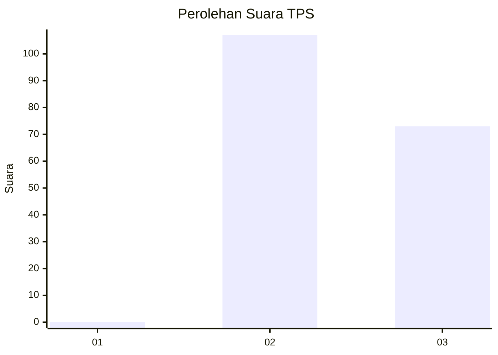
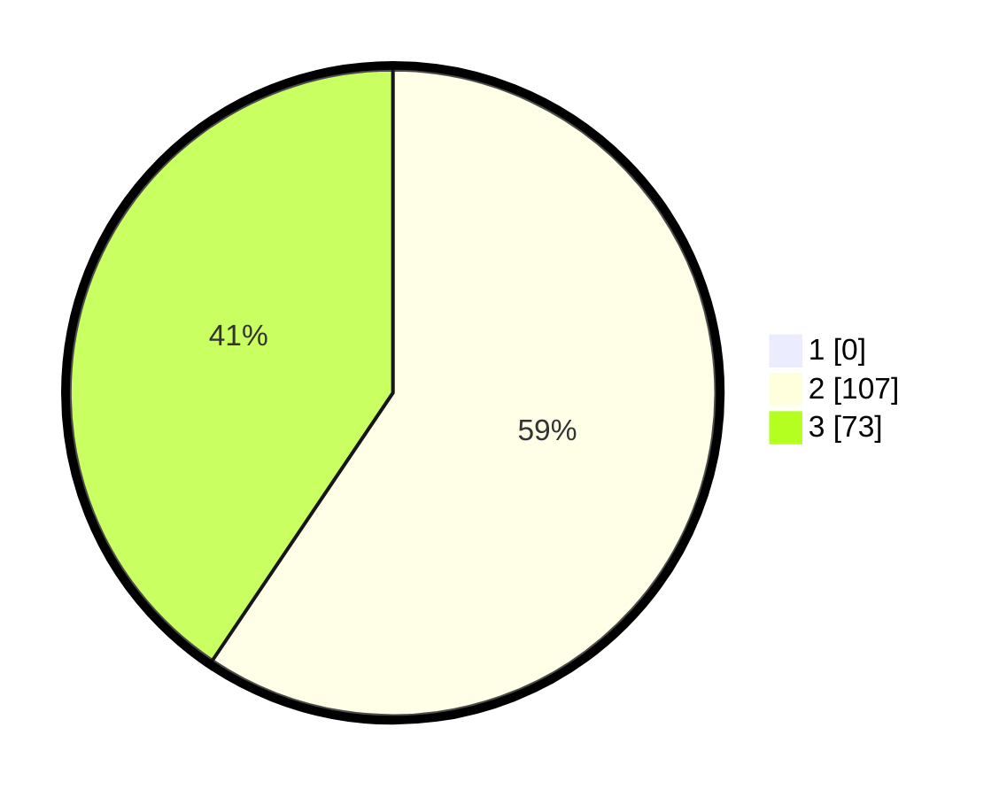

# Hasil

## Grafik

## Tabel

| No. | Nama Paslon    | Suara | Suara (raw) | Persentase |
|:--- |:-------------- | -----:| -----------:| ----------:|
| 1   | ANIES MUHAIMIN | 0     | [0][p-1]    | 0,00       |
| 2   | PRABOWO GIBRAN | 107   | [107][p-2]  | 59,44      |
| 3   | GANJAR MAHFUD  | 73    | [73][p-3]   | 40,56      |

[p-1]: https://github.com/gigit-pemilu/pemilu-2024-52-nusa-tenggara-barat/blob/main/pilpres/hitung-suara/sub/52-nusa-tenggara-barat/sub/01-lombok-barat/sub/01-gerung/sub/1001-gerung-utara/sub/003-tps/sub/paslon-1.txt
[p-2]: https://github.com/gigit-pemilu/pemilu-2024-52-nusa-tenggara-barat/blob/main/pilpres/hitung-suara/sub/52-nusa-tenggara-barat/sub/01-lombok-barat/sub/01-gerung/sub/1001-gerung-utara/sub/003-tps/sub/paslon-2.txt
[p-3]: https://github.com/gigit-pemilu/pemilu-2024-52-nusa-tenggara-barat/blob/main/pilpres/hitung-suara/sub/52-nusa-tenggara-barat/sub/01-lombok-barat/sub/01-gerung/sub/1001-gerung-utara/sub/003-tps/sub/paslon-3.txt

## Foto C Plano

https://sirekap-obj-formc.kpu.go.id/7a2a/pemilu/ppwp/52/01/01/10/01/5201011001003-20240216-015122--89ce3f33-1d66-4eb8-9007-261d80095c72.jpg

https://sirekap-obj-formc.kpu.go.id/7a2a/pemilu/ppwp/52/01/01/10/01/5201011001003-20240216-015137--7fb9299b-4ad8-40aa-835e-2d8198c80ead.jpg

https://sirekap-obj-formc.kpu.go.id/7a2a/pemilu/ppwp/52/01/01/10/01/5201011001003-20240216-015130--3f8e238f-14d0-4be8-99bc-5190bc202ecf.jpg

## Metadata

| Key        | Value               |
| ---------- | ------------------- |
| Time Stamp | 2024-02-16 08:00:28 |

## DATA PEMILIH TETAP

Jumlah pemilih dalam DPT: **197**.
 * L: **99**.
 * P: **98**.

## DATA PENGGUNA HAK PILIH

Jumlah pengguna hak pilih dalam DPT: **176**.
 * L: **86**.
 * P: **90**.

Jumlah pengguna hak pilih dalam DPTb: **3**.
 * L: **1**.
 * P: **2**.

Jumlah pengguna hak pilih dalam DPK: **2**.
 * L: **0**.
 * P: **2**.

Jumlah pengguna hak pilih: **181**.
 * L: **87**.
 * P: **94**.

## JUMLAH SUARA SAH DAN TIDAK SAH

JUMLAH SELURUH SUARA SAH: **180**.

JUMLAH SUARA TIDAK SAH: **1**.

JUMLAH SELURUH SUARA SAH DAN SUARA TIDAK SAH: **181**.

