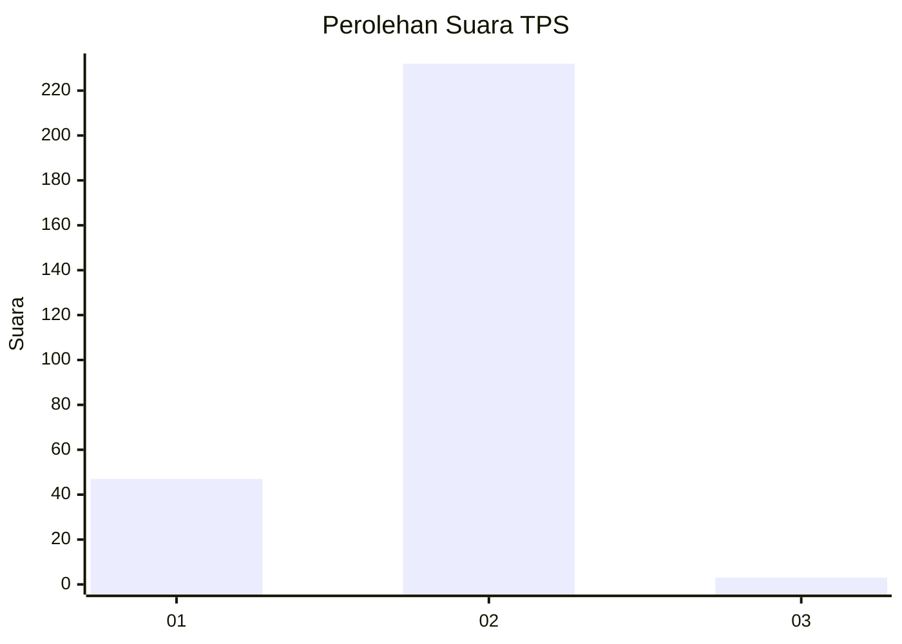
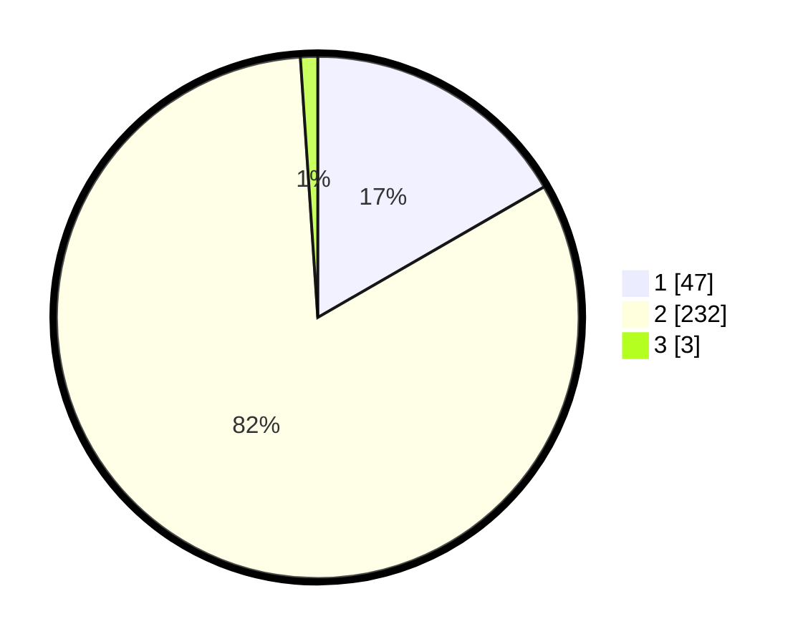

# Hasil

## Grafik

## Tabel

| No. | Nama Paslon    | Suara | Suara (raw) | Persentase |
|:--- |:-------------- | -----:| -----------:| ----------:|
| 1   | ANIES MUHAIMIN | 47    | [47][p-1]   | 16,67      |
| 2   | PRABOWO GIBRAN | 232   | [232][p-2]  | 82,27      |
| 3   | GANJAR MAHFUD  | 3     | [3][p-3]    | 1,06       |

[p-1]: https://github.com/gigit-pemilu/pemilu-2024-52-nusa-tenggara-barat/blob/main/pilpres/hitung-suara/sub/52-nusa-tenggara-barat/sub/01-lombok-barat/sub/01-gerung/sub/1001-gerung-utara/sub/013-tps/sub/paslon-1.txt
[p-2]: https://github.com/gigit-pemilu/pemilu-2024-52-nusa-tenggara-barat/blob/main/pilpres/hitung-suara/sub/52-nusa-tenggara-barat/sub/01-lombok-barat/sub/01-gerung/sub/1001-gerung-utara/sub/013-tps/sub/paslon-2.txt
[p-3]: https://github.com/gigit-pemilu/pemilu-2024-52-nusa-tenggara-barat/blob/main/pilpres/hitung-suara/sub/52-nusa-tenggara-barat/sub/01-lombok-barat/sub/01-gerung/sub/1001-gerung-utara/sub/013-tps/sub/paslon-3.txt

## Foto C Plano

https://sirekap-obj-formc.kpu.go.id/3bc2/pemilu/ppwp/52/01/01/10/01/5201011001013-20240314-133939--8b2e021f-8ea3-4b0e-a559-fd42ac744a9f.jpg

https://sirekap-obj-formc.kpu.go.id/3bc2/pemilu/ppwp/52/01/01/10/01/5201011001013-20240314-134605--792b41dd-0ccc-4ca1-8c54-7c2e6c3abe95.jpg

https://sirekap-obj-formc.kpu.go.id/3bc2/pemilu/ppwp/52/01/01/10/01/5201011001013-20240314-134941--0744f292-803d-4ff0-bca6-2ba7943127bf.jpg

## Metadata

| Key        | Value               |
| ---------- | ------------------- |
| Time Stamp | 2024-03-14 14:00:00 |

## DATA PEMILIH TETAP

Jumlah pemilih dalam DPT: **253**.
 * L: **752**.
 * P: **737**.

## DATA PENGGUNA HAK PILIH

Jumlah pengguna hak pilih dalam DPT: **777**.
 * L: **100**.
 * P: **7**.

Jumlah pengguna hak pilih dalam DPTb: **8**.
 * L: **88**.
 * P: **8**.

Jumlah pengguna hak pilih dalam DPK: **403**.
 * L: **2**.
 * P: **1**.

Jumlah pengguna hak pilih: **231**.
 * L: **173**.
 * P: **118**.

## JUMLAH SUARA SAH DAN TIDAK SAH

JUMLAH SELURUH SUARA SAH: **222**.

JUMLAH SUARA TIDAK SAH: **409**.

JUMLAH SELURUH SUARA SAH DAN SUARA TIDAK SAH: **235**.

