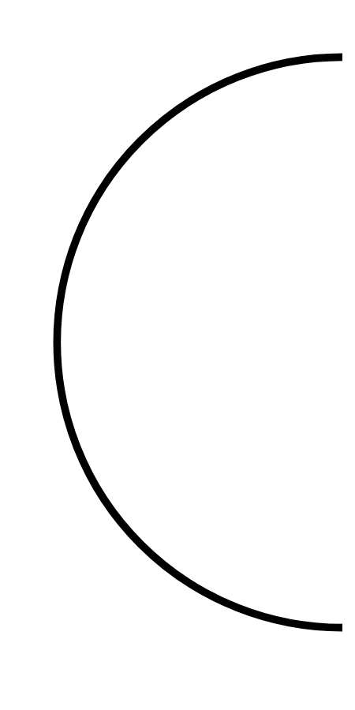

# Hasil

## Grafik

```mermaid
xychart-beta
    title "Perolehan Suara Nasional"
    x-axis []
    y-axis "Suara" 0 --> 0
    bar []
```



## Tabel

| No. | Nama Paslon | Suara | Suara (raw) | Persentase |
|:--- |:----------- | -----:| -----------:| ----------:|


[p-1]: https://github.com/gigit-pemilu/pemilu-2024/blob/main/pilpres/hitung-suara/sub/52-nusa-tenggara-barat/sub/01-lombok-barat/sub/03-narmada/sub/2011-sesaot/sub/007-tps/sub/paslon-1.txt
[p-2]: https://github.com/gigit-pemilu/pemilu-2024/blob/main/pilpres/hitung-suara/sub/52-nusa-tenggara-barat/sub/01-lombok-barat/sub/03-narmada/sub/2011-sesaot/sub/007-tps/sub/paslon-2.txt
[p-3]: https://github.com/gigit-pemilu/pemilu-2024/blob/main/pilpres/hitung-suara/sub/52-nusa-tenggara-barat/sub/01-lombok-barat/sub/03-narmada/sub/2011-sesaot/sub/007-tps/sub/paslon-3.txt

## Foto C Plano

https://sirekap-obj-formc.kpu.go.id/3fd0/pemilu/ppwp/52/01/03/20/11/5201032011007-20240314-155131--b13ad1dc-e991-4d32-b0be-eee5cfcfaf23.jpg

https://sirekap-obj-formc.kpu.go.id/3fd0/pemilu/ppwp/52/01/03/20/11/5201032011007-20240314-160037--31cf7c81-0456-4d8e-a05a-162fcc5d80f7.jpg

https://sirekap-obj-formc.kpu.go.id/3fd0/pemilu/ppwp/52/01/03/20/11/5201032011007-20240314-160725--868a27a5-47d9-4192-9c50-0e0c19fb1c6b.jpg


## Metadata

| Key        | Value               |
| ---------- | ------------------- |
| Time Stamp | 2024-03-14 16:30:00 |


## DATA PEMILIH TETAP

Jumlah pemilih dalam DPT: **77**.
 * L: **234**.
 * P: **143**.

## DATA PENGGUNA HAK PILIH

Jumlah pengguna hak pilih dalam DPT: **230**.
 * L: **610**.
 * P: **120**.

Jumlah pengguna hak pilih dalam DPTb: **800**.
 * L: **0**.
 * P: **88**.

Jumlah pengguna hak pilih dalam DPK: **1**.
 * L: **1**.
 * P: **0**.

Jumlah pengguna hak pilih: **235**.
 * L: **671**.
 * P: **120**.

## JUMLAH SUARA SAH DAN TIDAK SAH

JUMLAH SELURUH SUARA SAH: **225**.

JUMLAH SUARA TIDAK SAH: **5**.

JUMLAH SELURUH SUARA SAH DAN SUARA TIDAK SAH: **271**.


