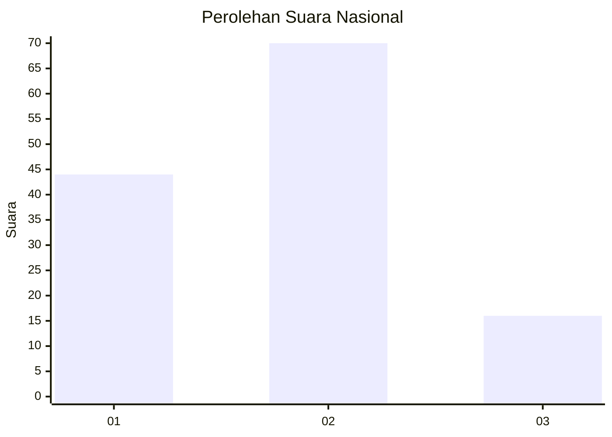
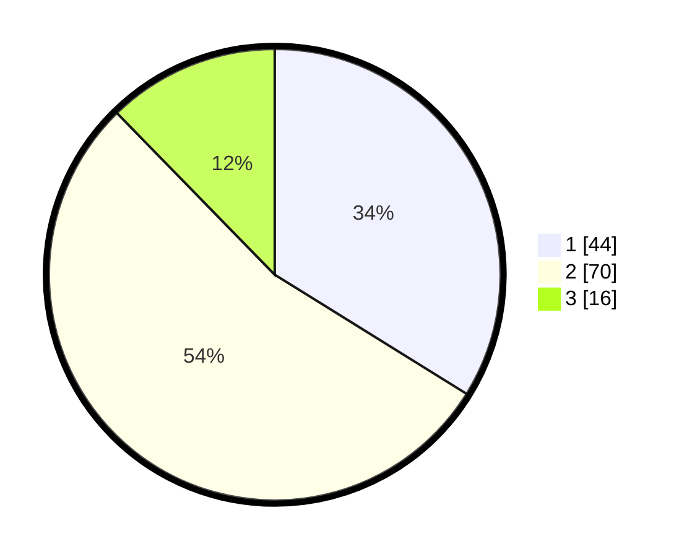

# Hasil

## Grafik

## Tabel

| No. | Nama Paslon    | Suara | Suara (raw) | Persentase |
|:--- |:-------------- | -----:| -----------:| ----------:|
| 1   | ANIES MUHAIMIN | 44    | [44][p-1]   | 33,85      |
| 2   | PRABOWO GIBRAN | 70    | [70][p-2]   | 53,85      |
| 3   | GANJAR MAHFUD  | 16    | [16][p-3]   | 12,31      |

[p-1]: https://github.com/gigit-pemilu/pemilu-2024/blob/main/pilpres/hitung-suara/sub/52-nusa-tenggara-barat/sub/01-lombok-barat/sub/03-narmada/sub/2012-dasan-tereng/sub/004-tps/sub/paslon-1.txt
[p-2]: https://github.com/gigit-pemilu/pemilu-2024/blob/main/pilpres/hitung-suara/sub/52-nusa-tenggara-barat/sub/01-lombok-barat/sub/03-narmada/sub/2012-dasan-tereng/sub/004-tps/sub/paslon-2.txt
[p-3]: https://github.com/gigit-pemilu/pemilu-2024/blob/main/pilpres/hitung-suara/sub/52-nusa-tenggara-barat/sub/01-lombok-barat/sub/03-narmada/sub/2012-dasan-tereng/sub/004-tps/sub/paslon-3.txt

## Foto C Plano

https://sirekap-obj-formc.kpu.go.id/d0d0/pemilu/ppwp/52/01/03/20/12/5201032012004-20240224-154736--d30c1267-35b3-441d-8484-f245f0dced5c.jpg

https://sirekap-obj-formc.kpu.go.id/d0d0/pemilu/ppwp/52/01/03/20/12/5201032012004-20240224-154813--1faffb7e-8cf5-46ec-b268-fc88cfc5aa2e.jpg

https://sirekap-obj-formc.kpu.go.id/d0d0/pemilu/ppwp/52/01/03/20/12/5201032012004-20240224-154837--828d3048-fde7-45f3-9cb0-dd5020296d06.jpg

## Metadata

| Key        | Value               |
| ---------- | ------------------- |
| Time Stamp | 2024-02-24 22:31:28 |

## DATA PEMILIH TETAP

Jumlah pemilih dalam DPT: **197**.
 * L: **79**.
 * P: **68**.

## DATA PENGGUNA HAK PILIH

Jumlah pengguna hak pilih dalam DPT: **120**.
 * L: **63**.
 * P: **857**.

Jumlah pengguna hak pilih dalam DPTb: **8**.
 * L: **0**.
 * P: **80**.

Jumlah pengguna hak pilih dalam DPK: **83**.
 * L: **5**.
 * P: **884**.

Jumlah pengguna hak pilih: **123**.
 * L: **863**.
 * P: **861**.

## JUMLAH SUARA SAH DAN TIDAK SAH

JUMLAH SELURUH SUARA SAH: **125**.

JUMLAH SUARA TIDAK SAH: **3**.

JUMLAH SELURUH SUARA SAH DAN SUARA TIDAK SAH: **128**.

