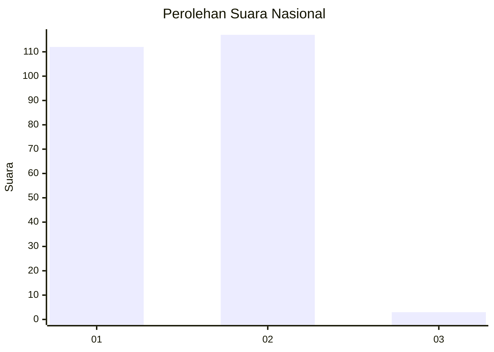
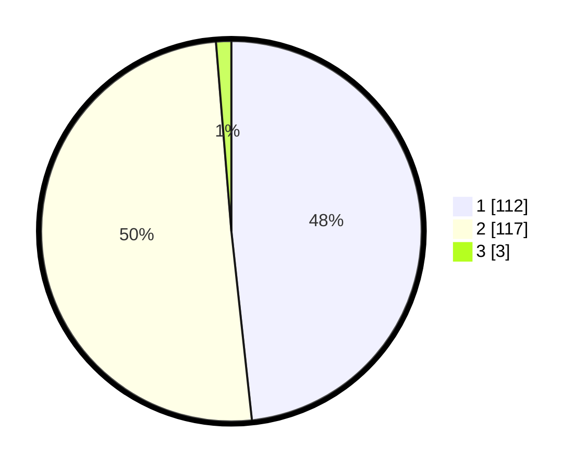

# Hasil

## Grafik

## Tabel

| No. | Nama Paslon    | Suara | Suara (raw) | Persentase |
|:--- |:-------------- | -----:| -----------:| ----------:|
| 1   | ANIES MUHAIMIN | 112   | [112][p-1]  | 48,28      |
| 2   | PRABOWO GIBRAN | 117   | [117][p-2]  | 50,43      |
| 3   | GANJAR MAHFUD  | 3     | [3][p-3]    | 1,29       |

[p-1]: https://github.com/gigit-pemilu/pemilu-2024/blob/main/pilpres/hitung-suara/sub/52-nusa-tenggara-barat/sub/01-lombok-barat/sub/07-sekotong/sub/2001-sekotong-tengah/sub/001-tps/sub/paslon-1.txt
[p-2]: https://github.com/gigit-pemilu/pemilu-2024/blob/main/pilpres/hitung-suara/sub/52-nusa-tenggara-barat/sub/01-lombok-barat/sub/07-sekotong/sub/2001-sekotong-tengah/sub/001-tps/sub/paslon-2.txt
[p-3]: https://github.com/gigit-pemilu/pemilu-2024/blob/main/pilpres/hitung-suara/sub/52-nusa-tenggara-barat/sub/01-lombok-barat/sub/07-sekotong/sub/2001-sekotong-tengah/sub/001-tps/sub/paslon-3.txt

## Foto C Plano

https://sirekap-obj-formc.kpu.go.id/bbc0/pemilu/ppwp/52/01/07/20/01/5201072001001-20240220-141311--9aa0e823-ef65-4911-96e9-2d8747873399.jpg

https://sirekap-obj-formc.kpu.go.id/bbc0/pemilu/ppwp/52/01/07/20/01/5201072001001-20240220-141353--e5532336-695c-438d-b188-024779ce6c65.jpg

https://sirekap-obj-formc.kpu.go.id/bbc0/pemilu/ppwp/52/01/07/20/01/5201072001001-20240220-141514--b59adc99-b3d9-45c0-9d08-822250094c27.jpg

## Metadata

| Key        | Value               |
| ---------- | ------------------- |
| Time Stamp | 2024-02-26 19:00:00 |

## DATA PEMILIH TETAP

Jumlah pemilih dalam DPT: **237**.
 * L: **303**.
 * P: **128**.

## DATA PENGGUNA HAK PILIH

Jumlah pengguna hak pilih dalam DPT: **233**.
 * L: **307**.
 * P: **125**.

Jumlah pengguna hak pilih dalam DPTb: **255**.
 * L: **255**.
 * P: **207**.

Jumlah pengguna hak pilih dalam DPK: **202**.
 * L: **552**.
 * P: **255**.

Jumlah pengguna hak pilih: **233**.
 * L: **207**.
 * P: **126**.

## JUMLAH SUARA SAH DAN TIDAK SAH

JUMLAH SELURUH SUARA SAH: **232**.

JUMLAH SUARA TIDAK SAH: **1**.

JUMLAH SELURUH SUARA SAH DAN SUARA TIDAK SAH: **233**.

