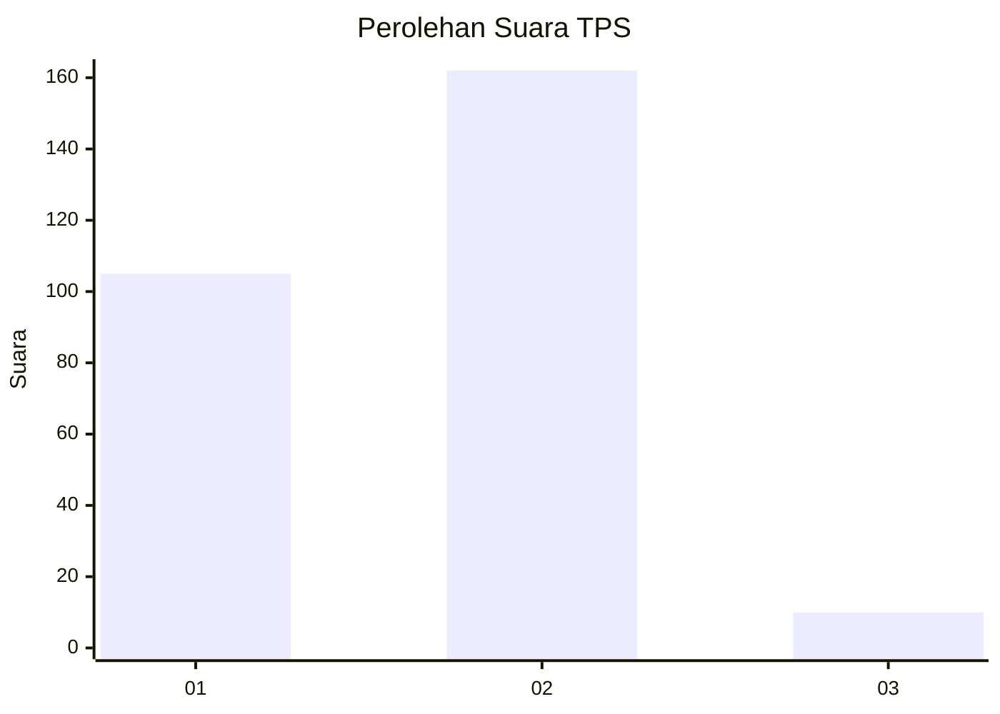
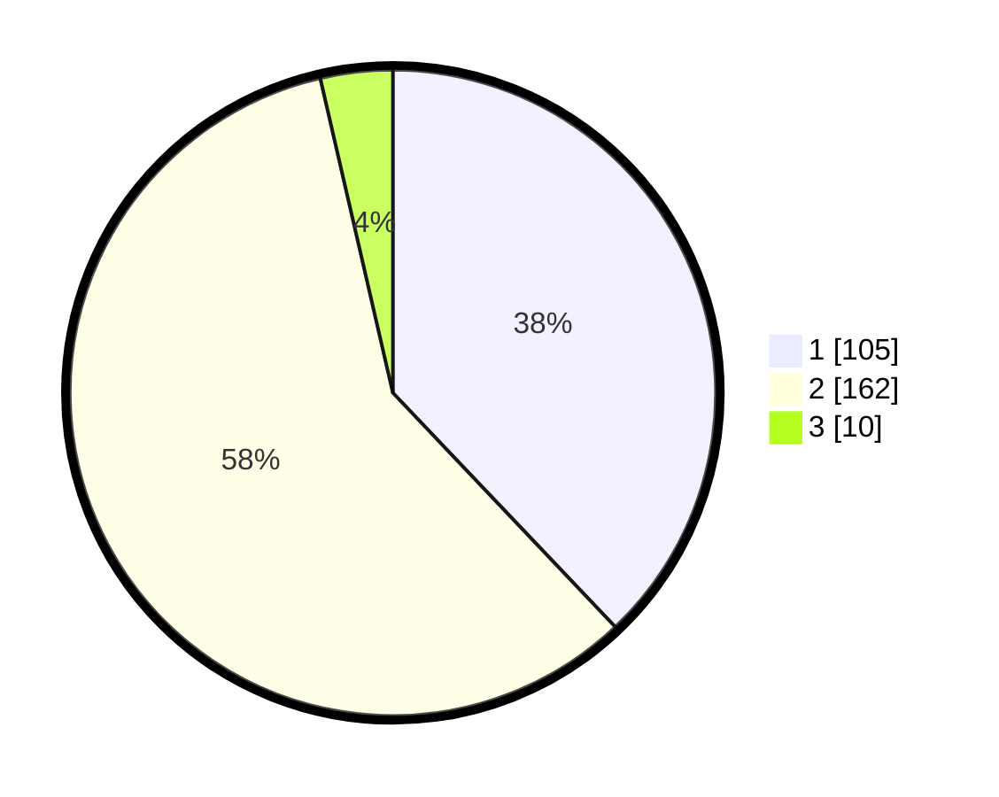

# Hasil

## Grafik

## Tabel

| No. | Nama Paslon    | Suara | Suara (raw) | Persentase |
|:--- |:-------------- | -----:| -----------:| ----------:|
| 1   | ANIES MUHAIMIN | 105   | [105][p-1]  | 37,91      |
| 2   | PRABOWO GIBRAN | 162   | [162][p-2]  | 58,48      |
| 3   | GANJAR MAHFUD  | 10    | [10][p-3]   | 3,61       |

[p-1]: https://github.com/gigit-pemilu/pemilu-2024-52-nusa-tenggara-barat/blob/main/pilpres/hitung-suara/sub/52-nusa-tenggara-barat/sub/01-lombok-barat/sub/07-sekotong/sub/2001-sekotong-tengah/sub/028-tps/sub/paslon-1.txt
[p-2]: https://github.com/gigit-pemilu/pemilu-2024-52-nusa-tenggara-barat/blob/main/pilpres/hitung-suara/sub/52-nusa-tenggara-barat/sub/01-lombok-barat/sub/07-sekotong/sub/2001-sekotong-tengah/sub/028-tps/sub/paslon-2.txt
[p-3]: https://github.com/gigit-pemilu/pemilu-2024-52-nusa-tenggara-barat/blob/main/pilpres/hitung-suara/sub/52-nusa-tenggara-barat/sub/01-lombok-barat/sub/07-sekotong/sub/2001-sekotong-tengah/sub/028-tps/sub/paslon-3.txt

## Foto C Plano

https://sirekap-obj-formc.kpu.go.id/603b/pemilu/ppwp/52/01/07/20/01/5201072001028-20240223-094025--25072895-c88c-46c3-b28c-a2509d8fea1d.jpg

https://sirekap-obj-formc.kpu.go.id/603b/pemilu/ppwp/52/01/07/20/01/5201072001028-20240223-093944--cbe48840-a2dc-4ff7-9450-7f6cc74e5a32.jpg

https://sirekap-obj-formc.kpu.go.id/603b/pemilu/ppwp/52/01/07/20/01/5201072001028-20240223-093916--28e05425-1aa5-449a-9ba0-54ab48fb6a2c.jpg

## Metadata

| Key        | Value               |
| ---------- | ------------------- |
| Time Stamp | 2024-02-26 19:00:00 |

## DATA PEMILIH TETAP

Jumlah pemilih dalam DPT: **277**.
 * L: **150**.
 * P: **177**.

## DATA PENGGUNA HAK PILIH

Jumlah pengguna hak pilih dalam DPT: **277**.
 * L: **142**.
 * P: **175**.

Jumlah pengguna hak pilih dalam DPTb: **222**.
 * L: **222**.
 * P: **222**.

Jumlah pengguna hak pilih dalam DPK: **122**.
 * L: **727**.
 * P: **222**.

Jumlah pengguna hak pilih: **577**.
 * L: **140**.
 * P: **175**.

## JUMLAH SUARA SAH DAN TIDAK SAH

JUMLAH SELURUH SUARA SAH: **277**.

JUMLAH SUARA TIDAK SAH: **0**.

JUMLAH SELURUH SUARA SAH DAN SUARA TIDAK SAH: **277**.

