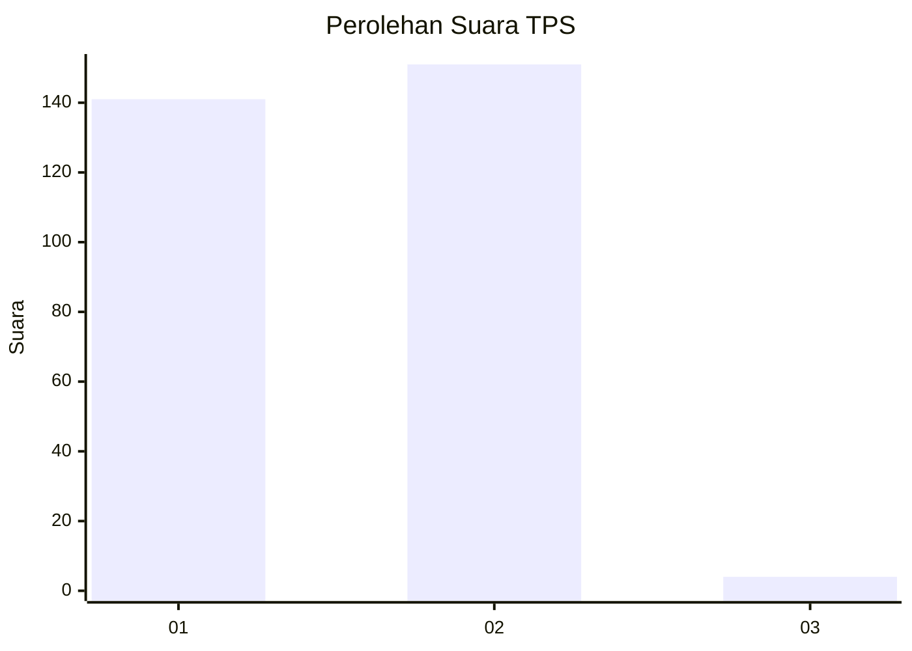
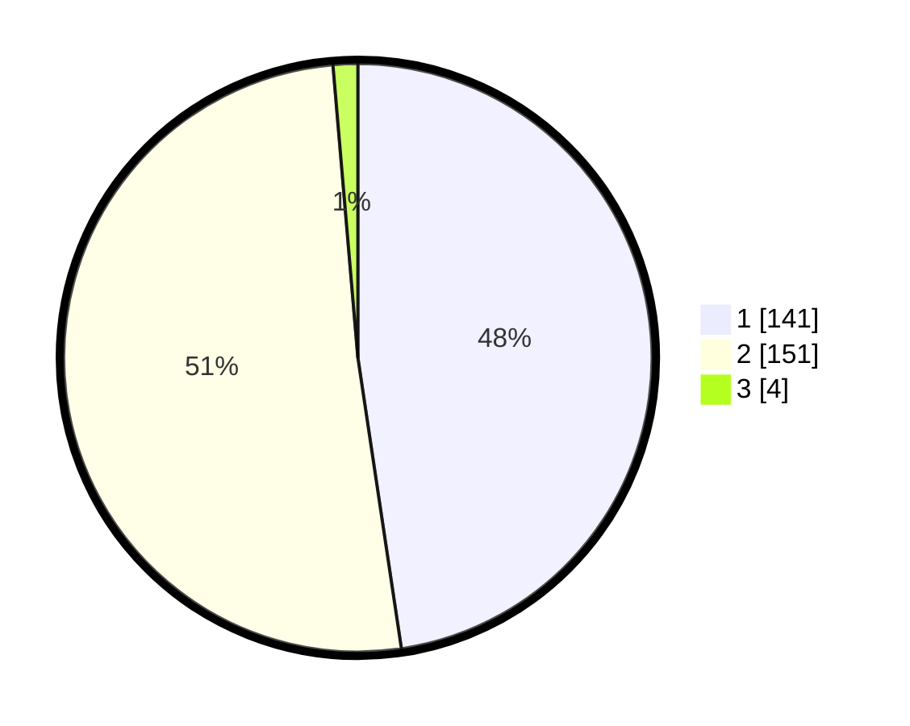

# Hasil

## Grafik

## Tabel

| No. | Nama Paslon    | Suara | Suara (raw) | Persentase |
|:--- |:-------------- | -----:| -----------:| ----------:|
| 1   | ANIES MUHAIMIN | 141   | [141][p-1]  | 47,64      |
| 2   | PRABOWO GIBRAN | 151   | [151][p-2]  | 51,01      |
| 3   | GANJAR MAHFUD  | 4     | [4][p-3]    | 1,35       |

[p-1]: https://github.com/gigit-pemilu/pemilu-2024-52-nusa-tenggara-barat/blob/main/pilpres/hitung-suara/sub/52-nusa-tenggara-barat/sub/01-lombok-barat/sub/07-sekotong/sub/2003-pelangan/sub/001-tps/sub/paslon-1.txt
[p-2]: https://github.com/gigit-pemilu/pemilu-2024-52-nusa-tenggara-barat/blob/main/pilpres/hitung-suara/sub/52-nusa-tenggara-barat/sub/01-lombok-barat/sub/07-sekotong/sub/2003-pelangan/sub/001-tps/sub/paslon-2.txt
[p-3]: https://github.com/gigit-pemilu/pemilu-2024-52-nusa-tenggara-barat/blob/main/pilpres/hitung-suara/sub/52-nusa-tenggara-barat/sub/01-lombok-barat/sub/07-sekotong/sub/2003-pelangan/sub/001-tps/sub/paslon-3.txt

## Foto C Plano

https://sirekap-obj-formc.kpu.go.id/5881/pemilu/ppwp/52/01/07/20/03/5201072003001-20240314-101950--71314e06-170e-433a-915b-42a032ba3e9f.jpg

https://sirekap-obj-formc.kpu.go.id/5881/pemilu/ppwp/52/01/07/20/03/5201072003001-20240314-102159--f7611823-79d2-4b59-9e45-66d3ce11df52.jpg

https://sirekap-obj-formc.kpu.go.id/5881/pemilu/ppwp/52/01/07/20/03/5201072003001-20240314-102317--3f79d4ed-5e07-41f4-b430-8feb6df93c7b.jpg

## Metadata

| Key        | Value               |
| ---------- | ------------------- |
| Time Stamp | 2024-03-14 10:30:00 |

## DATA PEMILIH TETAP

Jumlah pemilih dalam DPT: **0**.
 * L: **0**.
 * P: **0**.

## DATA PENGGUNA HAK PILIH

Jumlah pengguna hak pilih dalam DPT: **58**.
 * L: **0**.
 * P: **0**.

Jumlah pengguna hak pilih dalam DPTb: **500**.
 * L: **225**.
 * P: **555**.

Jumlah pengguna hak pilih dalam DPK: **0**.
 * L: **222**.
 * P: **0**.

Jumlah pengguna hak pilih: **529**.
 * L: **702**.
 * P: **15**.

## JUMLAH SUARA SAH DAN TIDAK SAH

JUMLAH SELURUH SUARA SAH: **0**.

JUMLAH SUARA TIDAK SAH: **7**.

JUMLAH SELURUH SUARA SAH DAN SUARA TIDAK SAH: **0**.

