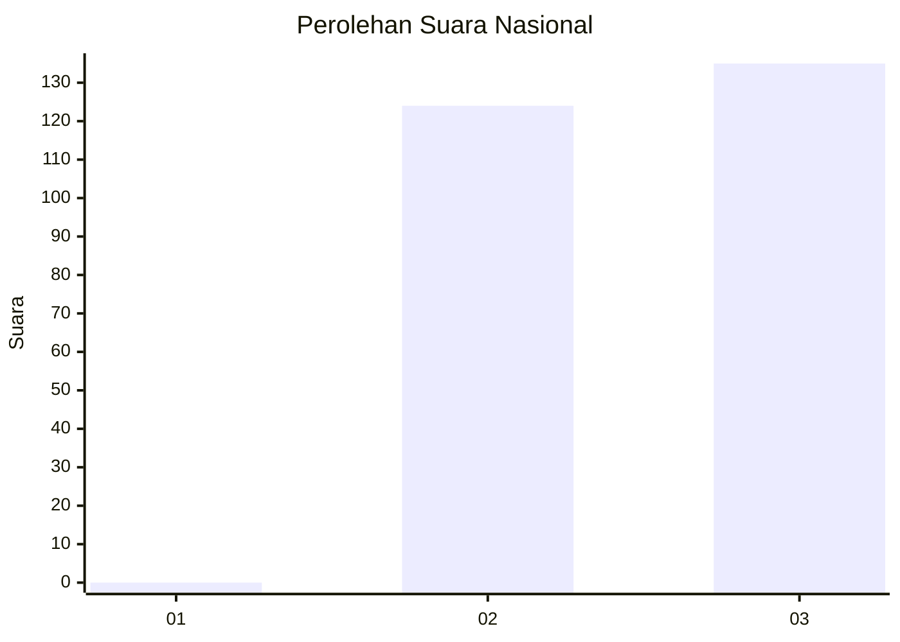
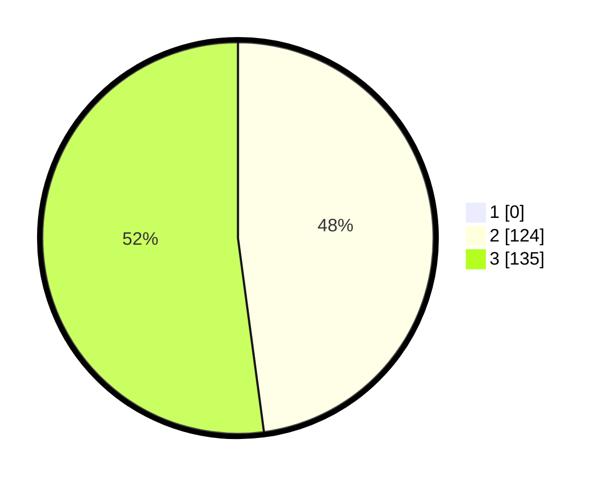

# Hasil

## Grafik

## Tabel

| No. | Nama Paslon    | Suara | Suara (raw) | Persentase |
|:--- |:-------------- | -----:| -----------:| ----------:|
| 1   | ANIES MUHAIMIN | 0     | [0][p-1]    | 0,00       |
| 2   | PRABOWO GIBRAN | 124   | [124][p-2]  | 47,88      |
| 3   | GANJAR MAHFUD  | 135   | [135][p-3]  | 52,12      |

[p-1]: https://github.com/gigit-pemilu/pemilu-2024/blob/main/pilpres/hitung-suara/sub/52-nusa-tenggara-barat/sub/01-lombok-barat/sub/07-sekotong/sub/2003-pelangan/sub/030-tps/sub/paslon-1.txt
[p-2]: https://github.com/gigit-pemilu/pemilu-2024/blob/main/pilpres/hitung-suara/sub/52-nusa-tenggara-barat/sub/01-lombok-barat/sub/07-sekotong/sub/2003-pelangan/sub/030-tps/sub/paslon-2.txt
[p-3]: https://github.com/gigit-pemilu/pemilu-2024/blob/main/pilpres/hitung-suara/sub/52-nusa-tenggara-barat/sub/01-lombok-barat/sub/07-sekotong/sub/2003-pelangan/sub/030-tps/sub/paslon-3.txt

## Foto C Plano

https://sirekap-obj-formc.kpu.go.id/5e7c/pemilu/ppwp/52/01/07/20/03/5201072003030-20240215-060102--acbfded1-50b8-43e4-b33b-3c9bdafaf0d8.jpg

https://sirekap-obj-formc.kpu.go.id/5e7c/pemilu/ppwp/52/01/07/20/03/5201072003030-20240215-060149--9d9882c2-822c-4373-8cc9-fd52625d2de6.jpg

https://sirekap-obj-formc.kpu.go.id/5e7c/pemilu/ppwp/52/01/07/20/03/5201072003030-20240215-060250--e7b711b7-aacd-4bda-8983-8e9dd8ea1a70.jpg

## Metadata

| Key        | Value               |
| ---------- | ------------------- |
| Time Stamp | 2024-02-25 14:00:00 |

