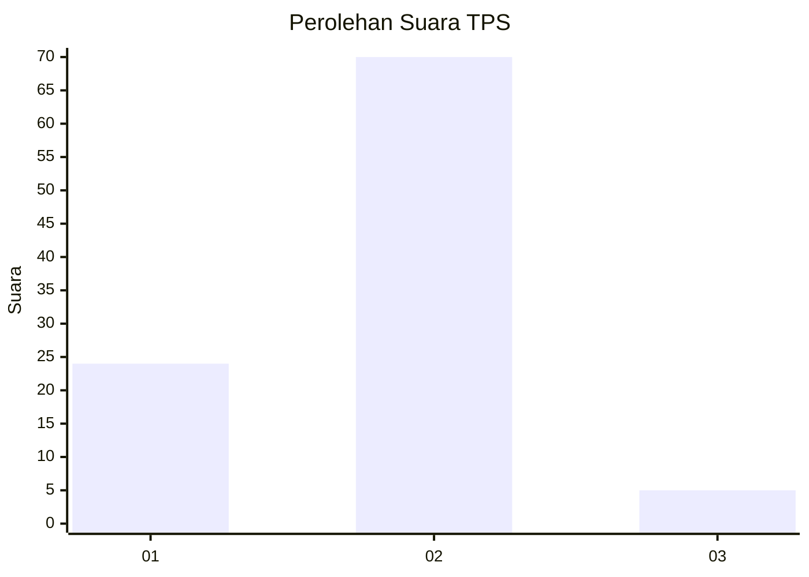
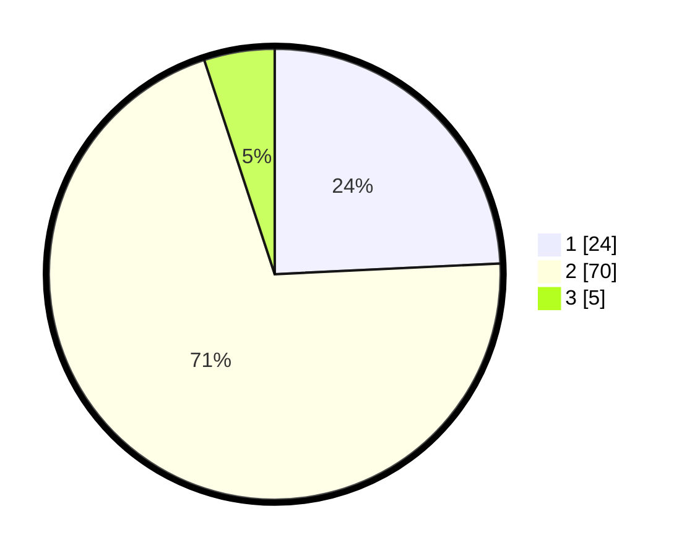

# Hasil

## Grafik

## Tabel

| No. | Nama Paslon    | Suara | Suara (raw) | Persentase |
|:--- |:-------------- | -----:| -----------:| ----------:|
| 1   | ANIES MUHAIMIN | 24    | [24][p-1]   | 24,24      |
| 2   | PRABOWO GIBRAN | 70    | [70][p-2]   | 70,71      |
| 3   | GANJAR MAHFUD  | 5     | [5][p-3]    | 5,05       |

[p-1]: https://github.com/gigit-pemilu/pemilu-2024-52-nusa-tenggara-barat/blob/main/pilpres/hitung-suara/sub/52-nusa-tenggara-barat/sub/01-lombok-barat/sub/07-sekotong/sub/2003-pelangan/sub/032-tps/sub/paslon-1.txt
[p-2]: https://github.com/gigit-pemilu/pemilu-2024-52-nusa-tenggara-barat/blob/main/pilpres/hitung-suara/sub/52-nusa-tenggara-barat/sub/01-lombok-barat/sub/07-sekotong/sub/2003-pelangan/sub/032-tps/sub/paslon-2.txt
[p-3]: https://github.com/gigit-pemilu/pemilu-2024-52-nusa-tenggara-barat/blob/main/pilpres/hitung-suara/sub/52-nusa-tenggara-barat/sub/01-lombok-barat/sub/07-sekotong/sub/2003-pelangan/sub/032-tps/sub/paslon-3.txt

## Foto C Plano

https://sirekap-obj-formc.kpu.go.id/1243/pemilu/ppwp/52/01/07/20/03/5201072003032-20240314-104357--986056a2-d68d-427e-8e43-0b1086de8361.jpg

https://sirekap-obj-formc.kpu.go.id/1243/pemilu/ppwp/52/01/07/20/03/5201072003032-20240314-104517--0d3d4c8c-e43d-4e25-8777-2f43561b98a0.jpg

https://sirekap-obj-formc.kpu.go.id/1243/pemilu/ppwp/52/01/07/20/03/5201072003032-20240314-104649--91f56a34-e6df-4820-a9f4-d7f449f52aac.jpg

## Metadata

| Key        | Value               |
| ---------- | ------------------- |
| Time Stamp | 2024-03-14 11:00:00 |

## DATA PEMILIH TETAP

Jumlah pemilih dalam DPT: **0**.
 * L: **0**.
 * P: **0**.

## DATA PENGGUNA HAK PILIH

Jumlah pengguna hak pilih dalam DPT: **507**.
 * L: **0**.
 * P: **0**.

Jumlah pengguna hak pilih dalam DPTb: **700**.
 * L: **25**.
 * P: **797**.

Jumlah pengguna hak pilih dalam DPK: **700**.
 * L: **2**.
 * P: **75**.

Jumlah pengguna hak pilih: **377**.
 * L: **0**.
 * P: **22**.

## JUMLAH SUARA SAH DAN TIDAK SAH

JUMLAH SELURUH SUARA SAH: **152**.

JUMLAH SUARA TIDAK SAH: **4**.

JUMLAH SELURUH SUARA SAH DAN SUARA TIDAK SAH: **156**.

