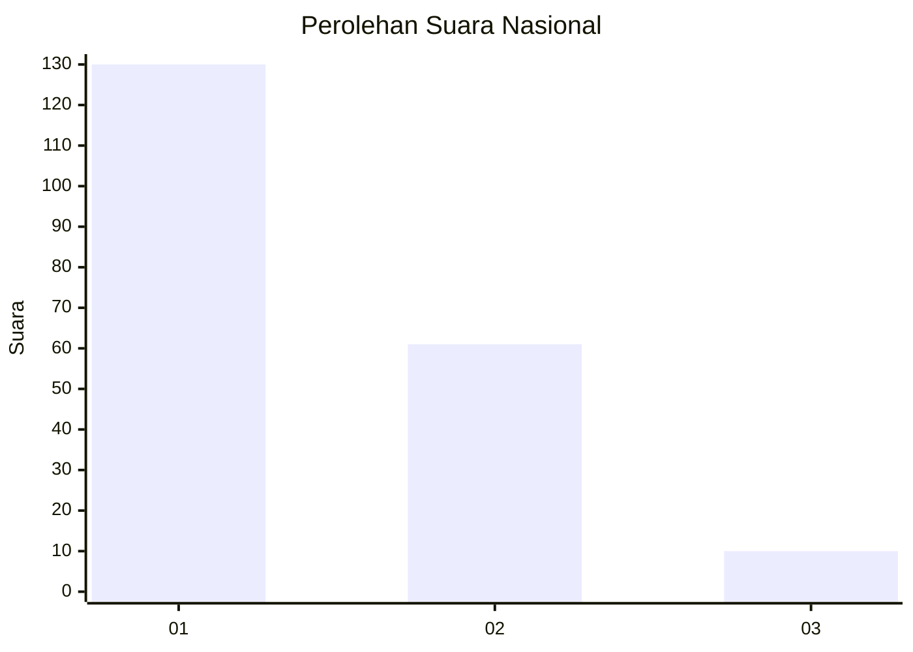
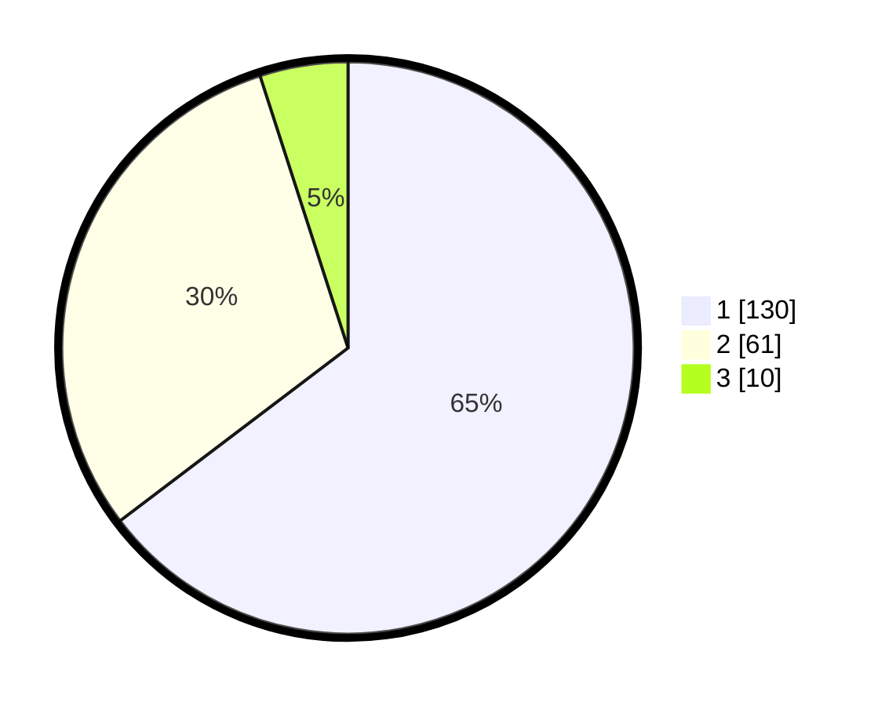

# Hasil

## Grafik

## Tabel

| No. | Nama Paslon    | Suara | Suara (raw) | Persentase |
|:--- |:-------------- | -----:| -----------:| ----------:|
| 1   | ANIES MUHAIMIN | 130   | [130][p-1]  | 64,68      |
| 2   | PRABOWO GIBRAN | 61    | [61][p-2]   | 30,35      |
| 3   | GANJAR MAHFUD  | 10    | [10][p-3]   | 4,98       |

[p-1]: https://github.com/gigit-pemilu/pemilu-2024/blob/main/pilpres/hitung-suara/sub/52-nusa-tenggara-barat/sub/01-lombok-barat/sub/07-sekotong/sub/2006-batu-putih/sub/012-tps/sub/paslon-1.txt
[p-2]: https://github.com/gigit-pemilu/pemilu-2024/blob/main/pilpres/hitung-suara/sub/52-nusa-tenggara-barat/sub/01-lombok-barat/sub/07-sekotong/sub/2006-batu-putih/sub/012-tps/sub/paslon-2.txt
[p-3]: https://github.com/gigit-pemilu/pemilu-2024/blob/main/pilpres/hitung-suara/sub/52-nusa-tenggara-barat/sub/01-lombok-barat/sub/07-sekotong/sub/2006-batu-putih/sub/012-tps/sub/paslon-3.txt

## Foto C Plano

https://sirekap-obj-formc.kpu.go.id/8974/pemilu/ppwp/52/01/07/20/06/5201072006012-20240215-033506--1f1a8510-57a3-49d4-a220-26b1b98e9694.jpg

https://sirekap-obj-formc.kpu.go.id/8974/pemilu/ppwp/52/01/07/20/06/5201072006012-20240215-063729--11ac65b8-012e-4e2b-bd5d-2e4da687c093.jpg

https://sirekap-obj-formc.kpu.go.id/8974/pemilu/ppwp/52/01/07/20/06/5201072006012-20240215-033635--64818dfd-1ab7-4798-bc2c-1cf4f3b507ed.jpg

## Metadata

| Key        | Value               |
| ---------- | ------------------- |
| Time Stamp | 2024-02-24 22:31:28 |

