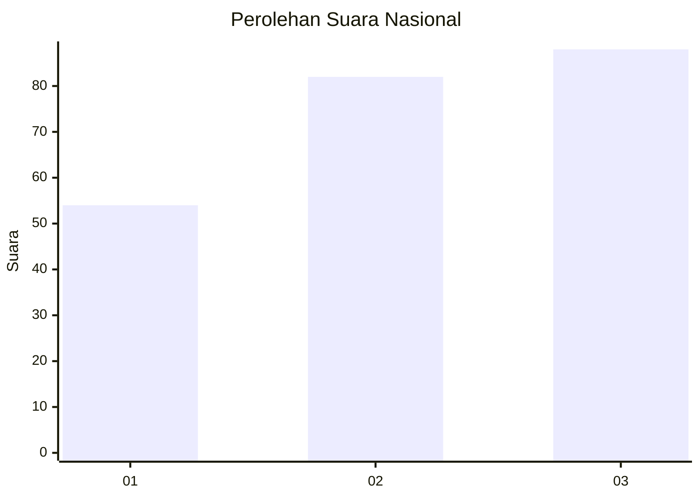
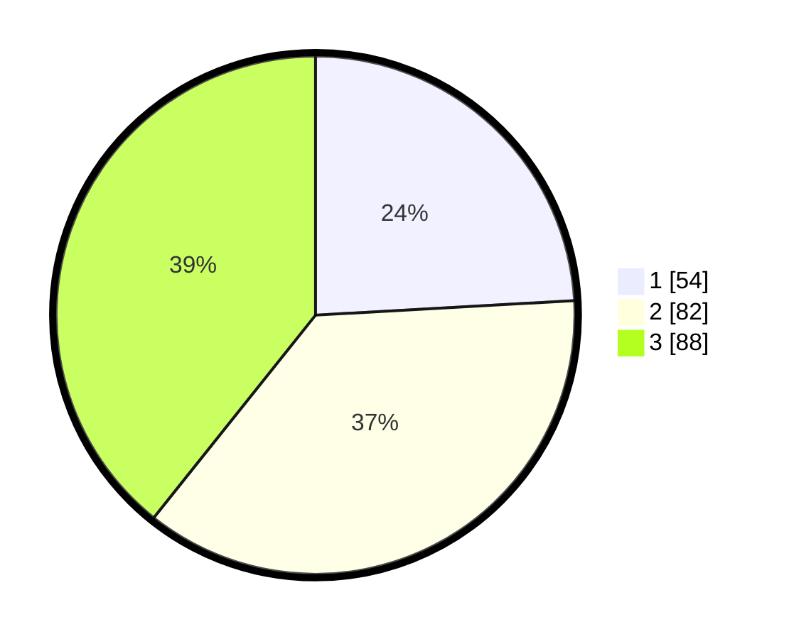

# Hasil

## Grafik

## Tabel

| No. | Nama Paslon    | Suara | Suara (raw) | Persentase |
|:--- |:-------------- | -----:| -----------:| ----------:|
| 1   | ANIES MUHAIMIN | 54    | [54][p-1]   | 24,11      |
| 2   | PRABOWO GIBRAN | 82    | [82][p-2]   | 36,61      |
| 3   | GANJAR MAHFUD  | 88    | [88][p-3]   | 39,29      |

[p-1]: https://github.com/gigit-pemilu/pemilu-2024/blob/main/pilpres/hitung-suara/sub/52-nusa-tenggara-barat/sub/01-lombok-barat/sub/07-sekotong/sub/2009-taman-baru/sub/005-tps/sub/paslon-1.txt
[p-2]: https://github.com/gigit-pemilu/pemilu-2024/blob/main/pilpres/hitung-suara/sub/52-nusa-tenggara-barat/sub/01-lombok-barat/sub/07-sekotong/sub/2009-taman-baru/sub/005-tps/sub/paslon-2.txt
[p-3]: https://github.com/gigit-pemilu/pemilu-2024/blob/main/pilpres/hitung-suara/sub/52-nusa-tenggara-barat/sub/01-lombok-barat/sub/07-sekotong/sub/2009-taman-baru/sub/005-tps/sub/paslon-3.txt

## Foto C Plano

https://sirekap-obj-formc.kpu.go.id/f8fc/pemilu/ppwp/52/01/07/20/09/5201072009005-20240223-144537--f53ce86a-f0ce-41ab-b8ab-7e116829d55b.jpg

https://sirekap-obj-formc.kpu.go.id/f8fc/pemilu/ppwp/52/01/07/20/09/5201072009005-20240223-144606--a26159c5-4abd-4d1e-b209-ed0cc5dfc646.jpg

https://sirekap-obj-formc.kpu.go.id/f8fc/pemilu/ppwp/52/01/07/20/09/5201072009005-20240223-144648--6747f983-8b29-4de0-b397-60b647d8ebf1.jpg

## Metadata

| Key        | Value               |
| ---------- | ------------------- |
| Time Stamp | 2024-02-24 22:31:28 |

## DATA PEMILIH TETAP

Jumlah pemilih dalam DPT: **240**.
 * L: **259**.
 * P: **120**.

## DATA PENGGUNA HAK PILIH

Jumlah pengguna hak pilih dalam DPT: **223**.
 * L: **425**.
 * P: **608**.

Jumlah pengguna hak pilih dalam DPTb: **808**.
 * L: **8**.
 * P: **808**.

Jumlah pengguna hak pilih dalam DPK: **62**.
 * L: **5**.
 * P: **837**.

Jumlah pengguna hak pilih: **245**.
 * L: **420**.
 * P: **425**.

## JUMLAH SUARA SAH DAN TIDAK SAH

JUMLAH SELURUH SUARA SAH: **244**.

JUMLAH SUARA TIDAK SAH: **802**.

JUMLAH SELURUH SUARA SAH DAN SUARA TIDAK SAH: **225**.

