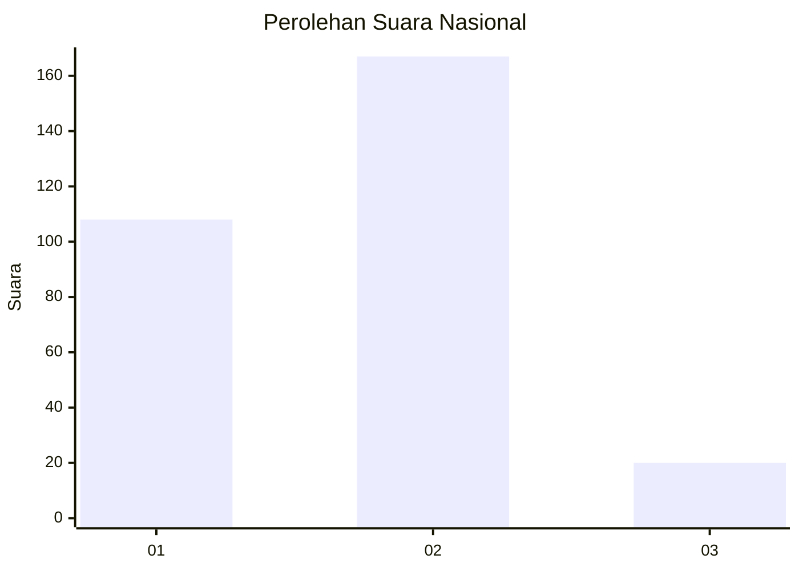
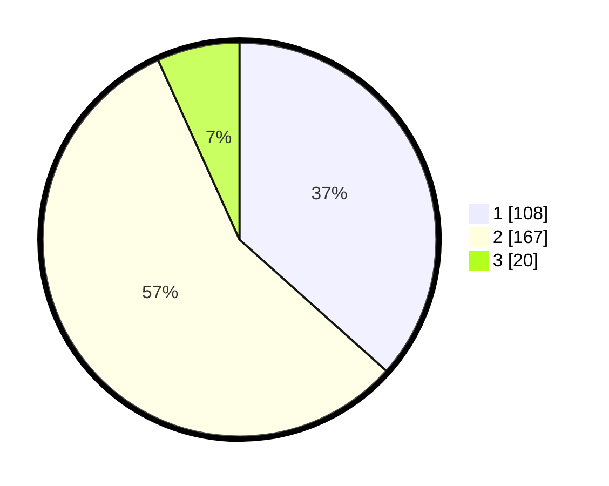

# Hasil

## Grafik

## Tabel

| No. | Nama Paslon    | Suara | Suara (raw) | Persentase |
|:--- |:-------------- | -----:| -----------:| ----------:|
| 1   | ANIES MUHAIMIN | 108   | [108][p-1]  | 36,61      |
| 2   | PRABOWO GIBRAN | 167   | [167][p-2]  | 56,61      |
| 3   | GANJAR MAHFUD  | 20    | [20][p-3]   | 6,78       |

[p-1]: https://github.com/gigit-pemilu/pemilu-2024/blob/main/pilpres/hitung-suara/sub/52-nusa-tenggara-barat/sub/01-lombok-barat/sub/07-sekotong/sub/2009-taman-baru/sub/012-tps/sub/paslon-1.txt
[p-2]: https://github.com/gigit-pemilu/pemilu-2024/blob/main/pilpres/hitung-suara/sub/52-nusa-tenggara-barat/sub/01-lombok-barat/sub/07-sekotong/sub/2009-taman-baru/sub/012-tps/sub/paslon-2.txt
[p-3]: https://github.com/gigit-pemilu/pemilu-2024/blob/main/pilpres/hitung-suara/sub/52-nusa-tenggara-barat/sub/01-lombok-barat/sub/07-sekotong/sub/2009-taman-baru/sub/012-tps/sub/paslon-3.txt

## Foto C Plano

https://sirekap-obj-formc.kpu.go.id/946d/pemilu/ppwp/52/01/07/20/09/5201072009012-20240220-130923--85d89bd3-18f2-4b35-816e-964919e4f9ab.jpg

https://sirekap-obj-formc.kpu.go.id/946d/pemilu/ppwp/52/01/07/20/09/5201072009012-20240220-130941--513e6714-cfca-40c0-bd74-fa796249b5b2.jpg

https://sirekap-obj-formc.kpu.go.id/946d/pemilu/ppwp/52/01/07/20/09/5201072009012-20240220-131009--1f95795b-299c-4f34-bfbe-4ea33efa3ac7.jpg

## Metadata

| Key        | Value               |
| ---------- | ------------------- |
| Time Stamp | 2024-02-21 12:00:00 |

## DATA PEMILIH TETAP

Jumlah pemilih dalam DPT: **235**.
 * L: **97**.
 * P: **248**.

## DATA PENGGUNA HAK PILIH

Jumlah pengguna hak pilih dalam DPT: **898**.
 * L: **47**.
 * P: **198**.

Jumlah pengguna hak pilih dalam DPTb: **488**.
 * L: **848**.
 * P: **888**.

Jumlah pengguna hak pilih dalam DPK: **848**.
 * L: **828**.
 * P: **842**.

Jumlah pengguna hak pilih: **258**.
 * L: **647**.
 * P: **348**.

## JUMLAH SUARA SAH DAN TIDAK SAH

JUMLAH SELURUH SUARA SAH: **295**.

JUMLAH SUARA TIDAK SAH: **0**.

JUMLAH SELURUH SUARA SAH DAN SUARA TIDAK SAH: **295**.

