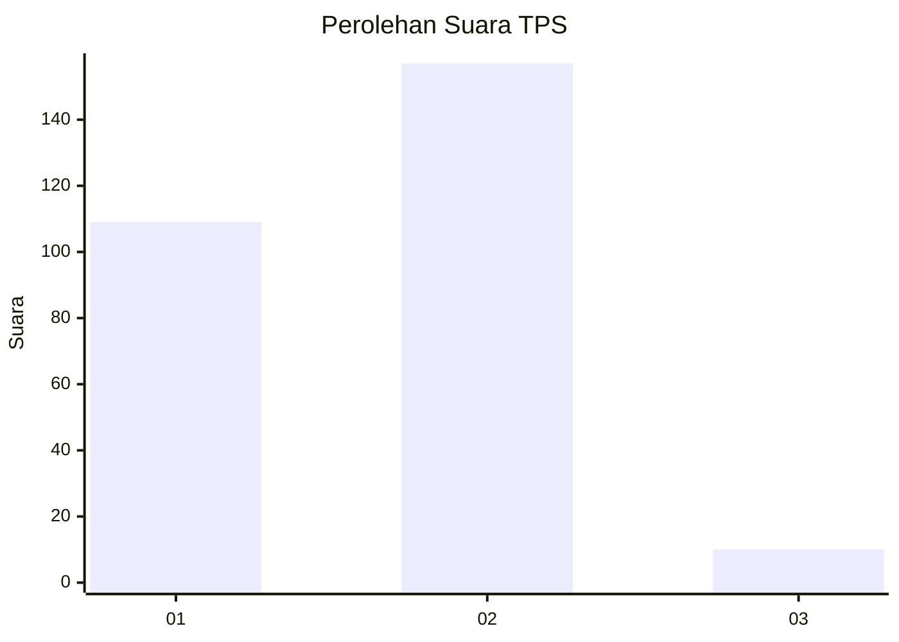
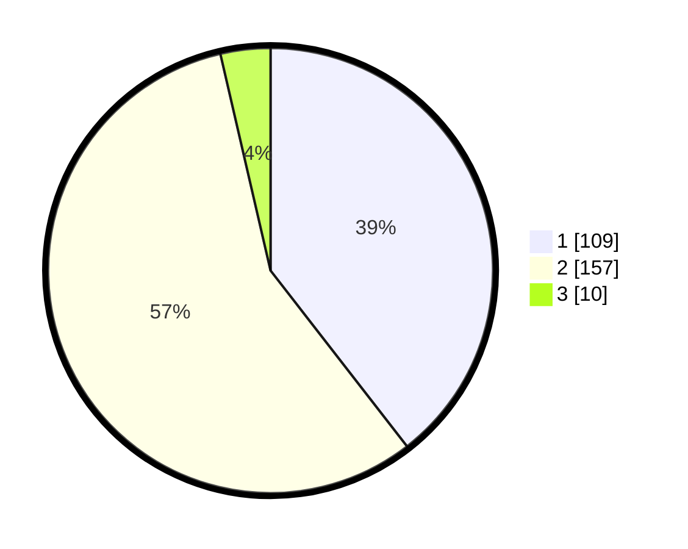

# Hasil

## Grafik

## Tabel

| No. | Nama Paslon    | Suara | Suara (raw) | Persentase |
|:--- |:-------------- | -----:| -----------:| ----------:|
| 1   | ANIES MUHAIMIN | 109   | [109][p-1]  | 39,49      |
| 2   | PRABOWO GIBRAN | 157   | [157][p-2]  | 56,88      |
| 3   | GANJAR MAHFUD  | 10    | [10][p-3]   | 3,62       |

[p-1]: https://github.com/gigit-pemilu/pemilu-2024-52-nusa-tenggara-barat/blob/main/pilpres/hitung-suara/sub/52-nusa-tenggara-barat/sub/01-lombok-barat/sub/08-labuapi/sub/2007-terong-tawah/sub/019-tps/sub/paslon-1.txt
[p-2]: https://github.com/gigit-pemilu/pemilu-2024-52-nusa-tenggara-barat/blob/main/pilpres/hitung-suara/sub/52-nusa-tenggara-barat/sub/01-lombok-barat/sub/08-labuapi/sub/2007-terong-tawah/sub/019-tps/sub/paslon-2.txt
[p-3]: https://github.com/gigit-pemilu/pemilu-2024-52-nusa-tenggara-barat/blob/main/pilpres/hitung-suara/sub/52-nusa-tenggara-barat/sub/01-lombok-barat/sub/08-labuapi/sub/2007-terong-tawah/sub/019-tps/sub/paslon-3.txt

## Foto C Plano

https://sirekap-obj-formc.kpu.go.id/5f37/pemilu/ppwp/52/01/08/20/07/5201082007019-20240215-023626--41f7b122-4083-46ff-9762-2ae2f4c1d787.jpg

https://sirekap-obj-formc.kpu.go.id/5f37/pemilu/ppwp/52/01/08/20/07/5201082007019-20240215-023845--fda8d1a7-d7d7-4873-962b-341f9daa50fe.jpg

https://sirekap-obj-formc.kpu.go.id/5f37/pemilu/ppwp/52/01/08/20/07/5201082007019-20240215-024035--b6f84eb1-6593-4ab9-8b64-a07a8c9e829b.jpg

## Metadata

| Key        | Value               |
| ---------- | ------------------- |
| Time Stamp | 2024-02-25 21:00:00 |

