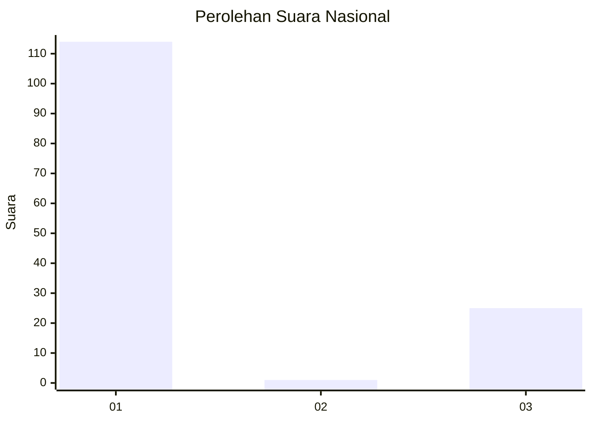
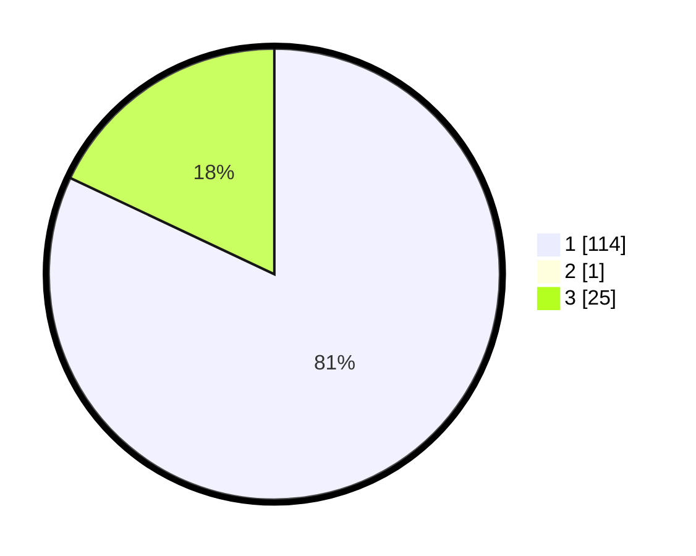

# Hasil

## Grafik

## Tabel

| No. | Nama Paslon    | Suara | Suara (raw) | Persentase |
|:--- |:-------------- | -----:| -----------:| ----------:|
| 1   | ANIES MUHAIMIN | 114   | [114][p-1]  | 81,43      |
| 2   | PRABOWO GIBRAN | 1     | [1][p-2]    | 0,71       |
| 3   | GANJAR MAHFUD  | 25    | [25][p-3]   | 17,86      |

[p-1]: https://github.com/gigit-pemilu/pemilu-2024/blob/main/pilpres/hitung-suara/sub/52-nusa-tenggara-barat/sub/01-lombok-barat/sub/08-labuapi/sub/2009-karang-bongkot/sub/006-tps/sub/paslon-1.txt
[p-2]: https://github.com/gigit-pemilu/pemilu-2024/blob/main/pilpres/hitung-suara/sub/52-nusa-tenggara-barat/sub/01-lombok-barat/sub/08-labuapi/sub/2009-karang-bongkot/sub/006-tps/sub/paslon-2.txt
[p-3]: https://github.com/gigit-pemilu/pemilu-2024/blob/main/pilpres/hitung-suara/sub/52-nusa-tenggara-barat/sub/01-lombok-barat/sub/08-labuapi/sub/2009-karang-bongkot/sub/006-tps/sub/paslon-3.txt

## Foto C Plano

https://sirekap-obj-formc.kpu.go.id/0a4c/pemilu/ppwp/52/01/08/20/09/5201082009006-20240215-033215--211dc211-6e6e-4ace-a183-e4f7fd173e9f.jpg

https://sirekap-obj-formc.kpu.go.id/0a4c/pemilu/ppwp/52/01/08/20/09/5201082009006-20240215-033416--784fe256-a3d0-4993-8041-4a49b76415d5.jpg

https://sirekap-obj-formc.kpu.go.id/0a4c/pemilu/ppwp/52/01/08/20/09/5201082009006-20240215-033514--7c94fe69-b802-49f3-b65e-b9882d473bed.jpg

## Metadata

| Key        | Value               |
| ---------- | ------------------- |
| Time Stamp | 2024-02-25 12:00:00 |

