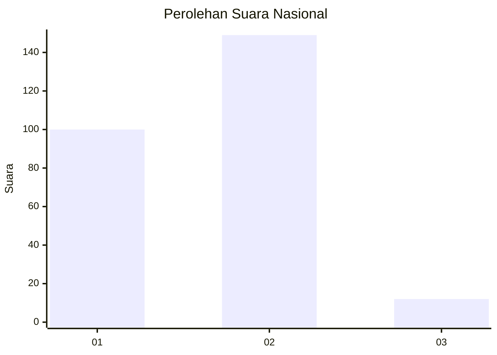
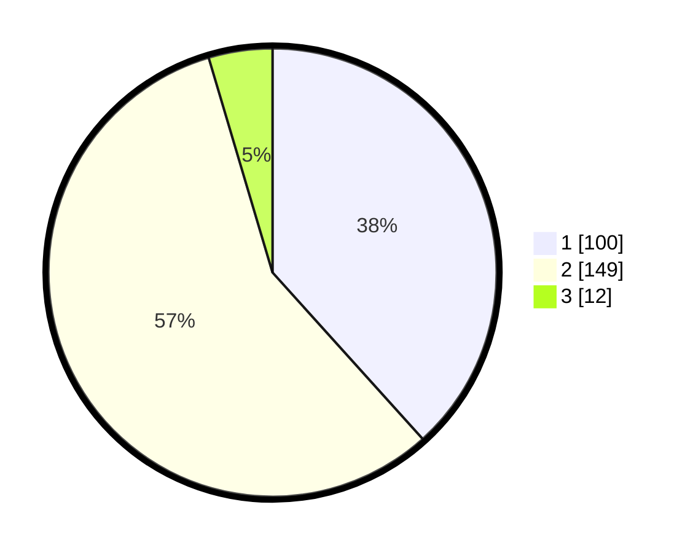

# Hasil

## Grafik

## Tabel

| No. | Nama Paslon    | Suara | Suara (raw) | Persentase |
|:--- |:-------------- | -----:| -----------:| ----------:|
| 1   | ANIES MUHAIMIN | 100   | [100][p-1]  | 38,31      |
| 2   | PRABOWO GIBRAN | 149   | [149][p-2]  | 57,09      |
| 3   | GANJAR MAHFUD  | 12    | [12][p-3]   | 4,60       |

[p-1]: https://github.com/gigit-pemilu/pemilu-2024/blob/main/pilpres/hitung-suara/sub/52-nusa-tenggara-barat/sub/01-lombok-barat/sub/09-gunungsari/sub/2002-midang/sub/021-tps/sub/paslon-1.txt
[p-2]: https://github.com/gigit-pemilu/pemilu-2024/blob/main/pilpres/hitung-suara/sub/52-nusa-tenggara-barat/sub/01-lombok-barat/sub/09-gunungsari/sub/2002-midang/sub/021-tps/sub/paslon-2.txt
[p-3]: https://github.com/gigit-pemilu/pemilu-2024/blob/main/pilpres/hitung-suara/sub/52-nusa-tenggara-barat/sub/01-lombok-barat/sub/09-gunungsari/sub/2002-midang/sub/021-tps/sub/paslon-3.txt

## Foto C Plano

https://sirekap-obj-formc.kpu.go.id/ef9f/pemilu/ppwp/52/01/09/20/02/5201092002021-20240214-234039--3223696c-4560-4cdb-81a2-47f7c3419244.jpg

https://sirekap-obj-formc.kpu.go.id/ef9f/pemilu/ppwp/52/01/09/20/02/5201092002021-20240214-212936--71c9d082-f44d-49fc-b916-e528925560fd.jpg

https://sirekap-obj-formc.kpu.go.id/ef9f/pemilu/ppwp/52/01/09/20/02/5201092002021-20240214-213001--d0e23a1f-b07d-4e0c-b03f-bb347cc471af.jpg

## Metadata

| Key        | Value               |
| ---------- | ------------------- |
| Time Stamp | 2024-02-15 01:47:43 |

