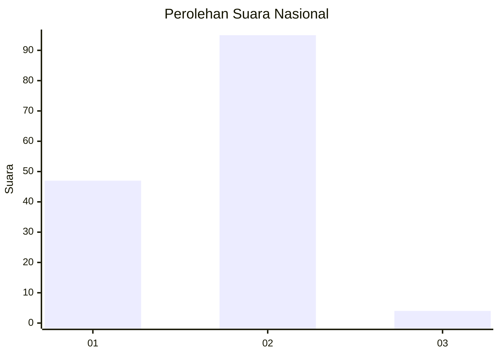
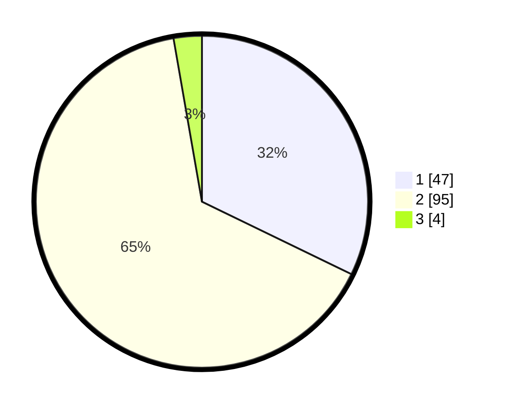

# Hasil

## Grafik

## Tabel

| No. | Nama Paslon    | Suara | Suara (raw) | Persentase |
|:--- |:-------------- | -----:| -----------:| ----------:|
| 1   | ANIES MUHAIMIN | 47    | [47][p-1]   | 32,19      |
| 2   | PRABOWO GIBRAN | 95    | [95][p-2]   | 65,07      |
| 3   | GANJAR MAHFUD  | 4     | [4][p-3]    | 2,74       |

[p-1]: https://github.com/gigit-pemilu/pemilu-2024/blob/main/pilpres/hitung-suara/sub/52-nusa-tenggara-barat/sub/01-lombok-barat/sub/09-gunungsari/sub/2008-penimbung/sub/003-tps/sub/paslon-1.txt
[p-2]: https://github.com/gigit-pemilu/pemilu-2024/blob/main/pilpres/hitung-suara/sub/52-nusa-tenggara-barat/sub/01-lombok-barat/sub/09-gunungsari/sub/2008-penimbung/sub/003-tps/sub/paslon-2.txt
[p-3]: https://github.com/gigit-pemilu/pemilu-2024/blob/main/pilpres/hitung-suara/sub/52-nusa-tenggara-barat/sub/01-lombok-barat/sub/09-gunungsari/sub/2008-penimbung/sub/003-tps/sub/paslon-3.txt

## Foto C Plano

https://sirekap-obj-formc.kpu.go.id/4040/pemilu/ppwp/52/01/09/20/08/5201092008003-20240314-112057--92aa4242-c4f6-4ef0-a8e9-685182c5f810.jpg

https://sirekap-obj-formc.kpu.go.id/4040/pemilu/ppwp/52/01/09/20/08/5201092008003-20240314-112129--e0bd382d-755a-44b8-9b1e-7514228cad98.jpg

https://sirekap-obj-formc.kpu.go.id/4040/pemilu/ppwp/52/01/09/20/08/5201092008003-20240314-112159--429410f0-f89f-40d1-aac9-a0a8856dac5a.jpg

## Metadata

| Key        | Value               |
| ---------- | ------------------- |
| Time Stamp | 2024-03-14 11:30:00 |

## DATA PEMILIH TETAP

Jumlah pemilih dalam DPT: **209**.
 * L: **93**.
 * P: **603**.

## DATA PENGGUNA HAK PILIH

Jumlah pengguna hak pilih dalam DPT: **523**.
 * L: **885**.
 * P: **33**.

Jumlah pengguna hak pilih dalam DPTb: **800**.
 * L: **53**.
 * P: **0**.

Jumlah pengguna hak pilih dalam DPK: **88**.
 * L: **0**.
 * P: **0**.

Jumlah pengguna hak pilih: **683**.
 * L: **85**.
 * P: **98**.

## JUMLAH SUARA SAH DAN TIDAK SAH

JUMLAH SELURUH SUARA SAH: **433**.

JUMLAH SUARA TIDAK SAH: **63**.

JUMLAH SELURUH SUARA SAH DAN SUARA TIDAK SAH: **683**.

