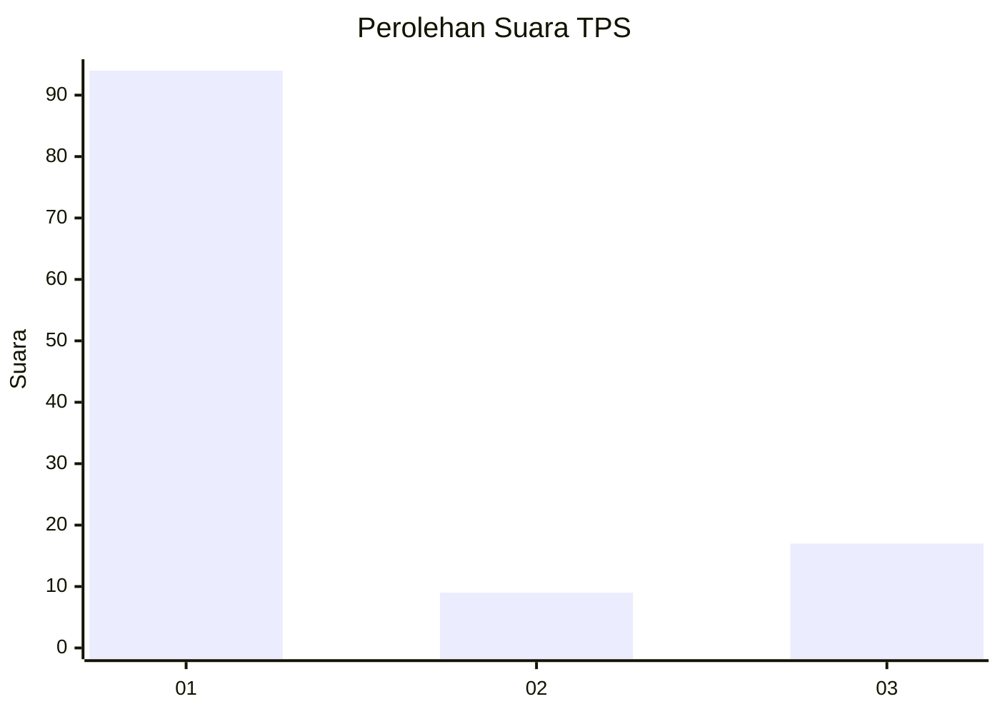
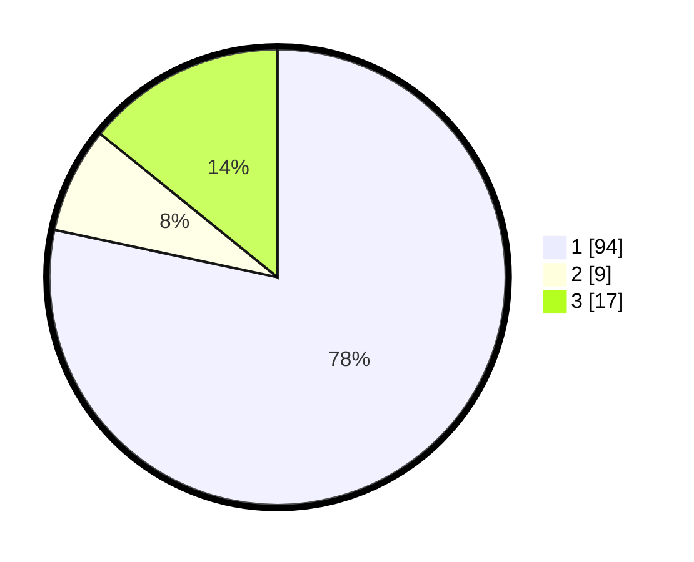

# Hasil

## Grafik

## Tabel

| No. | Nama Paslon    | Suara | Suara (raw) | Persentase |
|:--- |:-------------- | -----:| -----------:| ----------:|
| 1   | ANIES MUHAIMIN | 94    | [94][p-1]   | 78,33      |
| 2   | PRABOWO GIBRAN | 9     | [9][p-2]    | 7,50       |
| 3   | GANJAR MAHFUD  | 17    | [17][p-3]   | 14,17      |

[p-1]: https://github.com/gigit-pemilu/pemilu-2024-52-nusa-tenggara-barat/blob/main/pilpres/hitung-suara/sub/52-nusa-tenggara-barat/sub/01-lombok-barat/sub/09-gunungsari/sub/2009-taman-sari/sub/013-tps/sub/paslon-1.txt
[p-2]: https://github.com/gigit-pemilu/pemilu-2024-52-nusa-tenggara-barat/blob/main/pilpres/hitung-suara/sub/52-nusa-tenggara-barat/sub/01-lombok-barat/sub/09-gunungsari/sub/2009-taman-sari/sub/013-tps/sub/paslon-2.txt
[p-3]: https://github.com/gigit-pemilu/pemilu-2024-52-nusa-tenggara-barat/blob/main/pilpres/hitung-suara/sub/52-nusa-tenggara-barat/sub/01-lombok-barat/sub/09-gunungsari/sub/2009-taman-sari/sub/013-tps/sub/paslon-3.txt

## Foto C Plano

https://sirekap-obj-formc.kpu.go.id/48ad/pemilu/ppwp/52/01/09/20/09/5201092009013-20240318-115222--4886f617-9d45-458f-83fa-ca1247ca75f8.jpg

https://sirekap-obj-formc.kpu.go.id/48ad/pemilu/ppwp/52/01/09/20/09/5201092009013-20240318-114956--be1c2ac6-608b-40d6-b7a5-f6d1f43d61a8.jpg

https://sirekap-obj-formc.kpu.go.id/48ad/pemilu/ppwp/52/01/09/20/09/5201092009013-20240318-114828--5fd9e3e2-3176-4e45-9bb4-4e37e6d93069.jpg

## Metadata

| Key        | Value               |
| ---------- | ------------------- |
| Time Stamp | 2024-03-18 12:00:00 |

## DATA PEMILIH TETAP

Jumlah pemilih dalam DPT: **0**.
 * L: **0**.
 * P: **0**.

## DATA PENGGUNA HAK PILIH

Jumlah pengguna hak pilih dalam DPT: **0**.
 * L: **200**.
 * P: **0**.

Jumlah pengguna hak pilih dalam DPTb: **522**.
 * L: **557**.
 * P: **722**.

Jumlah pengguna hak pilih dalam DPK: **0**.
 * L: **557**.
 * P: **555**.

Jumlah pengguna hak pilih: **555**.
 * L: **111**.
 * P: **7**.

## JUMLAH SUARA SAH DAN TIDAK SAH

JUMLAH SELURUH SUARA SAH: **228**.

JUMLAH SUARA TIDAK SAH: **7**.

JUMLAH SELURUH SUARA SAH DAN SUARA TIDAK SAH: **229**.

