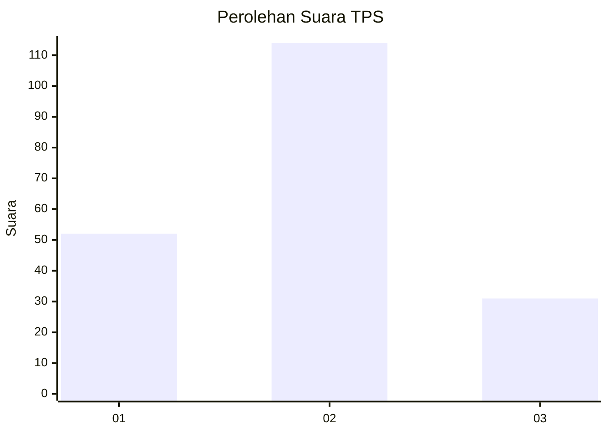

# Hasil

## Grafik

## Tabel

| No. | Nama Paslon    | Suara | Suara (raw) | Persentase |
|:--- |:-------------- | -----:| -----------:| ----------:|
| 1   | ANIES MUHAIMIN | 52    | [52][p-1]   | 26,40      |
| 2   | PRABOWO GIBRAN | 114   | [114][p-2]  | 57,87      |
| 3   | GANJAR MAHFUD  | 31    | [31][p-3]   | 15,74      |

[p-1]: https://github.com/gigit-pemilu/pemilu-2024-52-nusa-tenggara-barat/blob/main/pilpres/hitung-suara/sub/52-nusa-tenggara-barat/sub/01-lombok-barat/sub/12-lingsar/sub/2001-lingsar/sub/001-tps/sub/paslon-1.txt
[p-2]: https://github.com/gigit-pemilu/pemilu-2024-52-nusa-tenggara-barat/blob/main/pilpres/hitung-suara/sub/52-nusa-tenggara-barat/sub/01-lombok-barat/sub/12-lingsar/sub/2001-lingsar/sub/001-tps/sub/paslon-2.txt
[p-3]: https://github.com/gigit-pemilu/pemilu-2024-52-nusa-tenggara-barat/blob/main/pilpres/hitung-suara/sub/52-nusa-tenggara-barat/sub/01-lombok-barat/sub/12-lingsar/sub/2001-lingsar/sub/001-tps/sub/paslon-3.txt

## Foto C Plano

https://sirekap-obj-formc.kpu.go.id/df43/pemilu/ppwp/52/01/12/20/01/5201122001001-20240214-223031--b279ea71-f5cc-4c70-b1f8-8642721b96de.jpg

https://sirekap-obj-formc.kpu.go.id/df43/pemilu/ppwp/52/01/12/20/01/5201122001001-20240214-223139--5b8784e8-b4c5-4bb5-b4c1-7f1e5ac95cf6.jpg

https://sirekap-obj-formc.kpu.go.id/df43/pemilu/ppwp/52/01/12/20/01/5201122001001-20240214-223243--938e17e6-2627-4d0e-beaf-de43f864d4b0.jpg

## Metadata

| Key        | Value               |
| ---------- | ------------------- |
| Time Stamp | 2024-02-15 12:00:28 |

