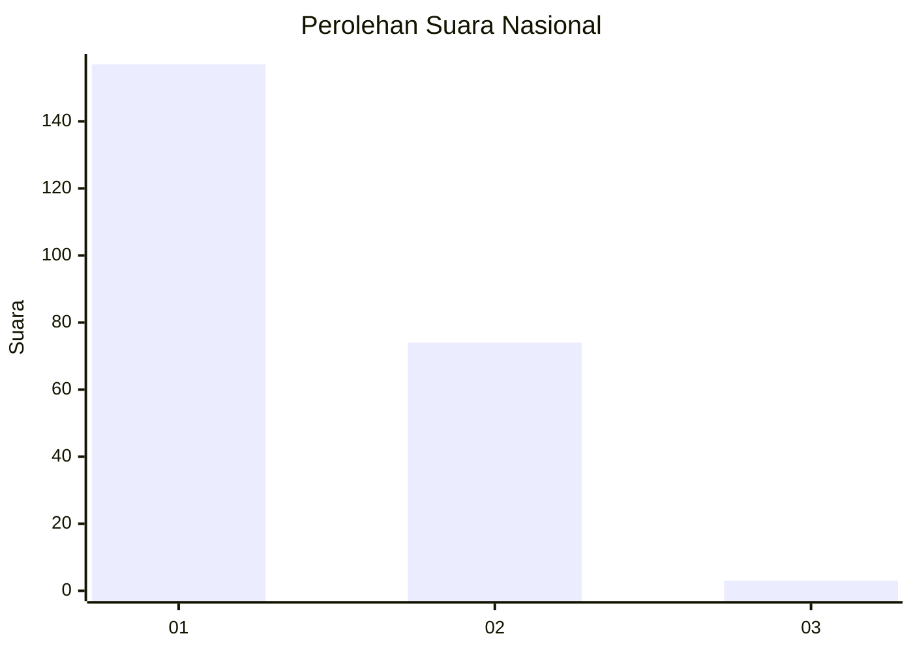
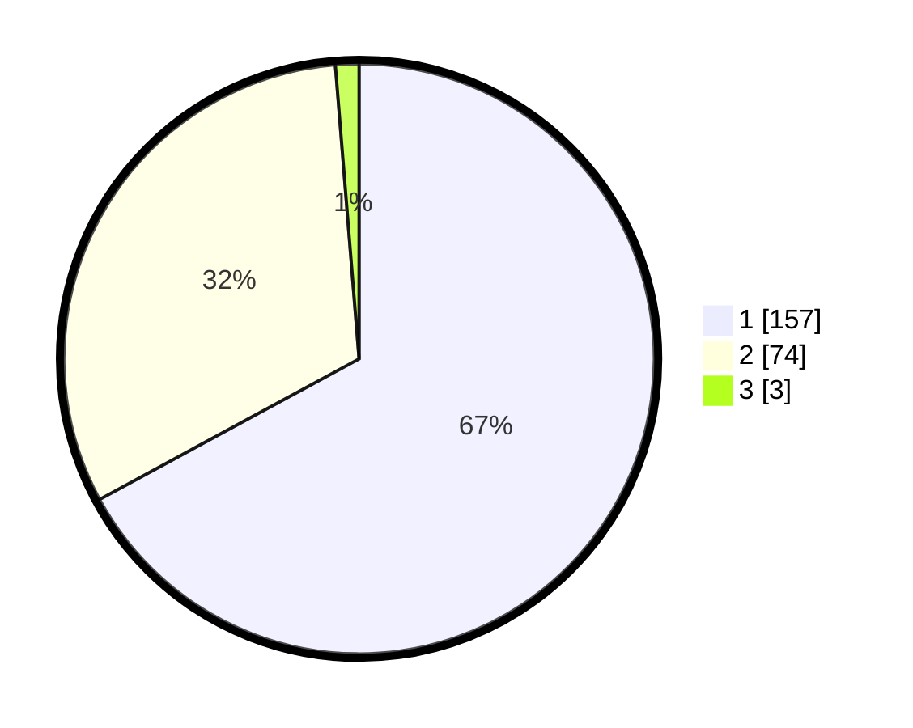

# Hasil

## Grafik

## Tabel

| No. | Nama Paslon    | Suara | Suara (raw) | Persentase |
|:--- |:-------------- | -----:| -----------:| ----------:|
| 1   | ANIES MUHAIMIN | 157   | [157][p-1]  | 67,09      |
| 2   | PRABOWO GIBRAN | 74    | [74][p-2]   | 31,62      |
| 3   | GANJAR MAHFUD  | 3     | [3][p-3]    | 1,28       |

[p-1]: https://github.com/gigit-pemilu/pemilu-2024/blob/main/pilpres/hitung-suara/sub/52-nusa-tenggara-barat/sub/01-lombok-barat/sub/12-lingsar/sub/2009-gegerung/sub/011-tps/sub/paslon-1.txt
[p-2]: https://github.com/gigit-pemilu/pemilu-2024/blob/main/pilpres/hitung-suara/sub/52-nusa-tenggara-barat/sub/01-lombok-barat/sub/12-lingsar/sub/2009-gegerung/sub/011-tps/sub/paslon-2.txt
[p-3]: https://github.com/gigit-pemilu/pemilu-2024/blob/main/pilpres/hitung-suara/sub/52-nusa-tenggara-barat/sub/01-lombok-barat/sub/12-lingsar/sub/2009-gegerung/sub/011-tps/sub/paslon-3.txt

## Foto C Plano

https://sirekap-obj-formc.kpu.go.id/3ca6/pemilu/ppwp/52/01/12/20/09/5201122009011-20240215-002430--800ab245-2dde-4369-9977-37192e7f3f61.jpg

https://sirekap-obj-formc.kpu.go.id/3ca6/pemilu/ppwp/52/01/12/20/09/5201122009011-20240215-002615--89fc4849-4330-46ba-815f-e526d4a4c0ac.jpg

https://sirekap-obj-formc.kpu.go.id/3ca6/pemilu/ppwp/52/01/12/20/09/5201122009011-20240215-002841--af09939d-662a-4fea-b7ba-20449c161da3.jpg

## Metadata

| Key        | Value               |
| ---------- | ------------------- |
| Time Stamp | 2024-02-21 19:00:00 |

