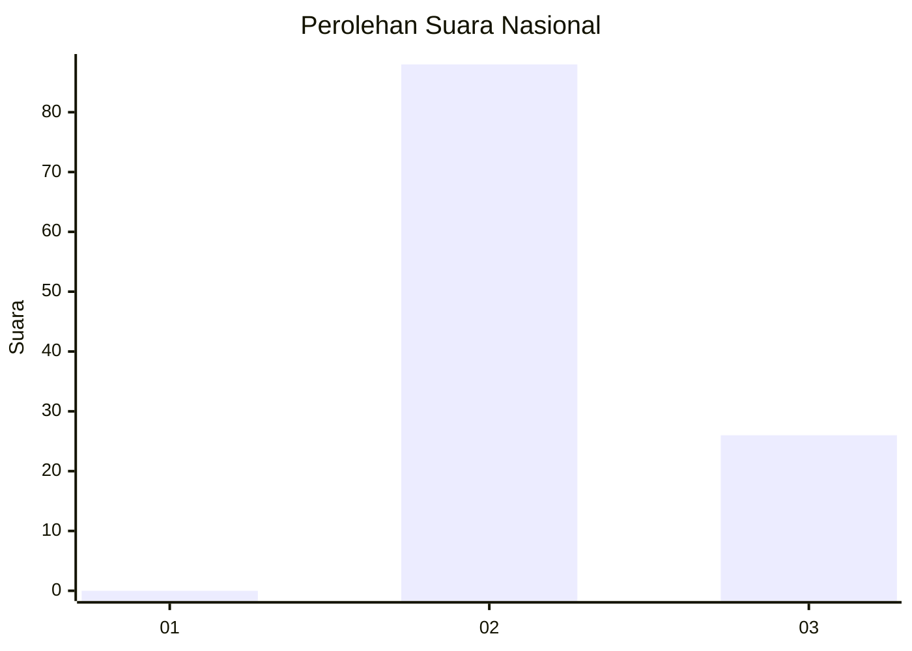
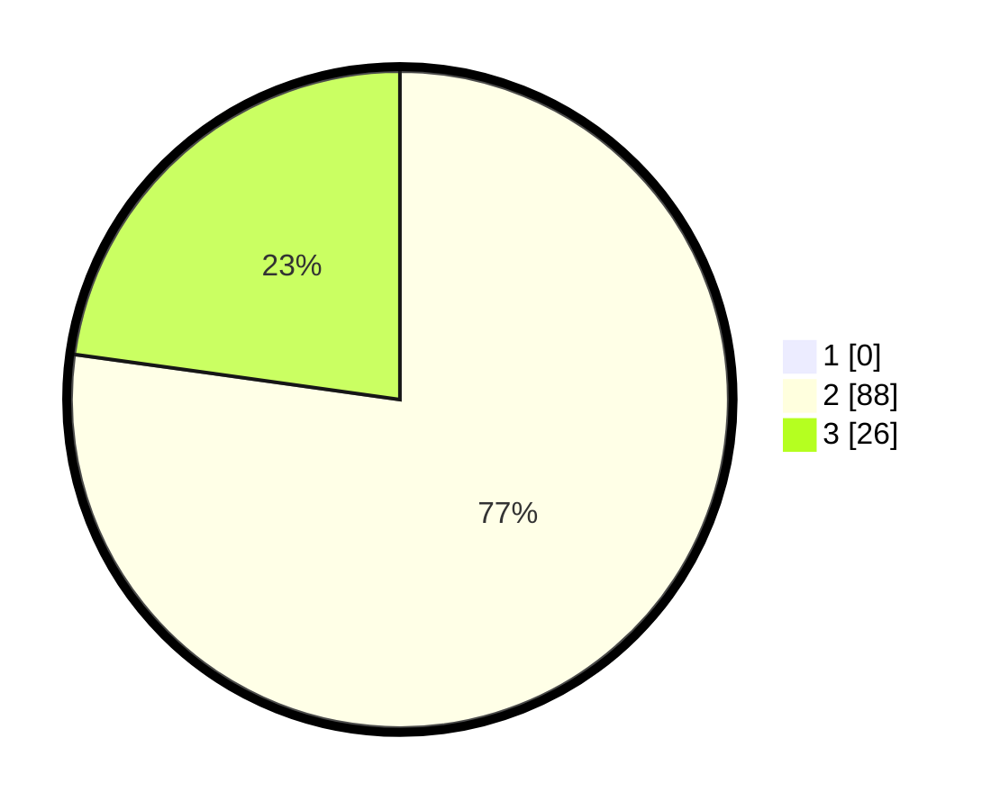

# Hasil

## Grafik

## Tabel

| No. | Nama Paslon    | Suara | Suara (raw) | Persentase |
|:--- |:-------------- | -----:| -----------:| ----------:|
| 1   | ANIES MUHAIMIN | 0     | [0][p-1]    | 0,00       |
| 2   | PRABOWO GIBRAN | 88    | [88][p-2]   | 77,19      |
| 3   | GANJAR MAHFUD  | 26    | [26][p-3]   | 22,81      |

[p-1]: https://github.com/gigit-pemilu/pemilu-2024/blob/main/pilpres/hitung-suara/sub/52-nusa-tenggara-barat/sub/01-lombok-barat/sub/12-lingsar/sub/2010-batu-mekar/sub/003-tps/sub/paslon-1.txt
[p-2]: https://github.com/gigit-pemilu/pemilu-2024/blob/main/pilpres/hitung-suara/sub/52-nusa-tenggara-barat/sub/01-lombok-barat/sub/12-lingsar/sub/2010-batu-mekar/sub/003-tps/sub/paslon-2.txt
[p-3]: https://github.com/gigit-pemilu/pemilu-2024/blob/main/pilpres/hitung-suara/sub/52-nusa-tenggara-barat/sub/01-lombok-barat/sub/12-lingsar/sub/2010-batu-mekar/sub/003-tps/sub/paslon-3.txt

## Foto C Plano

https://sirekap-obj-formc.kpu.go.id/5b84/pemilu/ppwp/52/01/12/20/10/5201122010003-20240214-193728--78d20e80-5200-44b6-bc32-b1372c01ece5.jpg

https://sirekap-obj-formc.kpu.go.id/5b84/pemilu/ppwp/52/01/12/20/10/5201122010003-20240214-193937--5dc3f01d-1b91-4b5f-811a-73b6c6dbcf1f.jpg

https://sirekap-obj-formc.kpu.go.id/5b84/pemilu/ppwp/52/01/12/20/10/5201122010003-20240214-194119--6ed5745a-5f73-47e0-b378-70f2cf94cfc7.jpg

## Metadata

| Key        | Value               |
| ---------- | ------------------- |
| Time Stamp | 2024-02-25 21:00:00 |

