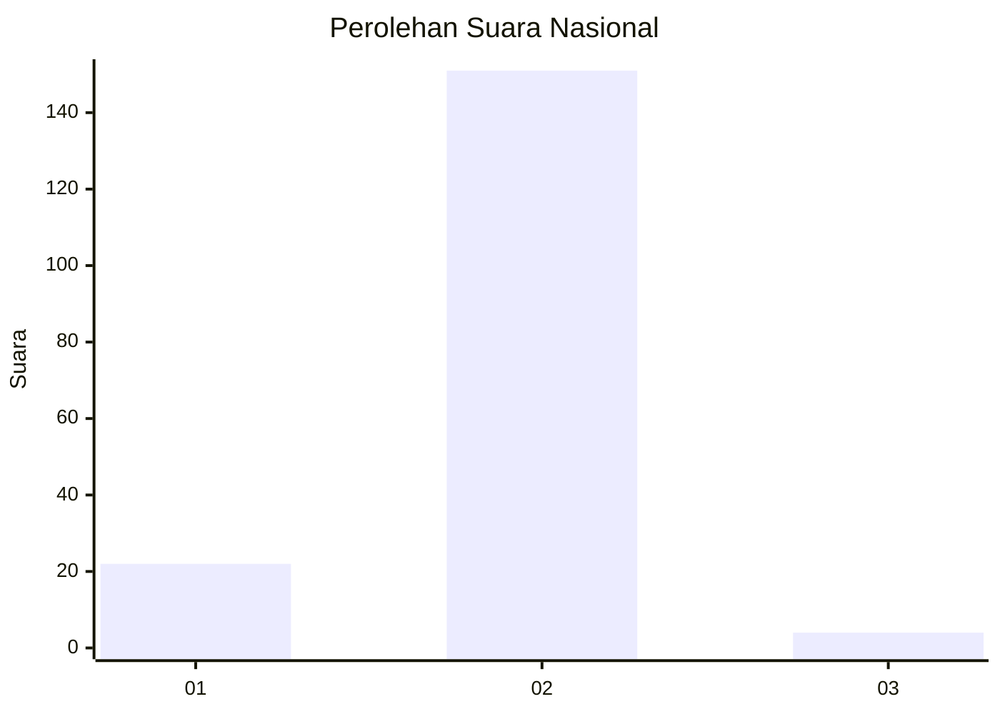
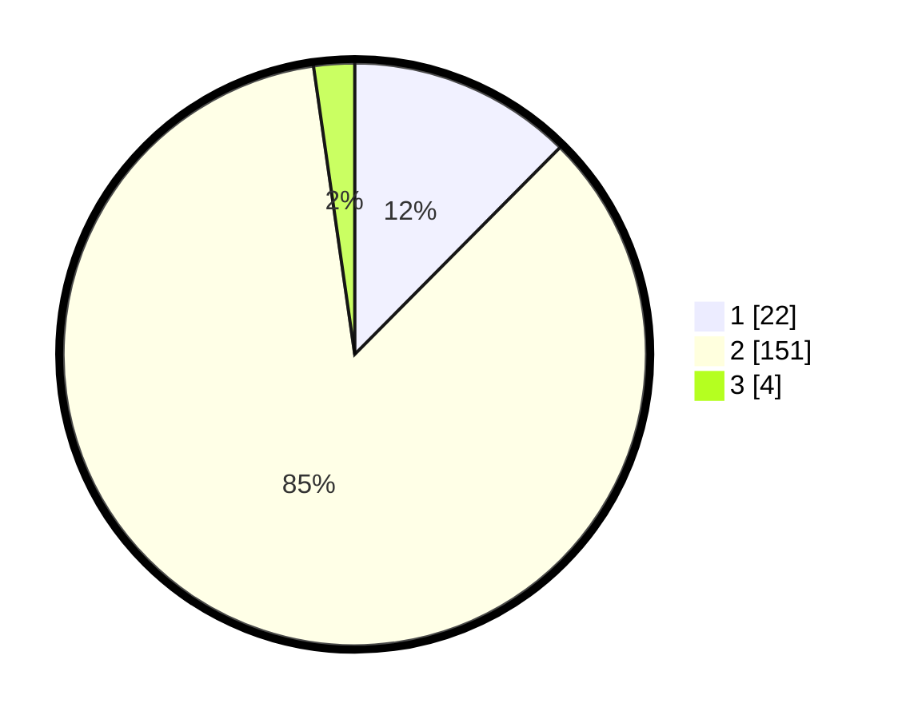

# Hasil

## Grafik

## Tabel

| No. | Nama Paslon    | Suara | Suara (raw) | Persentase |
|:--- |:-------------- | -----:| -----------:| ----------:|
| 1   | ANIES MUHAIMIN | 22    | [22][p-1]   | 12,43      |
| 2   | PRABOWO GIBRAN | 151   | [151][p-2]  | 85,31      |
| 3   | GANJAR MAHFUD  | 4     | [4][p-3]    | 2,26       |

[p-1]: https://github.com/gigit-pemilu/pemilu-2024/blob/main/pilpres/hitung-suara/sub/52-nusa-tenggara-barat/sub/01-lombok-barat/sub/13-lembar/sub/2001-lembar/sub/001-tps/sub/paslon-1.txt
[p-2]: https://github.com/gigit-pemilu/pemilu-2024/blob/main/pilpres/hitung-suara/sub/52-nusa-tenggara-barat/sub/01-lombok-barat/sub/13-lembar/sub/2001-lembar/sub/001-tps/sub/paslon-2.txt
[p-3]: https://github.com/gigit-pemilu/pemilu-2024/blob/main/pilpres/hitung-suara/sub/52-nusa-tenggara-barat/sub/01-lombok-barat/sub/13-lembar/sub/2001-lembar/sub/001-tps/sub/paslon-3.txt

## Foto C Plano

https://sirekap-obj-formc.kpu.go.id/4a3a/pemilu/ppwp/52/01/13/20/01/5201132001001-20240215-000305--3e603087-28ba-462d-a45d-65ff1b216382.jpg

https://sirekap-obj-formc.kpu.go.id/4a3a/pemilu/ppwp/52/01/13/20/01/5201132001001-20240215-000554--8c6e2cd8-416d-4be1-a2c8-7af18ff25f31.jpg

https://sirekap-obj-formc.kpu.go.id/4a3a/pemilu/ppwp/52/01/13/20/01/5201132001001-20240215-000810--d64869a1-eb0e-4324-a84b-41bdd58be6d3.jpg

## Metadata

| Key        | Value               |
| ---------- | ------------------- |
| Time Stamp | 2024-02-15 12:00:28 |

