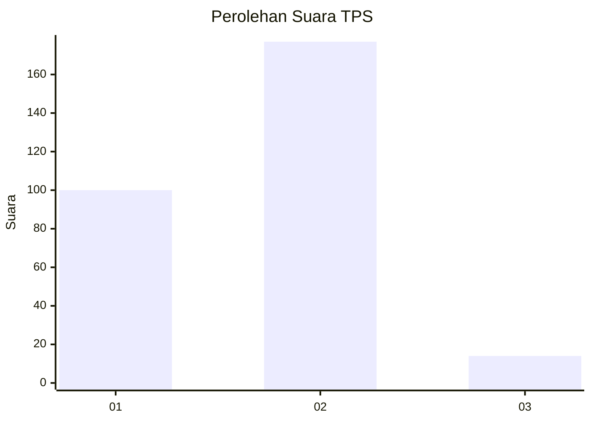
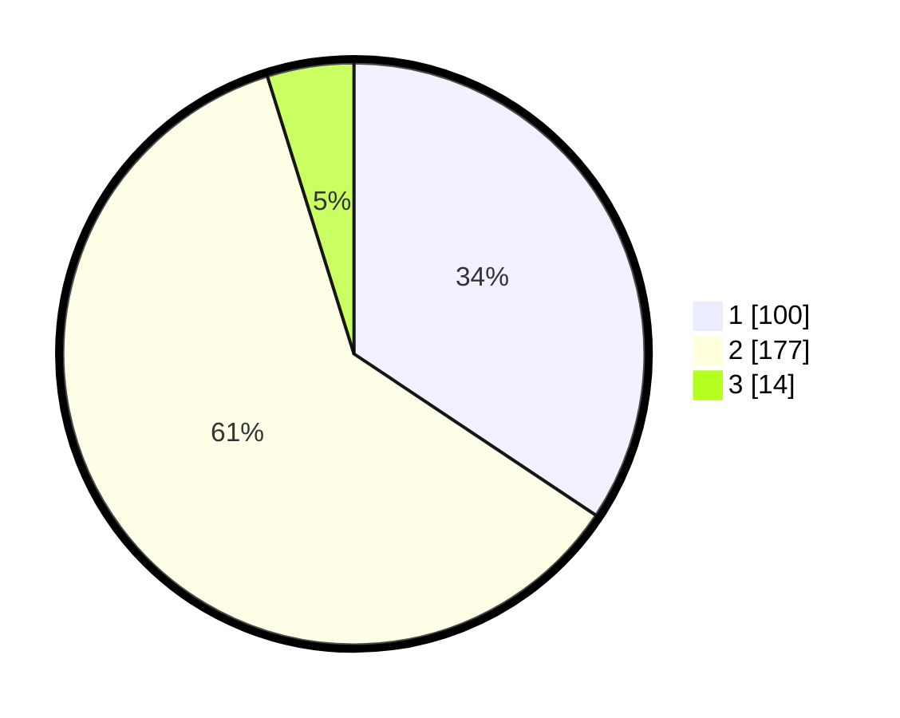

# Hasil

## Grafik

## Tabel

| No. | Nama Paslon    | Suara | Suara (raw) | Persentase |
|:--- |:-------------- | -----:| -----------:| ----------:|
| 1   | ANIES MUHAIMIN | 100   | [100][p-1]  | 34,36      |
| 2   | PRABOWO GIBRAN | 177   | [177][p-2]  | 60,82      |
| 3   | GANJAR MAHFUD  | 14    | [14][p-3]   | 4,81       |

[p-1]: https://github.com/gigit-pemilu/pemilu-2024-52-nusa-tenggara-barat/blob/main/pilpres/hitung-suara/sub/52-nusa-tenggara-barat/sub/01-lombok-barat/sub/13-lembar/sub/2008-mareje-timur/sub/001-tps/sub/paslon-1.txt
[p-2]: https://github.com/gigit-pemilu/pemilu-2024-52-nusa-tenggara-barat/blob/main/pilpres/hitung-suara/sub/52-nusa-tenggara-barat/sub/01-lombok-barat/sub/13-lembar/sub/2008-mareje-timur/sub/001-tps/sub/paslon-2.txt
[p-3]: https://github.com/gigit-pemilu/pemilu-2024-52-nusa-tenggara-barat/blob/main/pilpres/hitung-suara/sub/52-nusa-tenggara-barat/sub/01-lombok-barat/sub/13-lembar/sub/2008-mareje-timur/sub/001-tps/sub/paslon-3.txt

## Foto C Plano

https://sirekap-obj-formc.kpu.go.id/33d6/pemilu/ppwp/52/01/13/20/08/5201132008001-20240314-113953--f9f91bf3-7b77-4032-aea8-c5a5961ac86b.jpg

https://sirekap-obj-formc.kpu.go.id/33d6/pemilu/ppwp/52/01/13/20/08/5201132008001-20240314-104545--197e949b-e598-41c6-8041-8b256b22ec14.jpg

https://sirekap-obj-formc.kpu.go.id/33d6/pemilu/ppwp/52/01/13/20/08/5201132008001-20240314-104611--5f408083-16c0-460a-988c-8f30d762f51f.jpg

## Metadata

| Key        | Value               |
| ---------- | ------------------- |
| Time Stamp | 2024-03-14 12:30:00 |

## DATA PEMILIH TETAP

Jumlah pemilih dalam DPT: **0**.
 * L: **500**.
 * P: **0**.

## DATA PENGGUNA HAK PILIH

Jumlah pengguna hak pilih dalam DPT: **0**.
 * L: **475**.
 * P: **0**.

Jumlah pengguna hak pilih dalam DPTb: **0**.
 * L: **445**.
 * P: **0**.

Jumlah pengguna hak pilih dalam DPK: **295**.
 * L: **455**.
 * P: **145**.

Jumlah pengguna hak pilih: **0**.
 * L: **0**.
 * P: **0**.

## JUMLAH SUARA SAH DAN TIDAK SAH

JUMLAH SELURUH SUARA SAH: **299**.

JUMLAH SUARA TIDAK SAH: **55**.

JUMLAH SELURUH SUARA SAH DAN SUARA TIDAK SAH: **237**.

