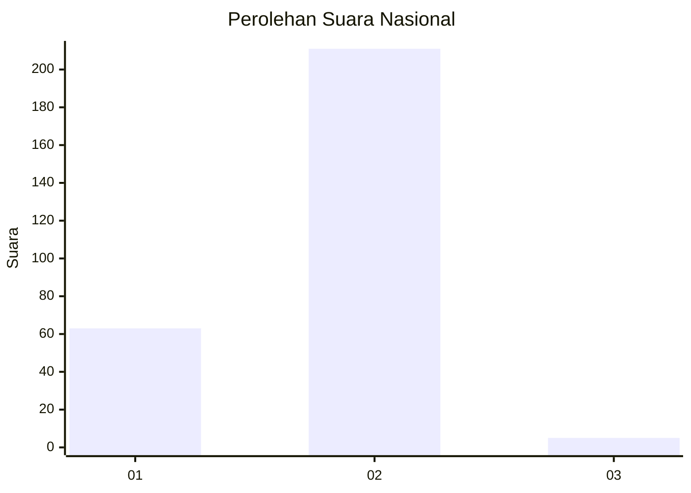
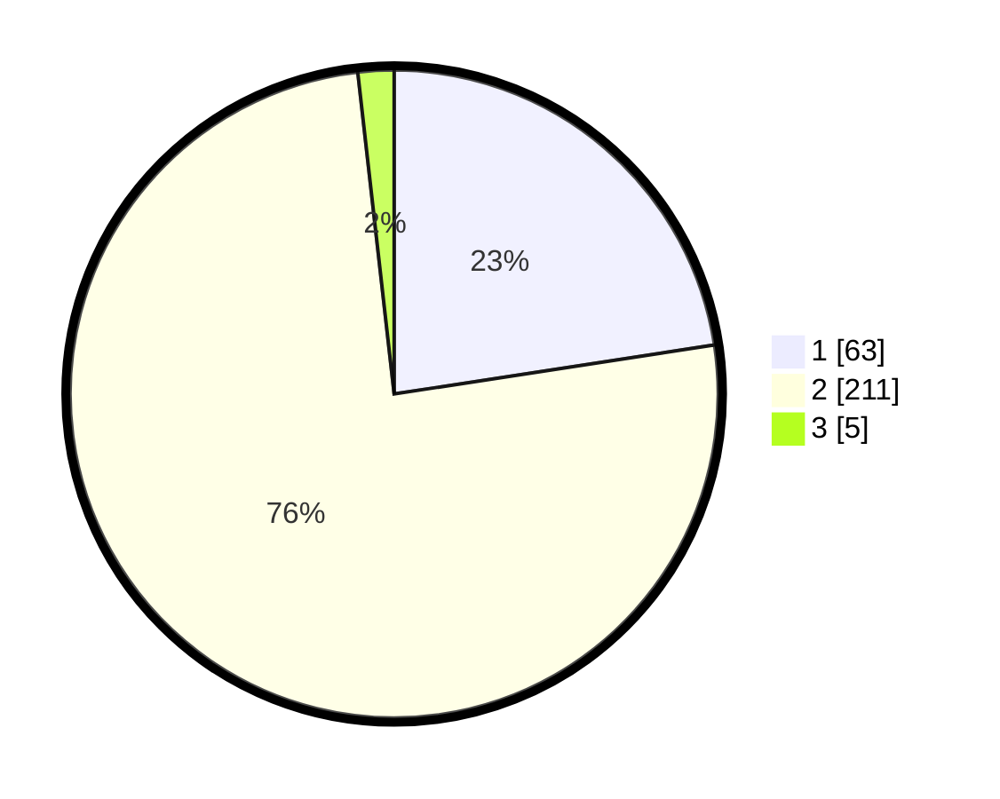

# Hasil

## Grafik

## Tabel

| No. | Nama Paslon    | Suara | Suara (raw) | Persentase |
|:--- |:-------------- | -----:| -----------:| ----------:|
| 1   | ANIES MUHAIMIN | 63    | [63][p-1]   | 22,58      |
| 2   | PRABOWO GIBRAN | 211   | [211][p-2]  | 75,63      |
| 3   | GANJAR MAHFUD  | 5     | [5][p-3]    | 1,79       |

[p-1]: https://github.com/gigit-pemilu/pemilu-2024/blob/main/pilpres/hitung-suara/sub/52-nusa-tenggara-barat/sub/01-lombok-barat/sub/13-lembar/sub/2008-mareje-timur/sub/004-tps/sub/paslon-1.txt
[p-2]: https://github.com/gigit-pemilu/pemilu-2024/blob/main/pilpres/hitung-suara/sub/52-nusa-tenggara-barat/sub/01-lombok-barat/sub/13-lembar/sub/2008-mareje-timur/sub/004-tps/sub/paslon-2.txt
[p-3]: https://github.com/gigit-pemilu/pemilu-2024/blob/main/pilpres/hitung-suara/sub/52-nusa-tenggara-barat/sub/01-lombok-barat/sub/13-lembar/sub/2008-mareje-timur/sub/004-tps/sub/paslon-3.txt

## Foto C Plano

https://sirekap-obj-formc.kpu.go.id/fc13/pemilu/ppwp/52/01/13/20/08/5201132008004-20240314-114304--4518c387-41ed-4b53-8986-ffc97d0b1861.jpg

https://sirekap-obj-formc.kpu.go.id/fc13/pemilu/ppwp/52/01/13/20/08/5201132008004-20240314-105012--1a461456-151e-400b-be7a-3ccfd0d0c7a0.jpg

https://sirekap-obj-formc.kpu.go.id/fc13/pemilu/ppwp/52/01/13/20/08/5201132008004-20240314-114442--f36ca682-5a39-4fc2-abca-1fb05a765543.jpg

## Metadata

| Key        | Value               |
| ---------- | ------------------- |
| Time Stamp | 2024-03-14 13:00:00 |

## DATA PEMILIH TETAP

Jumlah pemilih dalam DPT: **381**.
 * L: **850**.
 * P: **281**.

## DATA PENGGUNA HAK PILIH

Jumlah pengguna hak pilih dalam DPT: **472**.
 * L: **831**.
 * P: **361**.

Jumlah pengguna hak pilih dalam DPTb: **0**.
 * L: **0**.
 * P: **0**.

Jumlah pengguna hak pilih dalam DPK: **0**.
 * L: **0**.
 * P: **0**.

Jumlah pengguna hak pilih: **361**.
 * L: **472**.
 * P: **831**.

## JUMLAH SUARA SAH DAN TIDAK SAH

JUMLAH SELURUH SUARA SAH: **279**.

JUMLAH SUARA TIDAK SAH: **4**.

JUMLAH SELURUH SUARA SAH DAN SUARA TIDAK SAH: **287**.

