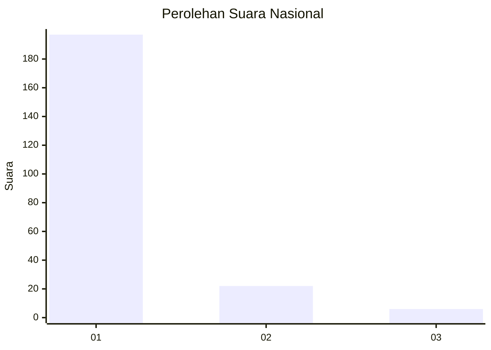
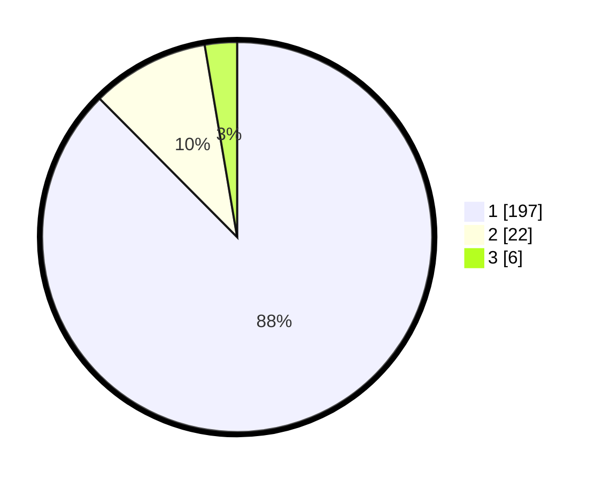

# Hasil

## Grafik

## Tabel

| No. | Nama Paslon    | Suara | Suara (raw) | Persentase |
|:--- |:-------------- | -----:| -----------:| ----------:|
| 1   | ANIES MUHAIMIN | 197   | [197][p-1]  | 87,56      |
| 2   | PRABOWO GIBRAN | 22    | [22][p-2]   | 9,78       |
| 3   | GANJAR MAHFUD  | 6     | [6][p-3]    | 2,67       |

[p-1]: https://github.com/gigit-pemilu/pemilu-2024/blob/main/pilpres/hitung-suara/sub/52-nusa-tenggara-barat/sub/01-lombok-barat/sub/14-batu-layar/sub/2001-batulayar/sub/002-tps/sub/paslon-1.txt
[p-2]: https://github.com/gigit-pemilu/pemilu-2024/blob/main/pilpres/hitung-suara/sub/52-nusa-tenggara-barat/sub/01-lombok-barat/sub/14-batu-layar/sub/2001-batulayar/sub/002-tps/sub/paslon-2.txt
[p-3]: https://github.com/gigit-pemilu/pemilu-2024/blob/main/pilpres/hitung-suara/sub/52-nusa-tenggara-barat/sub/01-lombok-barat/sub/14-batu-layar/sub/2001-batulayar/sub/002-tps/sub/paslon-3.txt

## Foto C Plano

https://sirekap-obj-formc.kpu.go.id/16d2/pemilu/ppwp/52/01/14/20/01/5201142001002-20240215-141222--9790a9b7-fcc4-4fe4-b252-35e8cfeab0bd.jpg

https://sirekap-obj-formc.kpu.go.id/16d2/pemilu/ppwp/52/01/14/20/01/5201142001002-20240215-164247--9c8dc22c-9a24-4f44-92ff-22d7a251a838.jpg

https://sirekap-obj-formc.kpu.go.id/16d2/pemilu/ppwp/52/01/14/20/01/5201142001002-20240215-164637--9b3b820a-a8b6-40e5-9448-bface89ef151.jpg

## Metadata

| Key        | Value               |
| ---------- | ------------------- |
| Time Stamp | 2024-02-24 22:31:28 |

