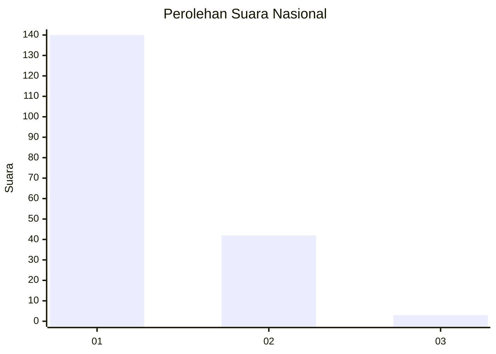
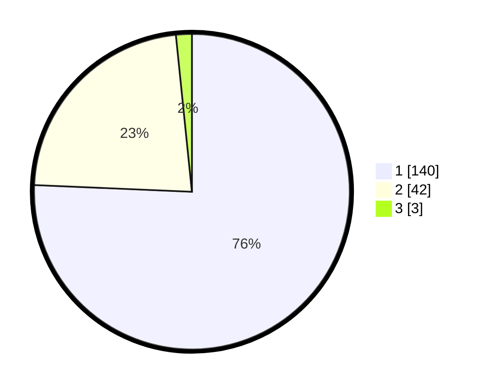

# Hasil

## Grafik

## Tabel

| No. | Nama Paslon    | Suara | Suara (raw) | Persentase |
|:--- |:-------------- | -----:| -----------:| ----------:|
| 1   | ANIES MUHAIMIN | 140   | [140][p-1]  | 75,68      |
| 2   | PRABOWO GIBRAN | 42    | [42][p-2]   | 22,70      |
| 3   | GANJAR MAHFUD  | 3     | [3][p-3]    | 1,62       |

[p-1]: https://github.com/gigit-pemilu/pemilu-2024/blob/main/pilpres/hitung-suara/sub/52-nusa-tenggara-barat/sub/02-lombok-tengah/sub/01-praya/sub/2013-jago/sub/033-tps/sub/paslon-1.txt
[p-2]: https://github.com/gigit-pemilu/pemilu-2024/blob/main/pilpres/hitung-suara/sub/52-nusa-tenggara-barat/sub/02-lombok-tengah/sub/01-praya/sub/2013-jago/sub/033-tps/sub/paslon-2.txt
[p-3]: https://github.com/gigit-pemilu/pemilu-2024/blob/main/pilpres/hitung-suara/sub/52-nusa-tenggara-barat/sub/02-lombok-tengah/sub/01-praya/sub/2013-jago/sub/033-tps/sub/paslon-3.txt

## Foto C Plano

https://sirekap-obj-formc.kpu.go.id/bea6/pemilu/ppwp/52/02/01/20/13/5202012013033-20240214-231057--a8b7bad7-56a0-47c7-b9c0-b3f1f1f479d7.jpg

https://sirekap-obj-formc.kpu.go.id/bea6/pemilu/ppwp/52/02/01/20/13/5202012013033-20240215-002420--bbfcef08-c855-404e-b838-2357dffabd8b.jpg

https://sirekap-obj-formc.kpu.go.id/bea6/pemilu/ppwp/52/02/01/20/13/5202012013033-20240214-211016--d241803d-f0b4-41a3-8ccd-ce9bc3f4f164.jpg

## Metadata

| Key        | Value               |
| ---------- | ------------------- |
| Time Stamp | 2024-02-17 14:45:18 |

