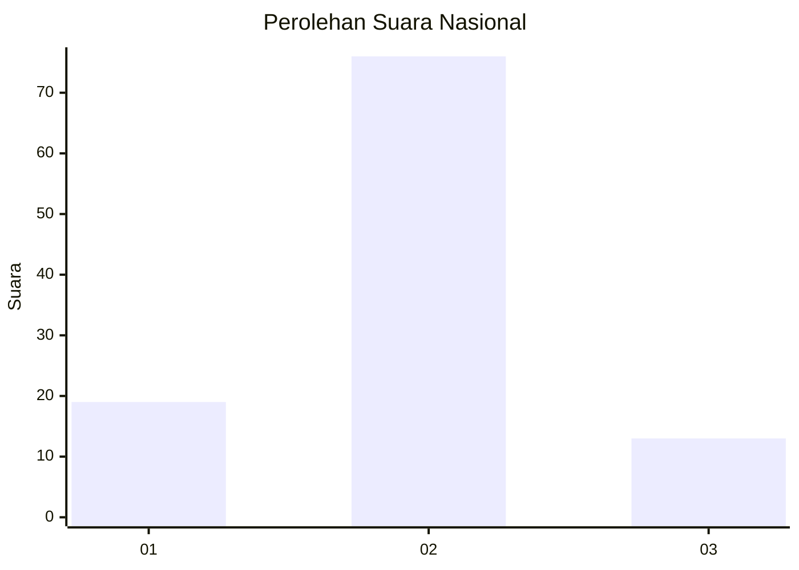
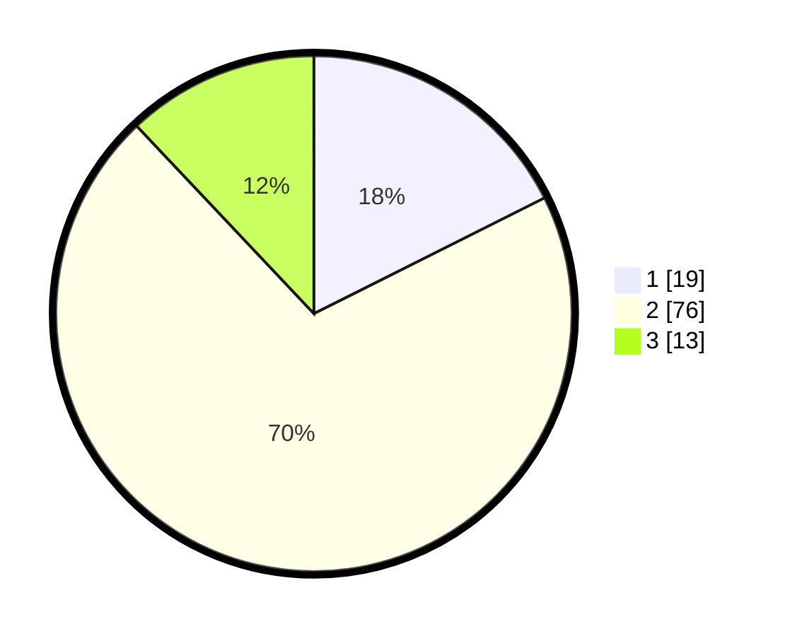

# Hasil

## Grafik

## Tabel

| No. | Nama Paslon    | Suara | Suara (raw) | Persentase |
|:--- |:-------------- | -----:| -----------:| ----------:|
| 1   | ANIES MUHAIMIN | 19    | [19][p-1]   | 17,59      |
| 2   | PRABOWO GIBRAN | 76    | [76][p-2]   | 70,37      |
| 3   | GANJAR MAHFUD  | 13    | [13][p-3]   | 12,04      |

[p-1]: https://github.com/gigit-pemilu/pemilu-2024/blob/main/pilpres/hitung-suara/sub/52-nusa-tenggara-barat/sub/02-lombok-tengah/sub/03-batukliang/sub/2001-bujak/sub/004-tps/sub/paslon-1.txt
[p-2]: https://github.com/gigit-pemilu/pemilu-2024/blob/main/pilpres/hitung-suara/sub/52-nusa-tenggara-barat/sub/02-lombok-tengah/sub/03-batukliang/sub/2001-bujak/sub/004-tps/sub/paslon-2.txt
[p-3]: https://github.com/gigit-pemilu/pemilu-2024/blob/main/pilpres/hitung-suara/sub/52-nusa-tenggara-barat/sub/02-lombok-tengah/sub/03-batukliang/sub/2001-bujak/sub/004-tps/sub/paslon-3.txt

## Foto C Plano

https://sirekap-obj-formc.kpu.go.id/7e08/pemilu/ppwp/52/02/03/20/01/5202032001004-20240214-224849--f26a5078-a7ad-4d3b-8893-ff53404dbb3c.jpg

https://sirekap-obj-formc.kpu.go.id/7e08/pemilu/ppwp/52/02/03/20/01/5202032001004-20240214-224922--7dcd4261-ebde-4b2f-97e7-f7be43904d87.jpg

https://sirekap-obj-formc.kpu.go.id/7e08/pemilu/ppwp/52/02/03/20/01/5202032001004-20240214-224953--4100aebe-ffa6-4a15-bdd3-54b9ec24f3d7.jpg

## Metadata

| Key        | Value               |
| ---------- | ------------------- |
| Time Stamp | 2024-02-17 17:30:00 |

