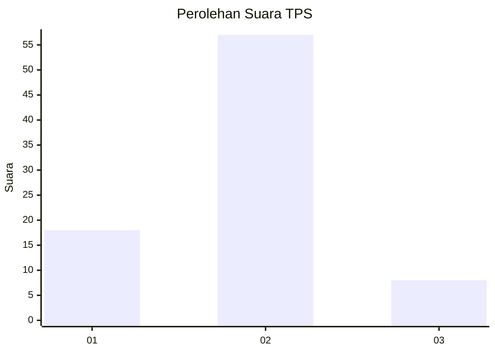

# Hasil

## Grafik

## Tabel

| No. | Nama Paslon    | Suara | Suara (raw) | Persentase |
|:--- |:-------------- | -----:| -----------:| ----------:|
| 1   | ANIES MUHAIMIN | 18    | [18][p-1]   | 21,69      |
| 2   | PRABOWO GIBRAN | 57    | [57][p-2]   | 68,67      |
| 3   | GANJAR MAHFUD  | 8     | [8][p-3]    | 9,64       |

[p-1]: https://github.com/gigit-pemilu/pemilu-2024-52-nusa-tenggara-barat/blob/main/pilpres/hitung-suara/sub/52-nusa-tenggara-barat/sub/02-lombok-tengah/sub/03-batukliang/sub/2001-bujak/sub/034-tps/sub/paslon-1.txt
[p-2]: https://github.com/gigit-pemilu/pemilu-2024-52-nusa-tenggara-barat/blob/main/pilpres/hitung-suara/sub/52-nusa-tenggara-barat/sub/02-lombok-tengah/sub/03-batukliang/sub/2001-bujak/sub/034-tps/sub/paslon-2.txt
[p-3]: https://github.com/gigit-pemilu/pemilu-2024-52-nusa-tenggara-barat/blob/main/pilpres/hitung-suara/sub/52-nusa-tenggara-barat/sub/02-lombok-tengah/sub/03-batukliang/sub/2001-bujak/sub/034-tps/sub/paslon-3.txt

## Foto C Plano

https://sirekap-obj-formc.kpu.go.id/6f09/pemilu/ppwp/52/02/03/20/01/5202032001034-20240214-213320--19e2898b-2b4c-4cfb-884a-066e36beb604.jpg

https://sirekap-obj-formc.kpu.go.id/6f09/pemilu/ppwp/52/02/03/20/01/5202032001034-20240214-213429--2fb7e25f-f790-42d4-b32d-681d257d34d7.jpg

https://sirekap-obj-formc.kpu.go.id/6f09/pemilu/ppwp/52/02/03/20/01/5202032001034-20240214-213547--557e0f65-7fdd-4c6c-97a3-423d12e7def4.jpg

## Metadata

| Key        | Value               |
| ---------- | ------------------- |
| Time Stamp | 2024-02-17 17:30:00 |

