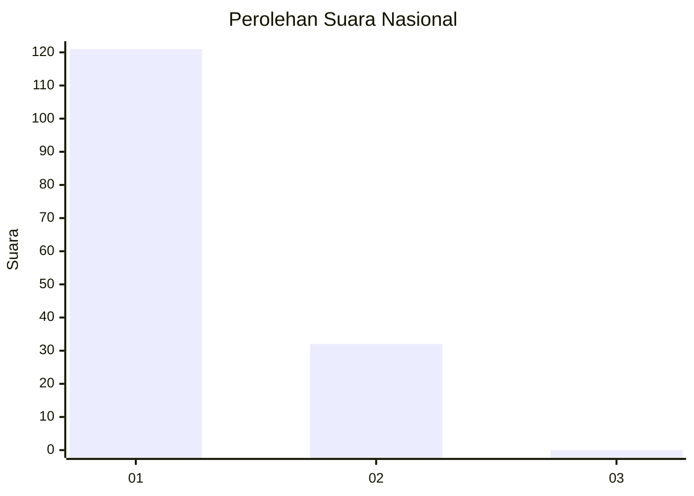
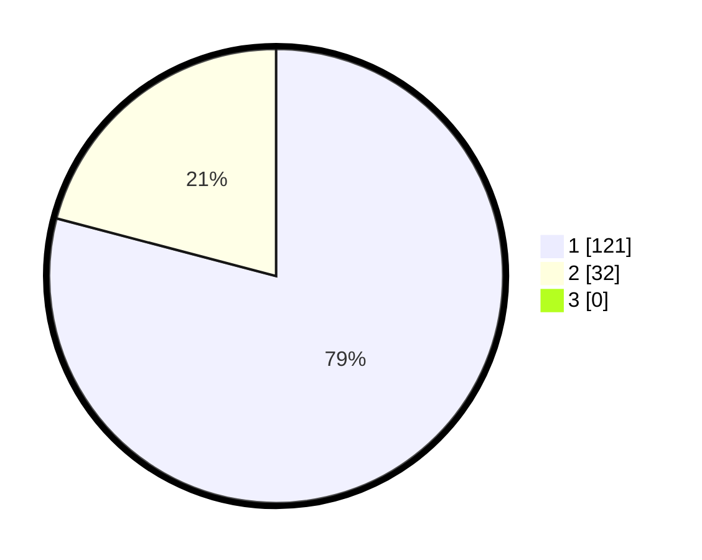

# Hasil

## Grafik

## Tabel

| No. | Nama Paslon    | Suara | Suara (raw) | Persentase |
|:--- |:-------------- | -----:| -----------:| ----------:|
| 1   | ANIES MUHAIMIN | 121   | [121][p-1]  | 79,08      |
| 2   | PRABOWO GIBRAN | 32    | [32][p-2]   | 20,92      |
| 3   | GANJAR MAHFUD  | 0     | [0][p-3]    | 0,00       |

[p-1]: https://github.com/gigit-pemilu/pemilu-2024/blob/main/pilpres/hitung-suara/sub/52-nusa-tenggara-barat/sub/02-lombok-tengah/sub/03-batukliang/sub/2005-aik-darek/sub/007-tps/sub/paslon-1.txt
[p-2]: https://github.com/gigit-pemilu/pemilu-2024/blob/main/pilpres/hitung-suara/sub/52-nusa-tenggara-barat/sub/02-lombok-tengah/sub/03-batukliang/sub/2005-aik-darek/sub/007-tps/sub/paslon-2.txt
[p-3]: https://github.com/gigit-pemilu/pemilu-2024/blob/main/pilpres/hitung-suara/sub/52-nusa-tenggara-barat/sub/02-lombok-tengah/sub/03-batukliang/sub/2005-aik-darek/sub/007-tps/sub/paslon-3.txt

## Foto C Plano

https://sirekap-obj-formc.kpu.go.id/1b23/pemilu/ppwp/52/02/03/20/05/5202032005007-20240214-233722--93a63794-a9c2-44f5-8809-94e0ad2abd51.jpg

https://sirekap-obj-formc.kpu.go.id/1b23/pemilu/ppwp/52/02/03/20/05/5202032005007-20240214-233950--0969af1e-ec53-454a-9698-77f2e0aea3ca.jpg

https://sirekap-obj-formc.kpu.go.id/1b23/pemilu/ppwp/52/02/03/20/05/5202032005007-20240214-233853--bf856fb8-d45b-42c2-a419-9b49621077e0.jpg

## Metadata

| Key        | Value               |
| ---------- | ------------------- |
| Time Stamp | 2024-02-17 19:00:04 |

