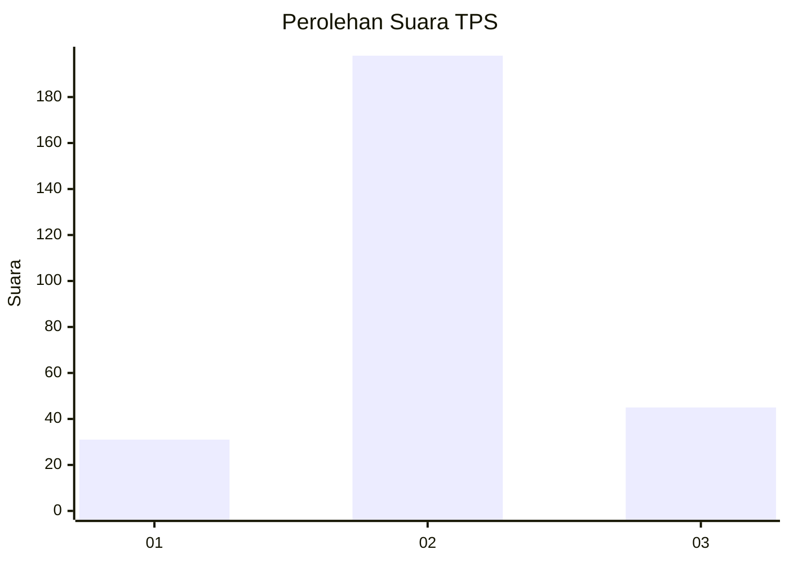
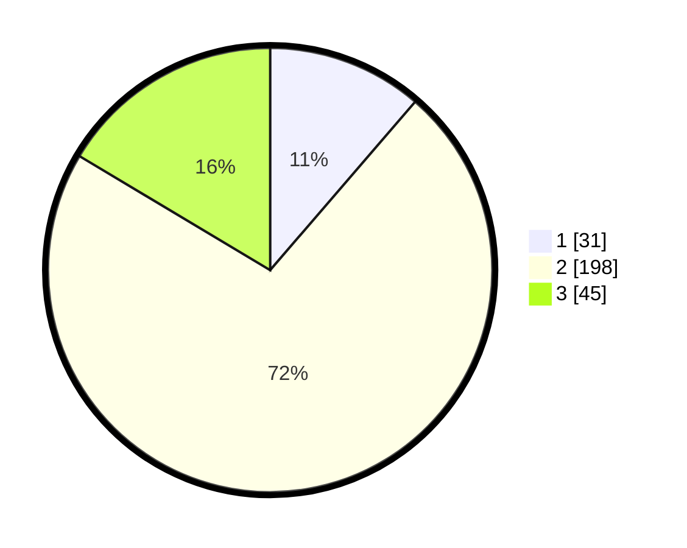

# Hasil

## Grafik

## Tabel

| No. | Nama Paslon    | Suara | Suara (raw) | Persentase |
|:--- |:-------------- | -----:| -----------:| ----------:|
| 1   | ANIES MUHAIMIN | 31    | [31][p-1]   | 11,31      |
| 2   | PRABOWO GIBRAN | 198   | [198][p-2]  | 72,26      |
| 3   | GANJAR MAHFUD  | 45    | [45][p-3]   | 16,42      |

[p-1]: https://github.com/gigit-pemilu/pemilu-2024-52-nusa-tenggara-barat/blob/main/pilpres/hitung-suara/sub/52-nusa-tenggara-barat/sub/02-lombok-tengah/sub/04-pujut/sub/2008-rembitan/sub/024-tps/sub/paslon-1.txt
[p-2]: https://github.com/gigit-pemilu/pemilu-2024-52-nusa-tenggara-barat/blob/main/pilpres/hitung-suara/sub/52-nusa-tenggara-barat/sub/02-lombok-tengah/sub/04-pujut/sub/2008-rembitan/sub/024-tps/sub/paslon-2.txt
[p-3]: https://github.com/gigit-pemilu/pemilu-2024-52-nusa-tenggara-barat/blob/main/pilpres/hitung-suara/sub/52-nusa-tenggara-barat/sub/02-lombok-tengah/sub/04-pujut/sub/2008-rembitan/sub/024-tps/sub/paslon-3.txt

## Foto C Plano

https://sirekap-obj-formc.kpu.go.id/2a72/pemilu/ppwp/52/02/04/20/08/5202042008024-20240214-205431--65c22d9d-ef80-4035-8e96-b5e67fd9eea9.jpg

https://sirekap-obj-formc.kpu.go.id/2a72/pemilu/ppwp/52/02/04/20/08/5202042008024-20240214-205528--f437a1a2-d281-4694-8a17-b0b73f0a78e5.jpg

https://sirekap-obj-formc.kpu.go.id/2a72/pemilu/ppwp/52/02/04/20/08/5202042008024-20240214-210331--9eab1932-5767-47fd-927f-7358ac857dfb.jpg

## Metadata

| Key        | Value               |
| ---------- | ------------------- |
| Time Stamp | 2024-02-21 18:00:00 |

