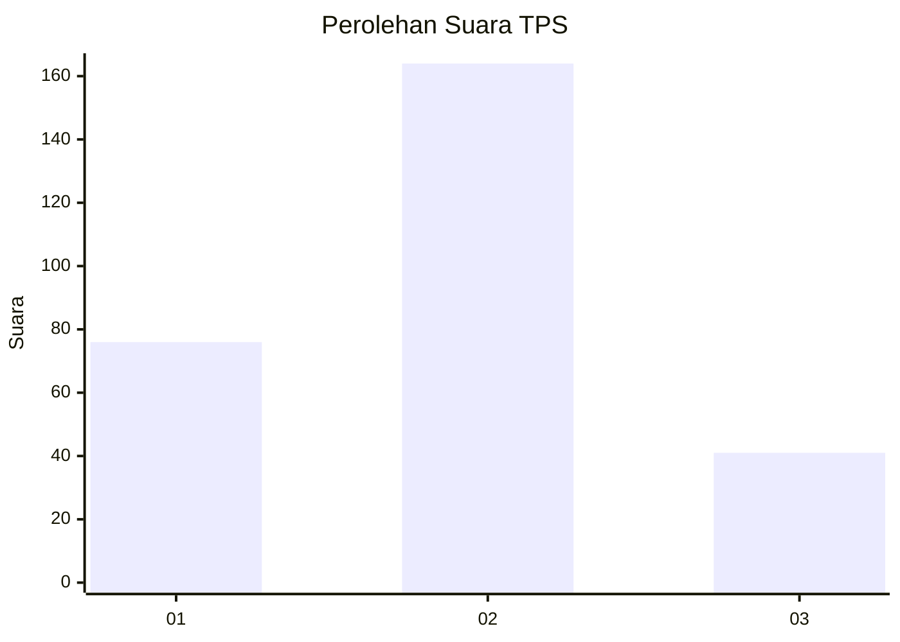
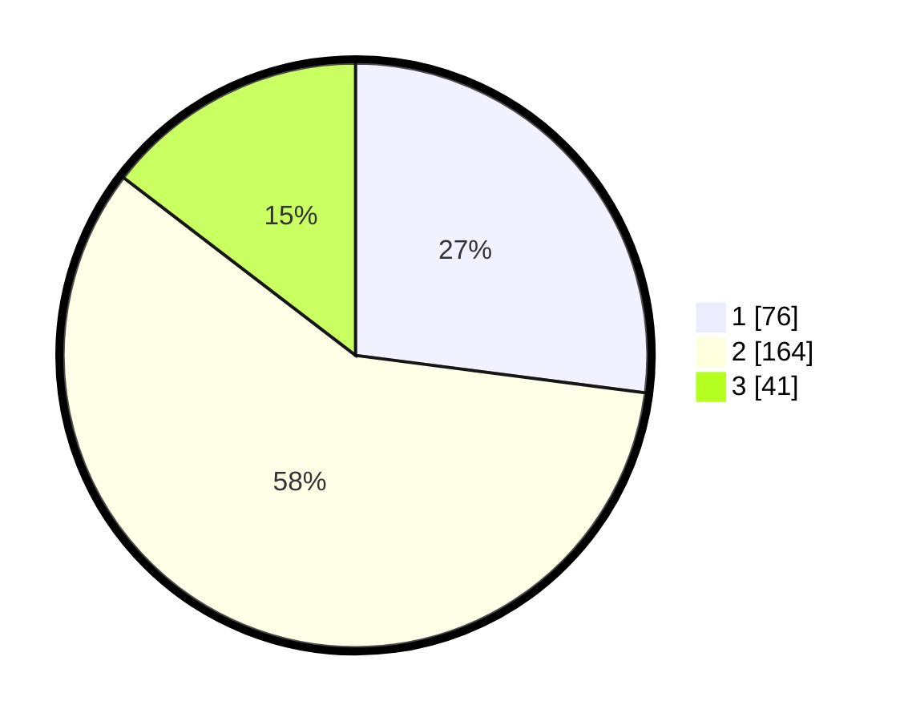

# Hasil

## Grafik

## Tabel

| No. | Nama Paslon    | Suara | Suara (raw) | Persentase |
|:--- |:-------------- | -----:| -----------:| ----------:|
| 1   | ANIES MUHAIMIN | 76    | [76][p-1]   | 27,05      |
| 2   | PRABOWO GIBRAN | 164   | [164][p-2]  | 58,36      |
| 3   | GANJAR MAHFUD  | 41    | [41][p-3]   | 14,59      |

[p-1]: https://github.com/gigit-pemilu/pemilu-2024-52-nusa-tenggara-barat/blob/main/pilpres/hitung-suara/sub/52-nusa-tenggara-barat/sub/02-lombok-tengah/sub/04-pujut/sub/2009-kuta/sub/006-tps/sub/paslon-1.txt
[p-2]: https://github.com/gigit-pemilu/pemilu-2024-52-nusa-tenggara-barat/blob/main/pilpres/hitung-suara/sub/52-nusa-tenggara-barat/sub/02-lombok-tengah/sub/04-pujut/sub/2009-kuta/sub/006-tps/sub/paslon-2.txt
[p-3]: https://github.com/gigit-pemilu/pemilu-2024-52-nusa-tenggara-barat/blob/main/pilpres/hitung-suara/sub/52-nusa-tenggara-barat/sub/02-lombok-tengah/sub/04-pujut/sub/2009-kuta/sub/006-tps/sub/paslon-3.txt

## Foto C Plano

https://sirekap-obj-formc.kpu.go.id/db0a/pemilu/ppwp/52/02/04/20/09/5202042009006-20240215-074323--0448cfa4-80b6-4339-a596-86a0eed145a1.jpg

https://sirekap-obj-formc.kpu.go.id/db0a/pemilu/ppwp/52/02/04/20/09/5202042009006-20240215-074637--157e8f83-bc13-4e87-b132-c78ec4c1c95c.jpg

https://sirekap-obj-formc.kpu.go.id/db0a/pemilu/ppwp/52/02/04/20/09/5202042009006-20240215-074900--d32b840a-a0cf-462e-be20-15a27afade33.jpg

## Metadata

| Key        | Value               |
| ---------- | ------------------- |
| Time Stamp | 2024-02-19 06:16:00 |

