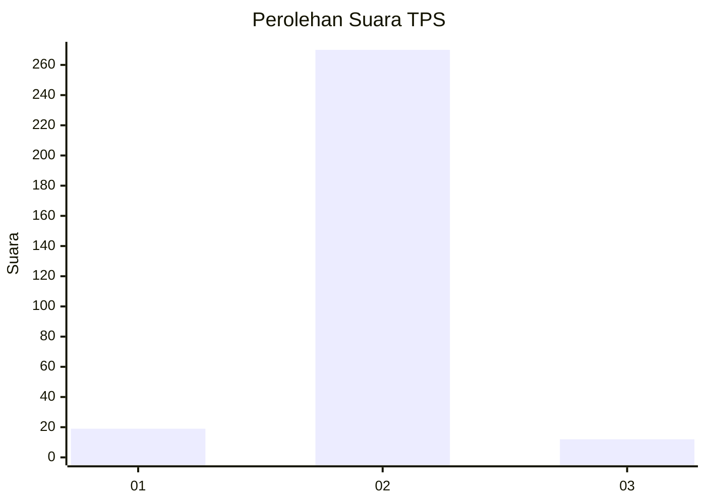
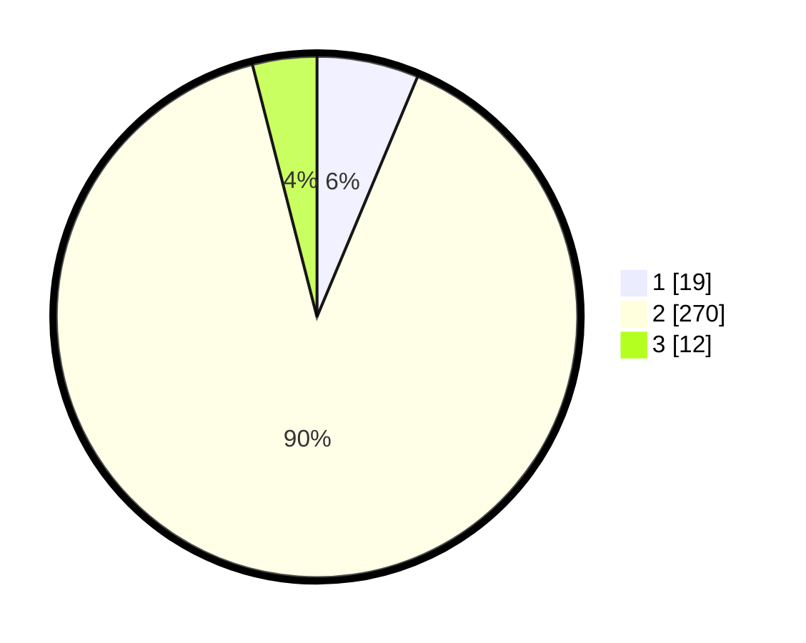

# Hasil

## Grafik

## Tabel

| No. | Nama Paslon    | Suara | Suara (raw) | Persentase |
|:--- |:-------------- | -----:| -----------:| ----------:|
| 1   | ANIES MUHAIMIN | 19    | [19][p-1]   | 6,31       |
| 2   | PRABOWO GIBRAN | 270   | [270][p-2]  | 89,70      |
| 3   | GANJAR MAHFUD  | 12    | [12][p-3]   | 3,99       |

[p-1]: https://github.com/gigit-pemilu/pemilu-2024-52-nusa-tenggara-barat/blob/main/pilpres/hitung-suara/sub/52-nusa-tenggara-barat/sub/02-lombok-tengah/sub/04-pujut/sub/2010-pengembur/sub/010-tps/sub/paslon-1.txt
[p-2]: https://github.com/gigit-pemilu/pemilu-2024-52-nusa-tenggara-barat/blob/main/pilpres/hitung-suara/sub/52-nusa-tenggara-barat/sub/02-lombok-tengah/sub/04-pujut/sub/2010-pengembur/sub/010-tps/sub/paslon-2.txt
[p-3]: https://github.com/gigit-pemilu/pemilu-2024-52-nusa-tenggara-barat/blob/main/pilpres/hitung-suara/sub/52-nusa-tenggara-barat/sub/02-lombok-tengah/sub/04-pujut/sub/2010-pengembur/sub/010-tps/sub/paslon-3.txt

## Foto C Plano

https://sirekap-obj-formc.kpu.go.id/22d7/pemilu/ppwp/52/02/04/20/10/5202042010010-20240215-081011--a15c1810-9c6d-4e32-a96b-6aef71e87577.jpg

https://sirekap-obj-formc.kpu.go.id/22d7/pemilu/ppwp/52/02/04/20/10/5202042010010-20240215-081310--3f938666-6315-43f6-8041-282b9e22f6c8.jpg

https://sirekap-obj-formc.kpu.go.id/22d7/pemilu/ppwp/52/02/04/20/10/5202042010010-20240215-081418--e86bdb43-6dc2-447d-bf16-ef6b21c7d983.jpg

## Metadata

| Key        | Value               |
| ---------- | ------------------- |
| Time Stamp | 2024-02-17 16:36:25 |

