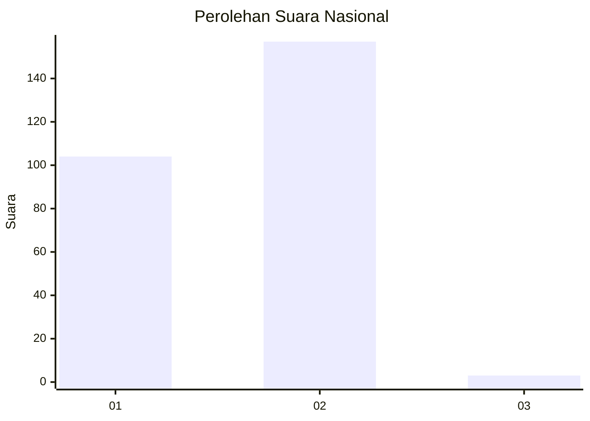
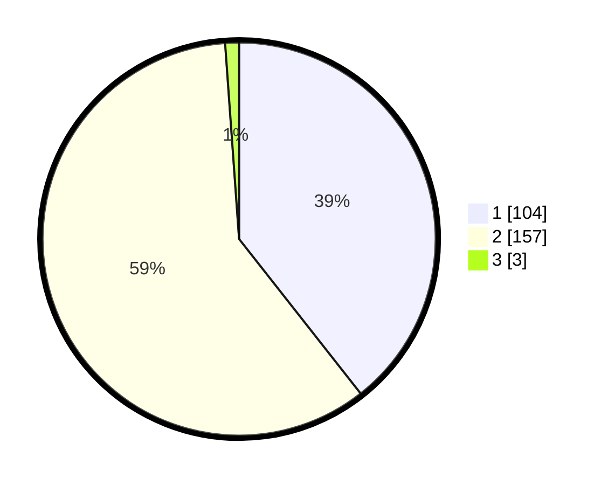

# Hasil

## Grafik

## Tabel

| No. | Nama Paslon    | Suara | Suara (raw) | Persentase |
|:--- |:-------------- | -----:| -----------:| ----------:|
| 1   | ANIES MUHAIMIN | 104   | [104][p-1]  | 39,39      |
| 2   | PRABOWO GIBRAN | 157   | [157][p-2]  | 59,47      |
| 3   | GANJAR MAHFUD  | 3     | [3][p-3]    | 1,14       |

[p-1]: https://github.com/gigit-pemilu/pemilu-2024/blob/main/pilpres/hitung-suara/sub/52-nusa-tenggara-barat/sub/02-lombok-tengah/sub/04-pujut/sub/2014-tanak-awu/sub/022-tps/sub/paslon-1.txt
[p-2]: https://github.com/gigit-pemilu/pemilu-2024/blob/main/pilpres/hitung-suara/sub/52-nusa-tenggara-barat/sub/02-lombok-tengah/sub/04-pujut/sub/2014-tanak-awu/sub/022-tps/sub/paslon-2.txt
[p-3]: https://github.com/gigit-pemilu/pemilu-2024/blob/main/pilpres/hitung-suara/sub/52-nusa-tenggara-barat/sub/02-lombok-tengah/sub/04-pujut/sub/2014-tanak-awu/sub/022-tps/sub/paslon-3.txt

## Foto C Plano

https://sirekap-obj-formc.kpu.go.id/c797/pemilu/ppwp/52/02/04/20/14/5202042014022-20240215-122657--67367403-b61d-4adc-b0d3-1a7c09a1fc5c.jpg

https://sirekap-obj-formc.kpu.go.id/c797/pemilu/ppwp/52/02/04/20/14/5202042014022-20240215-122757--12f5b454-16fb-4136-a0d3-fbd8e12b4fb4.jpg

https://sirekap-obj-formc.kpu.go.id/c797/pemilu/ppwp/52/02/04/20/14/5202042014022-20240215-122957--d54fdec0-6666-46e5-8ac7-d152b0fcd9aa.jpg

## Metadata

| Key        | Value               |
| ---------- | ------------------- |
| Time Stamp | 2024-02-19 06:16:00 |

