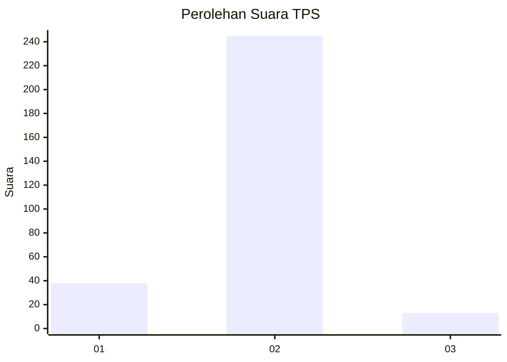
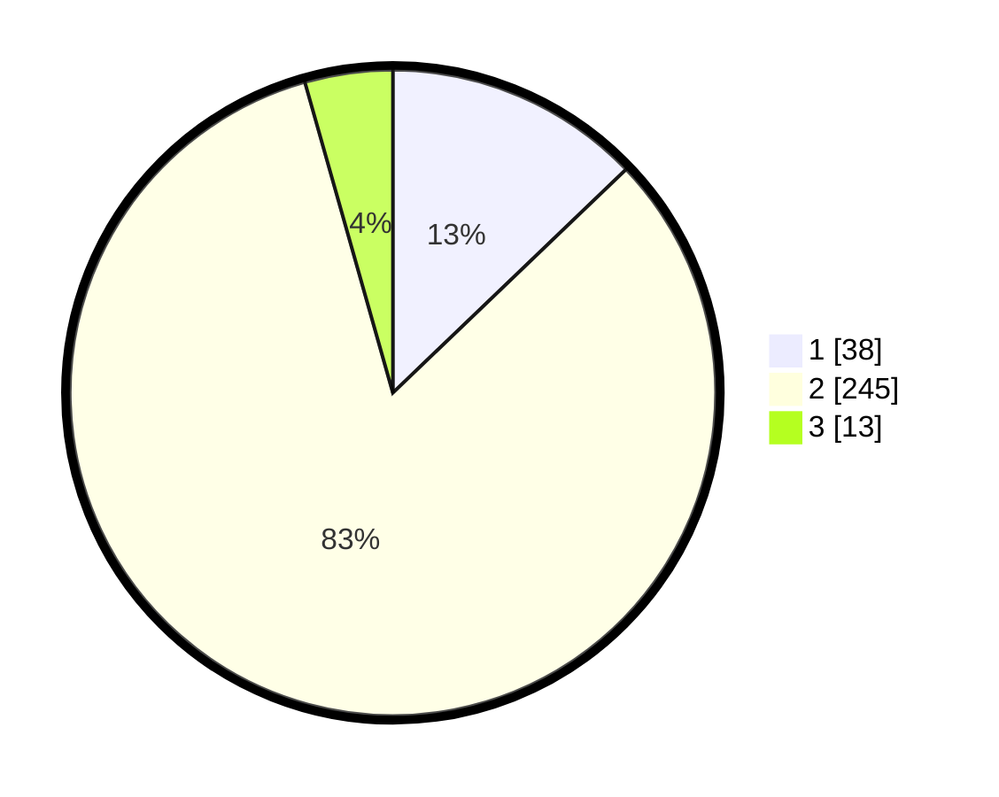

# Hasil

## Grafik

## Tabel

| No. | Nama Paslon    | Suara | Suara (raw) | Persentase |
|:--- |:-------------- | -----:| -----------:| ----------:|
| 1   | ANIES MUHAIMIN | 38    | [38][p-1]   | 12,84      |
| 2   | PRABOWO GIBRAN | 245   | [245][p-2]  | 82,77      |
| 3   | GANJAR MAHFUD  | 13    | [13][p-3]   | 4,39       |

[p-1]: https://github.com/gigit-pemilu/pemilu-2024-52-nusa-tenggara-barat/blob/main/pilpres/hitung-suara/sub/52-nusa-tenggara-barat/sub/02-lombok-tengah/sub/04-pujut/sub/2016-bangket-parak/sub/003-tps/sub/paslon-1.txt
[p-2]: https://github.com/gigit-pemilu/pemilu-2024-52-nusa-tenggara-barat/blob/main/pilpres/hitung-suara/sub/52-nusa-tenggara-barat/sub/02-lombok-tengah/sub/04-pujut/sub/2016-bangket-parak/sub/003-tps/sub/paslon-2.txt
[p-3]: https://github.com/gigit-pemilu/pemilu-2024-52-nusa-tenggara-barat/blob/main/pilpres/hitung-suara/sub/52-nusa-tenggara-barat/sub/02-lombok-tengah/sub/04-pujut/sub/2016-bangket-parak/sub/003-tps/sub/paslon-3.txt

## Foto C Plano

https://sirekap-obj-formc.kpu.go.id/ce2d/pemilu/ppwp/52/02/04/20/16/5202042016003-20240214-212941--e896652a-5db6-4cb2-a92c-0ceb89e71564.jpg

https://sirekap-obj-formc.kpu.go.id/ce2d/pemilu/ppwp/52/02/04/20/16/5202042016003-20240214-213028--ead114c8-a0b5-4591-ab5b-44445eccc11f.jpg

https://sirekap-obj-formc.kpu.go.id/ce2d/pemilu/ppwp/52/02/04/20/16/5202042016003-20240214-213124--0383bb72-57f7-4dd1-97e4-25fe0071d1cf.jpg

## Metadata

| Key        | Value               |
| ---------- | ------------------- |
| Time Stamp | 2024-02-19 06:16:00 |

