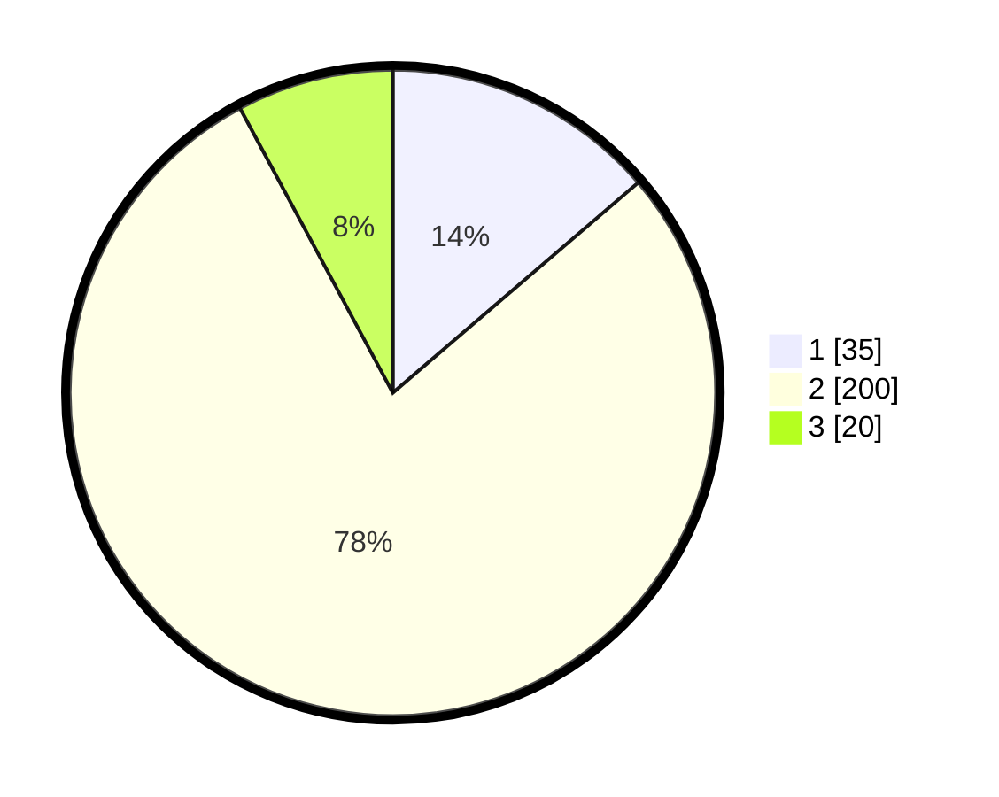

# Hasil

## Grafik

## Tabel

| No. | Nama Paslon    | Suara | Suara (raw) | Persentase |
|:--- |:-------------- | -----:| -----------:| ----------:|
| 1   | ANIES MUHAIMIN | 35    | [35][p-1]   | 13,73      |
| 2   | PRABOWO GIBRAN | 200   | [200][p-2]  | 78,43      |
| 3   | GANJAR MAHFUD  | 20    | [20][p-3]   | 7,84       |

[p-1]: https://github.com/gigit-pemilu/pemilu-2024/blob/main/pilpres/hitung-suara/sub/52-nusa-tenggara-barat/sub/02-lombok-tengah/sub/04-pujut/sub/2016-bangket-parak/sub/004-tps/sub/paslon-1.txt
[p-2]: https://github.com/gigit-pemilu/pemilu-2024/blob/main/pilpres/hitung-suara/sub/52-nusa-tenggara-barat/sub/02-lombok-tengah/sub/04-pujut/sub/2016-bangket-parak/sub/004-tps/sub/paslon-2.txt
[p-3]: https://github.com/gigit-pemilu/pemilu-2024/blob/main/pilpres/hitung-suara/sub/52-nusa-tenggara-barat/sub/02-lombok-tengah/sub/04-pujut/sub/2016-bangket-parak/sub/004-tps/sub/paslon-3.txt

## Foto C Plano

https://sirekap-obj-formc.kpu.go.id/c074/pemilu/ppwp/52/02/04/20/16/5202042016004-20240215-065413--cc591fbd-489d-4e11-bc49-47072e69e99c.jpg

https://sirekap-obj-formc.kpu.go.id/c074/pemilu/ppwp/52/02/04/20/16/5202042016004-20240215-065843--94a27a3c-f8b7-4eff-9596-3bbc3f67e96a.jpg

https://sirekap-obj-formc.kpu.go.id/c074/pemilu/ppwp/52/02/04/20/16/5202042016004-20240215-065728--3b761de5-82c5-48d6-8f7d-45fd54ddf939.jpg

## Metadata

| Key        | Value               |
| ---------- | ------------------- |
| Time Stamp | 2024-02-19 06:16:00 |

