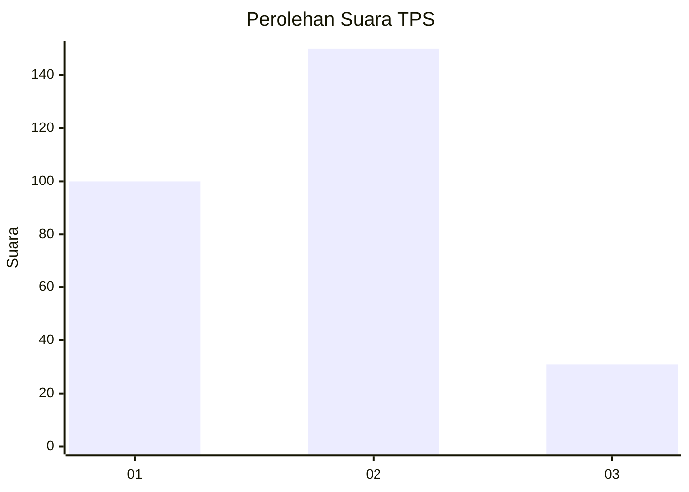
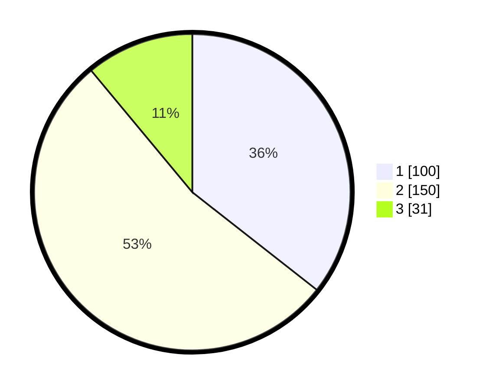

# Hasil

## Grafik

## Tabel

| No. | Nama Paslon    | Suara | Suara (raw) | Persentase |
|:--- |:-------------- | -----:| -----------:| ----------:|
| 1   | ANIES MUHAIMIN | 100   | [100][p-1]  | 35,59      |
| 2   | PRABOWO GIBRAN | 150   | [150][p-2]  | 53,38      |
| 3   | GANJAR MAHFUD  | 31    | [31][p-3]   | 11,03      |

[p-1]: https://github.com/gigit-pemilu/pemilu-2024-52-nusa-tenggara-barat/blob/main/pilpres/hitung-suara/sub/52-nusa-tenggara-barat/sub/02-lombok-tengah/sub/04-pujut/sub/2018-kerame-jati/sub/007-tps/sub/paslon-1.txt
[p-2]: https://github.com/gigit-pemilu/pemilu-2024-52-nusa-tenggara-barat/blob/main/pilpres/hitung-suara/sub/52-nusa-tenggara-barat/sub/02-lombok-tengah/sub/04-pujut/sub/2018-kerame-jati/sub/007-tps/sub/paslon-2.txt
[p-3]: https://github.com/gigit-pemilu/pemilu-2024-52-nusa-tenggara-barat/blob/main/pilpres/hitung-suara/sub/52-nusa-tenggara-barat/sub/02-lombok-tengah/sub/04-pujut/sub/2018-kerame-jati/sub/007-tps/sub/paslon-3.txt

## Foto C Plano

https://sirekap-obj-formc.kpu.go.id/632c/pemilu/ppwp/52/02/04/20/18/5202042018007-20240215-153625--cf1ac0d1-8975-4486-979f-86ce76391d49.jpg

https://sirekap-obj-formc.kpu.go.id/632c/pemilu/ppwp/52/02/04/20/18/5202042018007-20240215-153651--fcee6515-5608-4cda-b2b0-5a76d34987b7.jpg

https://sirekap-obj-formc.kpu.go.id/632c/pemilu/ppwp/52/02/04/20/18/5202042018007-20240215-153721--7442af04-89d4-43cb-880b-56a2e9f2ef5c.jpg

## Metadata

| Key        | Value               |
| ---------- | ------------------- |
| Time Stamp | 2024-02-17 16:36:25 |

