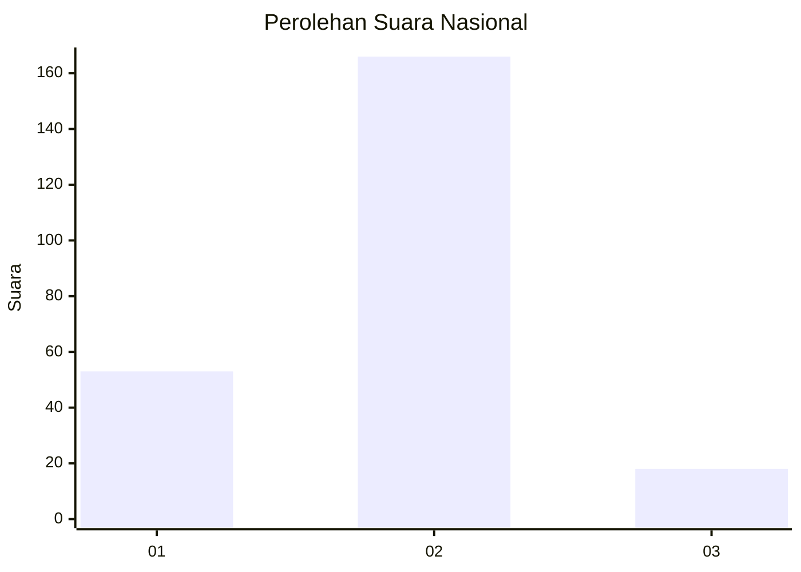
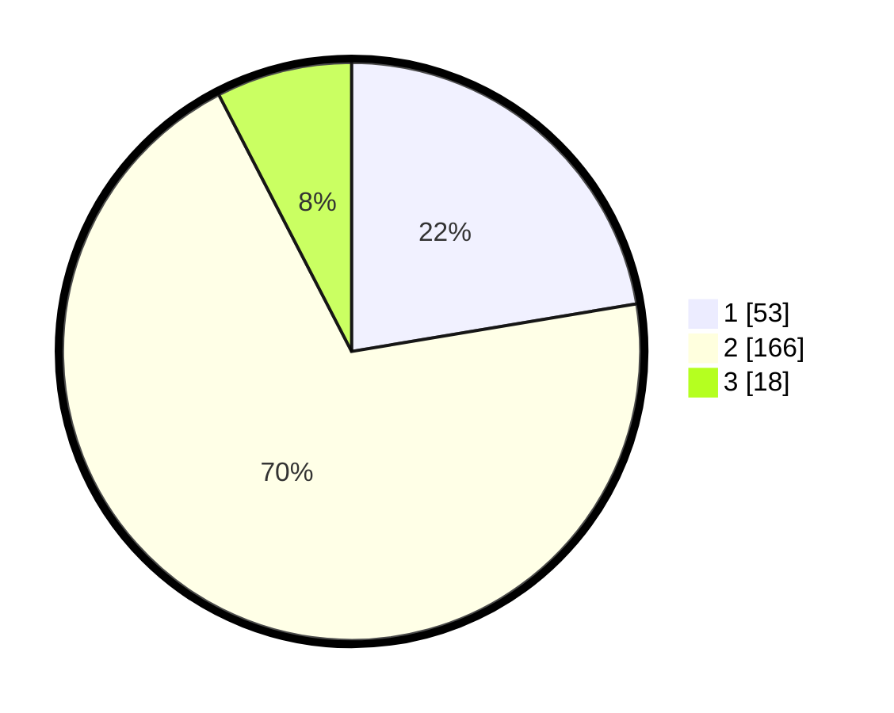

# Hasil

## Grafik

## Tabel

| No. | Nama Paslon    | Suara | Suara (raw) | Persentase |
|:--- |:-------------- | -----:| -----------:| ----------:|
| 1   | ANIES MUHAIMIN | 53    | [53][p-1]   | 22,36      |
| 2   | PRABOWO GIBRAN | 166   | [166][p-2]  | 70,04      |
| 3   | GANJAR MAHFUD  | 18    | [18][p-3]   | 7,59       |

[p-1]: https://github.com/gigit-pemilu/pemilu-2024/blob/main/pilpres/hitung-suara/sub/52-nusa-tenggara-barat/sub/02-lombok-tengah/sub/05-praya-barat/sub/2001-bonder/sub/002-tps/sub/paslon-1.txt
[p-2]: https://github.com/gigit-pemilu/pemilu-2024/blob/main/pilpres/hitung-suara/sub/52-nusa-tenggara-barat/sub/02-lombok-tengah/sub/05-praya-barat/sub/2001-bonder/sub/002-tps/sub/paslon-2.txt
[p-3]: https://github.com/gigit-pemilu/pemilu-2024/blob/main/pilpres/hitung-suara/sub/52-nusa-tenggara-barat/sub/02-lombok-tengah/sub/05-praya-barat/sub/2001-bonder/sub/002-tps/sub/paslon-3.txt

## Foto C Plano

https://sirekap-obj-formc.kpu.go.id/0b75/pemilu/ppwp/52/02/05/20/01/5202052001002-20240215-025319--c206b315-baa4-4f42-9e4a-da9472e96d79.jpg

https://sirekap-obj-formc.kpu.go.id/0b75/pemilu/ppwp/52/02/05/20/01/5202052001002-20240215-082542--59574471-d8fb-4157-8183-6764dafe1652.jpg

https://sirekap-obj-formc.kpu.go.id/0b75/pemilu/ppwp/52/02/05/20/01/5202052001002-20240214-223526--40751ef9-a450-438d-864b-5984cb2ed322.jpg

## Metadata

| Key        | Value               |
| ---------- | ------------------- |
| Time Stamp | 2024-02-15 19:30:26 |

