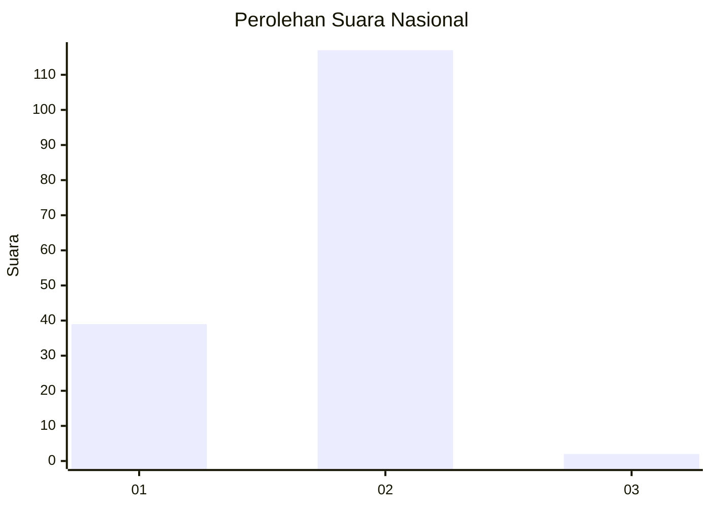
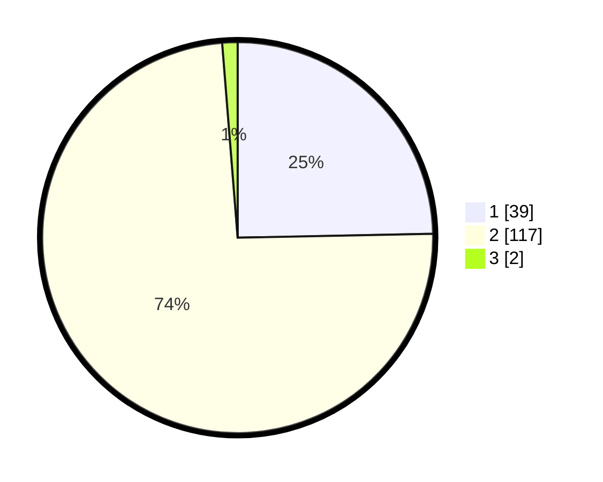

# Hasil

## Grafik

## Tabel

| No. | Nama Paslon    | Suara | Suara (raw) | Persentase |
|:--- |:-------------- | -----:| -----------:| ----------:|
| 1   | ANIES MUHAIMIN | 39    | [39][p-1]   | 24,68      |
| 2   | PRABOWO GIBRAN | 117   | [117][p-2]  | 74,05      |
| 3   | GANJAR MAHFUD  | 2     | [2][p-3]    | 1,27       |

[p-1]: https://github.com/gigit-pemilu/pemilu-2024/blob/main/pilpres/hitung-suara/sub/52-nusa-tenggara-barat/sub/02-lombok-tengah/sub/05-praya-barat/sub/2001-bonder/sub/003-tps/sub/paslon-1.txt
[p-2]: https://github.com/gigit-pemilu/pemilu-2024/blob/main/pilpres/hitung-suara/sub/52-nusa-tenggara-barat/sub/02-lombok-tengah/sub/05-praya-barat/sub/2001-bonder/sub/003-tps/sub/paslon-2.txt
[p-3]: https://github.com/gigit-pemilu/pemilu-2024/blob/main/pilpres/hitung-suara/sub/52-nusa-tenggara-barat/sub/02-lombok-tengah/sub/05-praya-barat/sub/2001-bonder/sub/003-tps/sub/paslon-3.txt

## Foto C Plano

https://sirekap-obj-formc.kpu.go.id/a5fa/pemilu/ppwp/52/02/05/20/01/5202052001003-20240215-060257--4e0a482b-a9b5-484b-89df-56ece8d1cc3a.jpg

https://sirekap-obj-formc.kpu.go.id/a5fa/pemilu/ppwp/52/02/05/20/01/5202052001003-20240215-060532--c8393ad8-8c40-4e8e-8751-084896799ce5.jpg

https://sirekap-obj-formc.kpu.go.id/a5fa/pemilu/ppwp/52/02/05/20/01/5202052001003-20240215-060809--dc627213-8c26-4539-b538-e53d7f3c890a.jpg

## Metadata

| Key        | Value               |
| ---------- | ------------------- |
| Time Stamp | 2024-02-17 16:00:02 |

