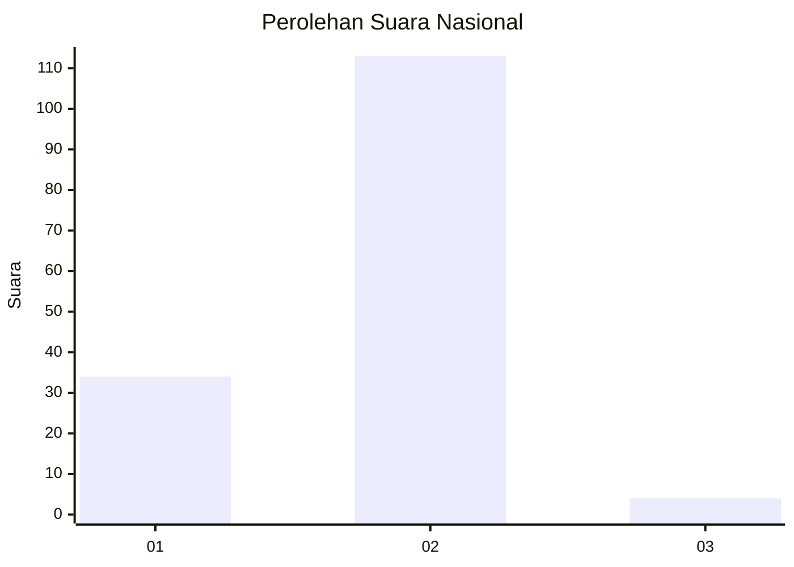

# Hasil

## Grafik

## Tabel

| No. | Nama Paslon    | Suara | Suara (raw) | Persentase |
|:--- |:-------------- | -----:| -----------:| ----------:|
| 1   | ANIES MUHAIMIN | 34    | [34][p-1]   | 22,52      |
| 2   | PRABOWO GIBRAN | 113   | [113][p-2]  | 74,83      |
| 3   | GANJAR MAHFUD  | 4     | [4][p-3]    | 2,65       |

[p-1]: https://github.com/gigit-pemilu/pemilu-2024/blob/main/pilpres/hitung-suara/sub/52-nusa-tenggara-barat/sub/02-lombok-tengah/sub/05-praya-barat/sub/2001-bonder/sub/004-tps/sub/paslon-1.txt
[p-2]: https://github.com/gigit-pemilu/pemilu-2024/blob/main/pilpres/hitung-suara/sub/52-nusa-tenggara-barat/sub/02-lombok-tengah/sub/05-praya-barat/sub/2001-bonder/sub/004-tps/sub/paslon-2.txt
[p-3]: https://github.com/gigit-pemilu/pemilu-2024/blob/main/pilpres/hitung-suara/sub/52-nusa-tenggara-barat/sub/02-lombok-tengah/sub/05-praya-barat/sub/2001-bonder/sub/004-tps/sub/paslon-3.txt

## Foto C Plano

https://sirekap-obj-formc.kpu.go.id/939d/pemilu/ppwp/52/02/05/20/01/5202052001004-20240215-063939--e84ad7fd-f328-47f1-847f-2dfe40fda933.jpg

https://sirekap-obj-formc.kpu.go.id/939d/pemilu/ppwp/52/02/05/20/01/5202052001004-20240215-063956--f5e4c601-eb6d-422d-a7f0-e287b27b3cf9.jpg

https://sirekap-obj-formc.kpu.go.id/939d/pemilu/ppwp/52/02/05/20/01/5202052001004-20240215-064015--246e26f6-619a-4b95-a068-ba74ce9f86d8.jpg

## Metadata

| Key        | Value               |
| ---------- | ------------------- |
| Time Stamp | 2024-02-15 19:30:26 |

