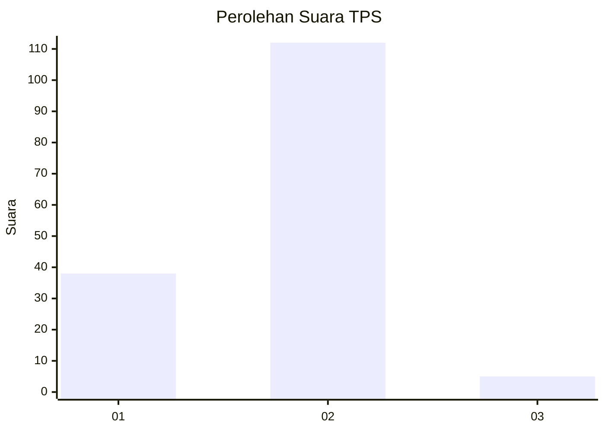
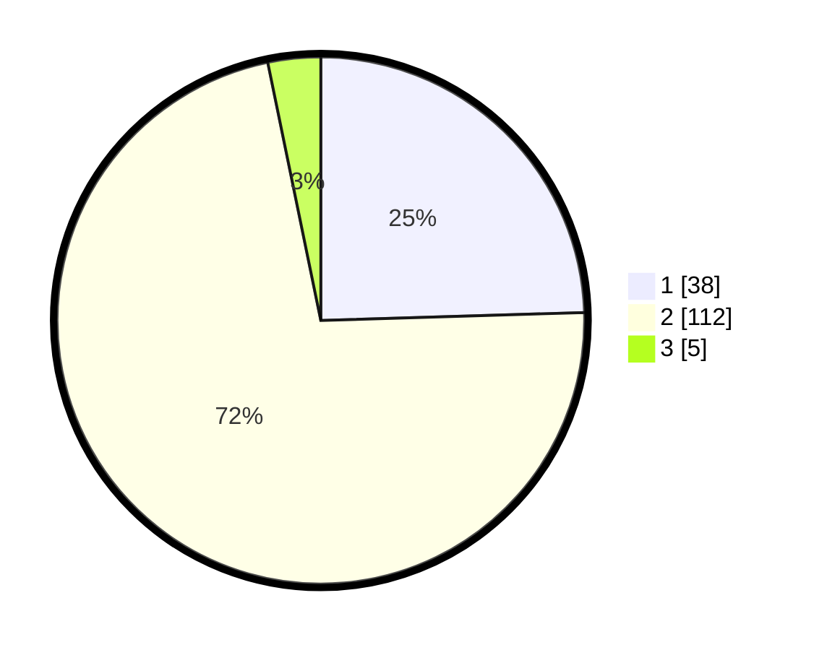

# Hasil

## Grafik

## Tabel

| No. | Nama Paslon    | Suara | Suara (raw) | Persentase |
|:--- |:-------------- | -----:| -----------:| ----------:|
| 1   | ANIES MUHAIMIN | 38    | [38][p-1]   | 24,52      |
| 2   | PRABOWO GIBRAN | 112   | [112][p-2]  | 72,26      |
| 3   | GANJAR MAHFUD  | 5     | [5][p-3]    | 3,23       |

[p-1]: https://github.com/gigit-pemilu/pemilu-2024-52-nusa-tenggara-barat/blob/main/pilpres/hitung-suara/sub/52-nusa-tenggara-barat/sub/02-lombok-tengah/sub/05-praya-barat/sub/2001-bonder/sub/005-tps/sub/paslon-1.txt
[p-2]: https://github.com/gigit-pemilu/pemilu-2024-52-nusa-tenggara-barat/blob/main/pilpres/hitung-suara/sub/52-nusa-tenggara-barat/sub/02-lombok-tengah/sub/05-praya-barat/sub/2001-bonder/sub/005-tps/sub/paslon-2.txt
[p-3]: https://github.com/gigit-pemilu/pemilu-2024-52-nusa-tenggara-barat/blob/main/pilpres/hitung-suara/sub/52-nusa-tenggara-barat/sub/02-lombok-tengah/sub/05-praya-barat/sub/2001-bonder/sub/005-tps/sub/paslon-3.txt

## Foto C Plano

https://sirekap-obj-formc.kpu.go.id/ed5d/pemilu/ppwp/52/02/05/20/01/5202052001005-20240215-075437--9ce1e4e4-7766-43bb-99e2-189e9bcb023e.jpg

https://sirekap-obj-formc.kpu.go.id/ed5d/pemilu/ppwp/52/02/05/20/01/5202052001005-20240215-075847--bded9853-a92d-4c58-928a-6f23eec5dfcd.jpg

https://sirekap-obj-formc.kpu.go.id/ed5d/pemilu/ppwp/52/02/05/20/01/5202052001005-20240215-080039--3c7b86ab-1f82-40ba-9948-3d2ffc73ec4c.jpg

## Metadata

| Key        | Value               |
| ---------- | ------------------- |
| Time Stamp | 2024-02-15 19:30:26 |

