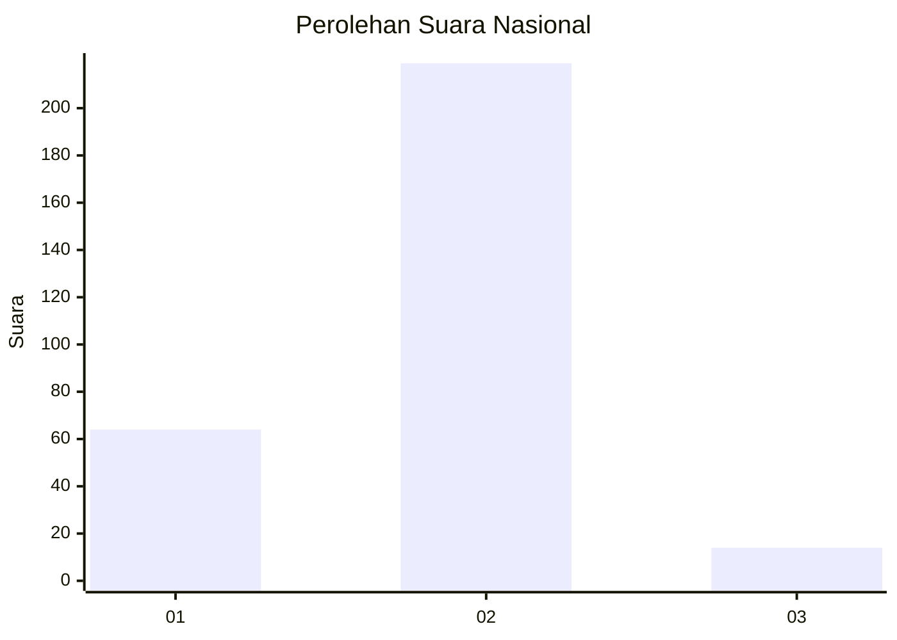
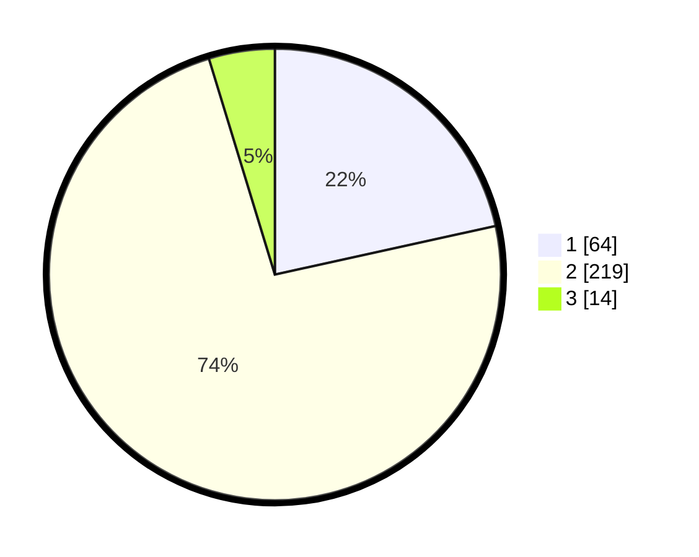

# Hasil

## Grafik

## Tabel

| No. | Nama Paslon    | Suara | Suara (raw) | Persentase |
|:--- |:-------------- | -----:| -----------:| ----------:|
| 1   | ANIES MUHAIMIN | 64    | [64][p-1]   | 21,55      |
| 2   | PRABOWO GIBRAN | 219   | [219][p-2]  | 73,74      |
| 3   | GANJAR MAHFUD  | 14    | [14][p-3]   | 4,71       |

[p-1]: https://github.com/gigit-pemilu/pemilu-2024/blob/main/pilpres/hitung-suara/sub/52-nusa-tenggara-barat/sub/02-lombok-tengah/sub/05-praya-barat/sub/2001-bonder/sub/006-tps/sub/paslon-1.txt
[p-2]: https://github.com/gigit-pemilu/pemilu-2024/blob/main/pilpres/hitung-suara/sub/52-nusa-tenggara-barat/sub/02-lombok-tengah/sub/05-praya-barat/sub/2001-bonder/sub/006-tps/sub/paslon-2.txt
[p-3]: https://github.com/gigit-pemilu/pemilu-2024/blob/main/pilpres/hitung-suara/sub/52-nusa-tenggara-barat/sub/02-lombok-tengah/sub/05-praya-barat/sub/2001-bonder/sub/006-tps/sub/paslon-3.txt

## Foto C Plano

https://sirekap-obj-formc.kpu.go.id/2d48/pemilu/ppwp/52/02/05/20/01/5202052001006-20240215-004351--7e22fc54-a430-4814-b71e-a009e092b78e.jpg

https://sirekap-obj-formc.kpu.go.id/2d48/pemilu/ppwp/52/02/05/20/01/5202052001006-20240215-004504--964a912b-cbc7-4460-b91f-2c3938c11df0.jpg

https://sirekap-obj-formc.kpu.go.id/2d48/pemilu/ppwp/52/02/05/20/01/5202052001006-20240215-004645--b2d383f7-238b-49f1-b89e-a66ba45cf748.jpg

## Metadata

| Key        | Value               |
| ---------- | ------------------- |
| Time Stamp | 2024-02-15 19:30:26 |

