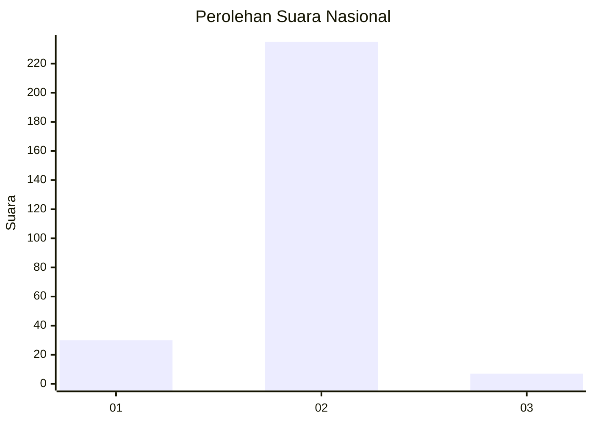
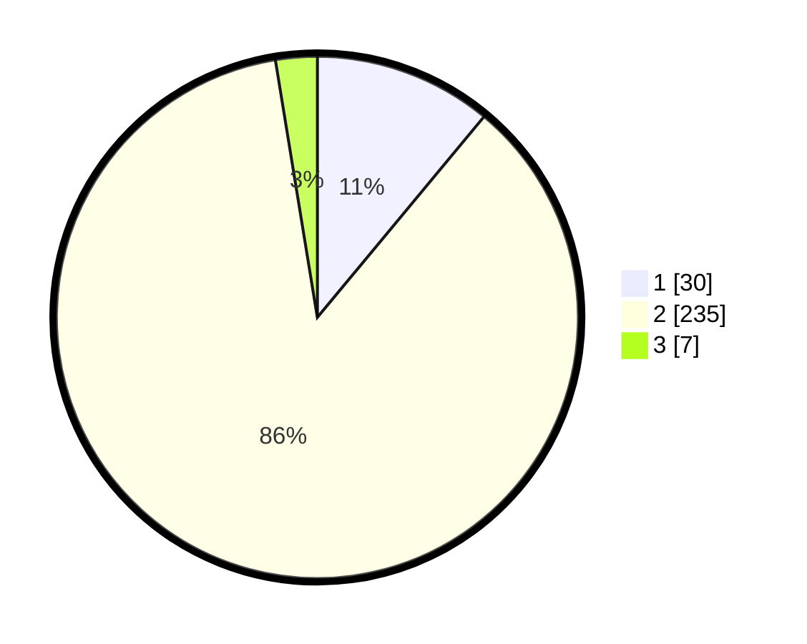

# Hasil

## Grafik

## Tabel

| No. | Nama Paslon    | Suara | Suara (raw) | Persentase |
|:--- |:-------------- | -----:| -----------:| ----------:|
| 1   | ANIES MUHAIMIN | 30    | [30][p-1]   | 11,03      |
| 2   | PRABOWO GIBRAN | 235   | [235][p-2]  | 86,40      |
| 3   | GANJAR MAHFUD  | 7     | [7][p-3]    | 2,57       |

[p-1]: https://github.com/gigit-pemilu/pemilu-2024/blob/main/pilpres/hitung-suara/sub/52-nusa-tenggara-barat/sub/02-lombok-tengah/sub/05-praya-barat/sub/2002-banyu-urip/sub/008-tps/sub/paslon-1.txt
[p-2]: https://github.com/gigit-pemilu/pemilu-2024/blob/main/pilpres/hitung-suara/sub/52-nusa-tenggara-barat/sub/02-lombok-tengah/sub/05-praya-barat/sub/2002-banyu-urip/sub/008-tps/sub/paslon-2.txt
[p-3]: https://github.com/gigit-pemilu/pemilu-2024/blob/main/pilpres/hitung-suara/sub/52-nusa-tenggara-barat/sub/02-lombok-tengah/sub/05-praya-barat/sub/2002-banyu-urip/sub/008-tps/sub/paslon-3.txt

## Foto C Plano

https://sirekap-obj-formc.kpu.go.id/1a94/pemilu/ppwp/52/02/05/20/02/5202052002008-20240214-221926--bb03a4d7-fd86-4c45-8c6b-735b4b7f8a10.jpg

https://sirekap-obj-formc.kpu.go.id/1a94/pemilu/ppwp/52/02/05/20/02/5202052002008-20240215-060956--bdfedcac-1edb-4c58-8bc2-d703b8573f35.jpg

https://sirekap-obj-formc.kpu.go.id/1a94/pemilu/ppwp/52/02/05/20/02/5202052002008-20240214-224057--8e4d239d-34e9-45af-9247-9ea95ca2c3b0.jpg

## Metadata

| Key        | Value               |
| ---------- | ------------------- |
| Time Stamp | 2024-02-15 19:30:26 |

