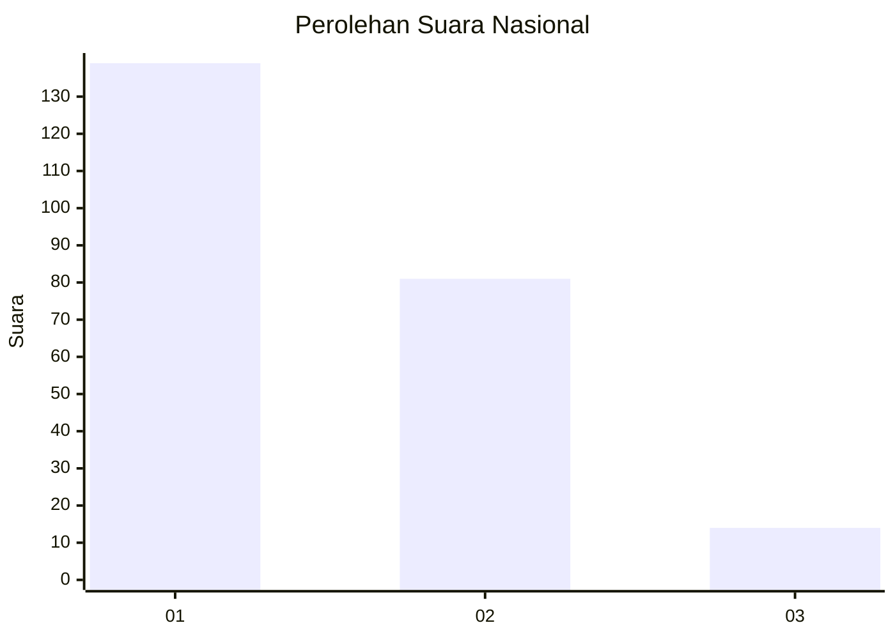
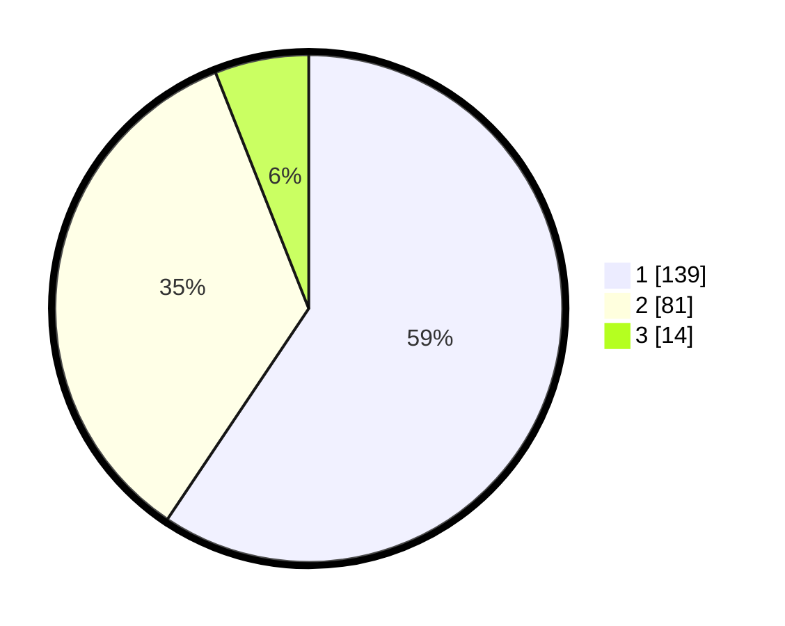

# Hasil

## Grafik

## Tabel

| No. | Nama Paslon    | Suara | Suara (raw) | Persentase |
|:--- |:-------------- | -----:| -----------:| ----------:|
| 1   | ANIES MUHAIMIN | 139   | [139][p-1]  | 59,40      |
| 2   | PRABOWO GIBRAN | 81    | [81][p-2]   | 34,62      |
| 3   | GANJAR MAHFUD  | 14    | [14][p-3]   | 5,98       |

[p-1]: https://github.com/gigit-pemilu/pemilu-2024/blob/main/pilpres/hitung-suara/sub/52-nusa-tenggara-barat/sub/02-lombok-tengah/sub/05-praya-barat/sub/2004-kateng/sub/012-tps/sub/paslon-1.txt
[p-2]: https://github.com/gigit-pemilu/pemilu-2024/blob/main/pilpres/hitung-suara/sub/52-nusa-tenggara-barat/sub/02-lombok-tengah/sub/05-praya-barat/sub/2004-kateng/sub/012-tps/sub/paslon-2.txt
[p-3]: https://github.com/gigit-pemilu/pemilu-2024/blob/main/pilpres/hitung-suara/sub/52-nusa-tenggara-barat/sub/02-lombok-tengah/sub/05-praya-barat/sub/2004-kateng/sub/012-tps/sub/paslon-3.txt

## Foto C Plano

https://sirekap-obj-formc.kpu.go.id/7b93/pemilu/ppwp/52/02/05/20/04/5202052004012-20240214-220441--64cdd263-8e05-4055-a0f6-094b6b201b76.jpg

https://sirekap-obj-formc.kpu.go.id/7b93/pemilu/ppwp/52/02/05/20/04/5202052004012-20240214-230231--92dbd1e0-5656-466a-bf93-8ca40c094c66.jpg

https://sirekap-obj-formc.kpu.go.id/7b93/pemilu/ppwp/52/02/05/20/04/5202052004012-20240214-155310--578f6b7f-c71f-46fd-951e-ab85f859e654.jpg

## Metadata

| Key        | Value               |
| ---------- | ------------------- |
| Time Stamp | 2024-02-19 06:16:00 |

