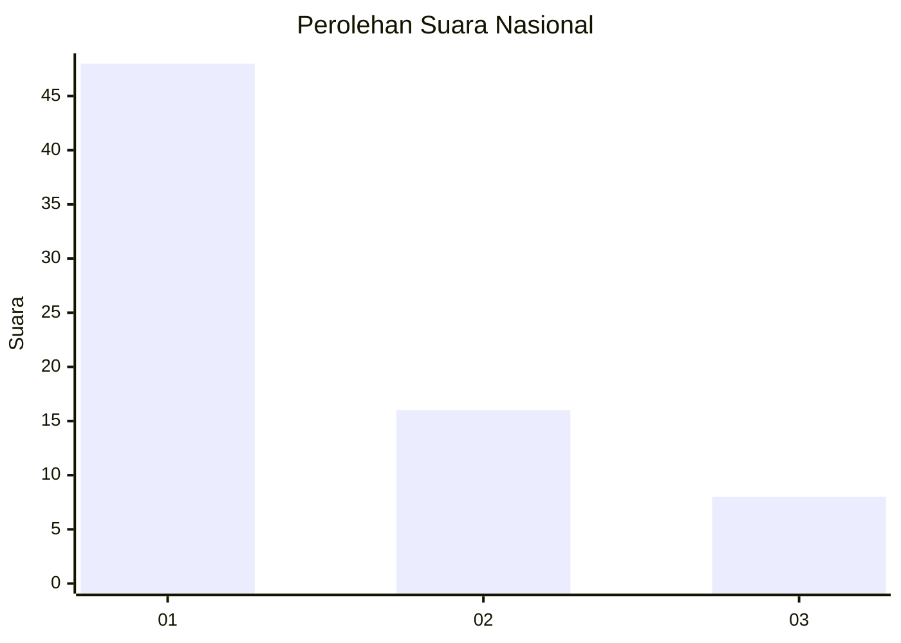
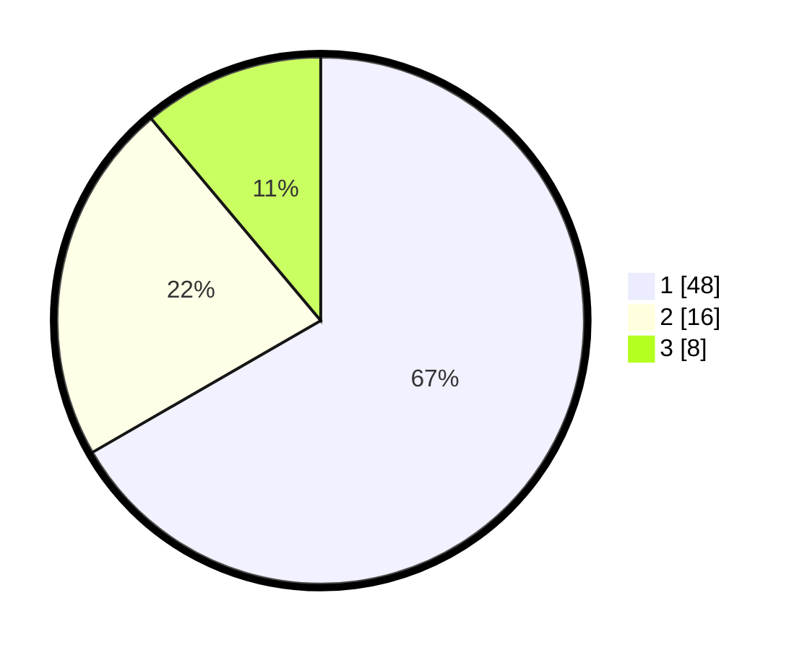

# Hasil

## Grafik

## Tabel

| No. | Nama Paslon    | Suara | Suara (raw) | Persentase |
|:--- |:-------------- | -----:| -----------:| ----------:|
| 1   | ANIES MUHAIMIN | 48    | [48][p-1]   | 66,67      |
| 2   | PRABOWO GIBRAN | 16    | [16][p-2]   | 22,22      |
| 3   | GANJAR MAHFUD  | 8     | [8][p-3]    | 11,11      |

[p-1]: https://github.com/gigit-pemilu/pemilu-2024/blob/main/pilpres/hitung-suara/sub/52-nusa-tenggara-barat/sub/02-lombok-tengah/sub/05-praya-barat/sub/2006-penujak/sub/040-tps/sub/paslon-1.txt
[p-2]: https://github.com/gigit-pemilu/pemilu-2024/blob/main/pilpres/hitung-suara/sub/52-nusa-tenggara-barat/sub/02-lombok-tengah/sub/05-praya-barat/sub/2006-penujak/sub/040-tps/sub/paslon-2.txt
[p-3]: https://github.com/gigit-pemilu/pemilu-2024/blob/main/pilpres/hitung-suara/sub/52-nusa-tenggara-barat/sub/02-lombok-tengah/sub/05-praya-barat/sub/2006-penujak/sub/040-tps/sub/paslon-3.txt

## Foto C Plano

https://sirekap-obj-formc.kpu.go.id/b8b5/pemilu/ppwp/52/02/05/20/06/5202052006040-20240215-015534--53b77962-fed3-4abe-b12f-1fe3387634c8.jpg

https://sirekap-obj-formc.kpu.go.id/b8b5/pemilu/ppwp/52/02/05/20/06/5202052006040-20240215-000558--1b5c6d1b-6b8a-490a-90a1-873a21dcef0e.jpg

https://sirekap-obj-formc.kpu.go.id/b8b5/pemilu/ppwp/52/02/05/20/06/5202052006040-20240215-000737--51f78138-3c82-4b5b-bb4b-546d54c0aa46.jpg

## Metadata

| Key        | Value               |
| ---------- | ------------------- |
| Time Stamp | 2024-02-22 12:00:00 |

