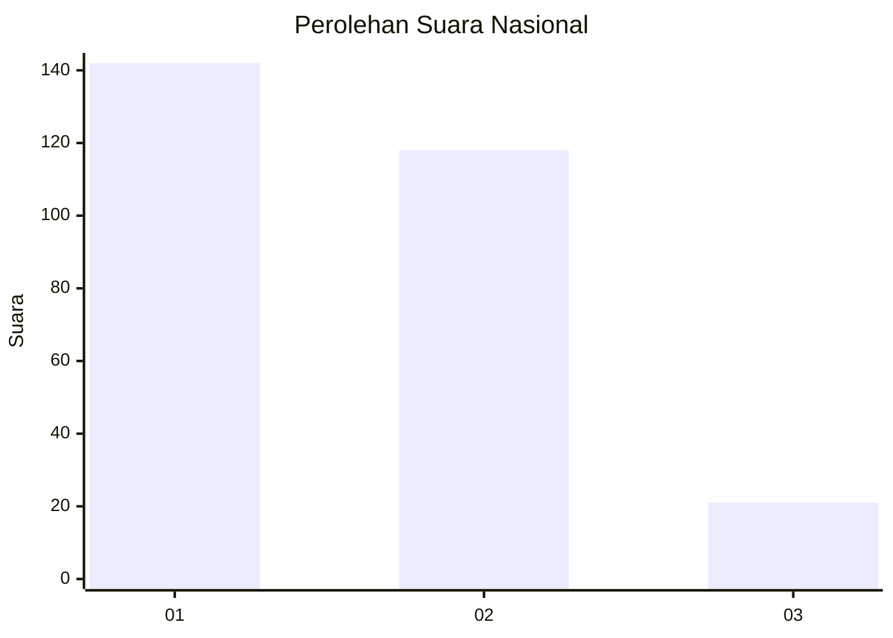
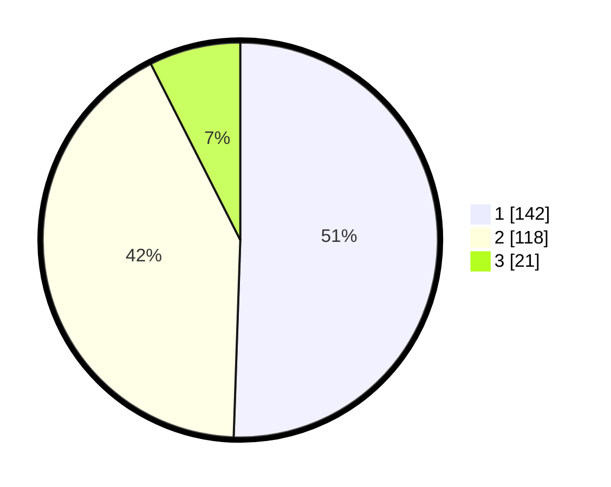

# Hasil

## Grafik

## Tabel

| No. | Nama Paslon    | Suara | Suara (raw) | Persentase |
|:--- |:-------------- | -----:| -----------:| ----------:|
| 1   | ANIES MUHAIMIN | 142   | [142][p-1]  | 50,53      |
| 2   | PRABOWO GIBRAN | 118   | [118][p-2]  | 41,99      |
| 3   | GANJAR MAHFUD  | 21    | [21][p-3]   | 7,47       |

[p-1]: https://github.com/gigit-pemilu/pemilu-2024/blob/main/pilpres/hitung-suara/sub/52-nusa-tenggara-barat/sub/02-lombok-tengah/sub/05-praya-barat/sub/2009-batujai/sub/008-tps/sub/paslon-1.txt
[p-2]: https://github.com/gigit-pemilu/pemilu-2024/blob/main/pilpres/hitung-suara/sub/52-nusa-tenggara-barat/sub/02-lombok-tengah/sub/05-praya-barat/sub/2009-batujai/sub/008-tps/sub/paslon-2.txt
[p-3]: https://github.com/gigit-pemilu/pemilu-2024/blob/main/pilpres/hitung-suara/sub/52-nusa-tenggara-barat/sub/02-lombok-tengah/sub/05-praya-barat/sub/2009-batujai/sub/008-tps/sub/paslon-3.txt

## Foto C Plano

https://sirekap-obj-formc.kpu.go.id/a732/pemilu/ppwp/52/02/05/20/09/5202052009008-20240214-235816--af9801e6-77cb-4532-86b5-426bf088f305.jpg

https://sirekap-obj-formc.kpu.go.id/a732/pemilu/ppwp/52/02/05/20/09/5202052009008-20240215-000036--6149955c-c390-4bd7-b071-4b9cbedbcb0d.jpg

https://sirekap-obj-formc.kpu.go.id/a732/pemilu/ppwp/52/02/05/20/09/5202052009008-20240215-000252--6c234602-5632-456c-8ff0-60c180a83c01.jpg

## Metadata

| Key        | Value               |
| ---------- | ------------------- |
| Time Stamp | 2024-02-19 06:16:00 |

