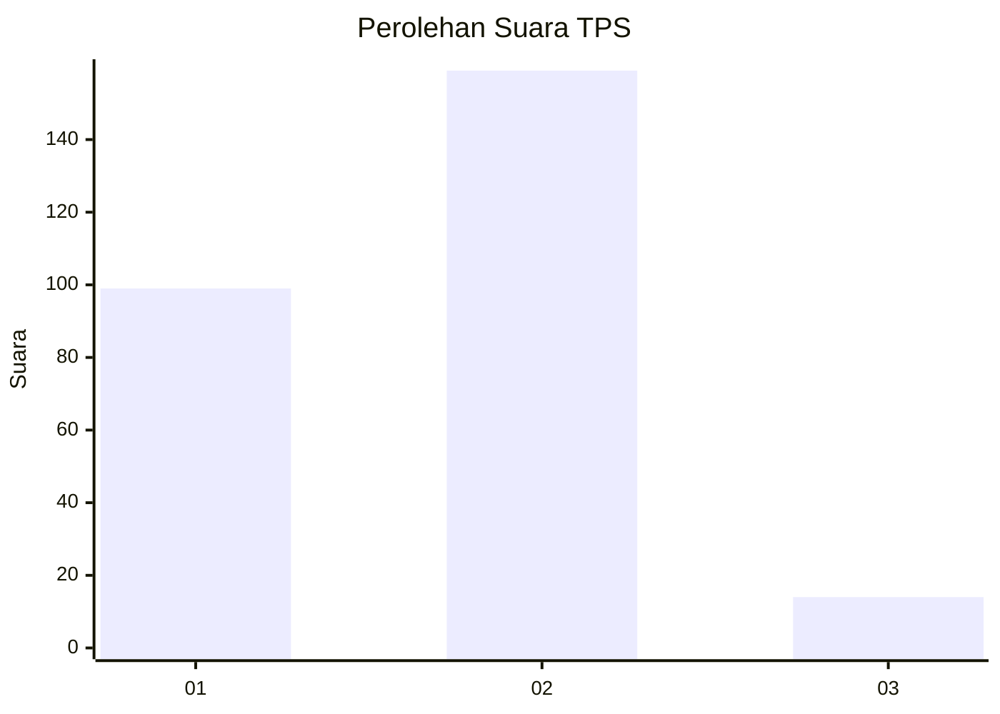
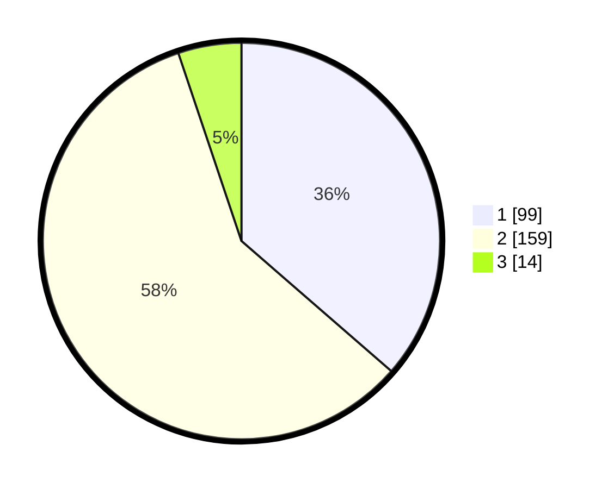

# Hasil

## Grafik

## Tabel

| No. | Nama Paslon    | Suara | Suara (raw) | Persentase |
|:--- |:-------------- | -----:| -----------:| ----------:|
| 1   | ANIES MUHAIMIN | 99    | [99][p-1]   | 36,40      |
| 2   | PRABOWO GIBRAN | 159   | [159][p-2]  | 58,46      |
| 3   | GANJAR MAHFUD  | 14    | [14][p-3]   | 5,15       |

[p-1]: https://github.com/gigit-pemilu/pemilu-2024-52-nusa-tenggara-barat/blob/main/pilpres/hitung-suara/sub/52-nusa-tenggara-barat/sub/02-lombok-tengah/sub/05-praya-barat/sub/2009-batujai/sub/018-tps/sub/paslon-1.txt
[p-2]: https://github.com/gigit-pemilu/pemilu-2024-52-nusa-tenggara-barat/blob/main/pilpres/hitung-suara/sub/52-nusa-tenggara-barat/sub/02-lombok-tengah/sub/05-praya-barat/sub/2009-batujai/sub/018-tps/sub/paslon-2.txt
[p-3]: https://github.com/gigit-pemilu/pemilu-2024-52-nusa-tenggara-barat/blob/main/pilpres/hitung-suara/sub/52-nusa-tenggara-barat/sub/02-lombok-tengah/sub/05-praya-barat/sub/2009-batujai/sub/018-tps/sub/paslon-3.txt

## Foto C Plano

https://sirekap-obj-formc.kpu.go.id/79e3/pemilu/ppwp/52/02/05/20/09/5202052009018-20240215-044509--c3a99121-0f6d-475d-bb31-92d306056a6f.jpg

https://sirekap-obj-formc.kpu.go.id/79e3/pemilu/ppwp/52/02/05/20/09/5202052009018-20240215-044621--ad6eb79f-747c-4b3e-b53a-be1f4e2915ab.jpg

https://sirekap-obj-formc.kpu.go.id/79e3/pemilu/ppwp/52/02/05/20/09/5202052009018-20240215-044700--35575d2a-06bd-4030-a852-ce142e4b7dcd.jpg

## Metadata

| Key        | Value               |
| ---------- | ------------------- |
| Time Stamp | 2024-02-19 06:16:00 |

