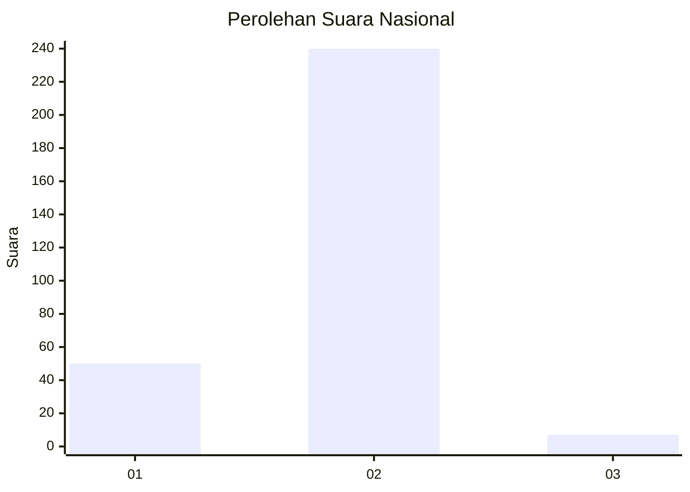
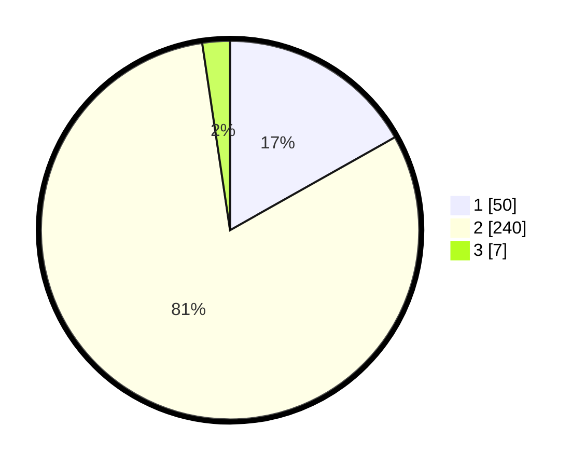

# Hasil

## Grafik

## Tabel

| No. | Nama Paslon    | Suara | Suara (raw) | Persentase |
|:--- |:-------------- | -----:| -----------:| ----------:|
| 1   | ANIES MUHAIMIN | 50    | [50][p-1]   | 16,84      |
| 2   | PRABOWO GIBRAN | 240   | [240][p-2]  | 80,81      |
| 3   | GANJAR MAHFUD  | 7     | [7][p-3]    | 2,36       |

[p-1]: https://github.com/gigit-pemilu/pemilu-2024/blob/main/pilpres/hitung-suara/sub/52-nusa-tenggara-barat/sub/02-lombok-tengah/sub/05-praya-barat/sub/2009-batujai/sub/039-tps/sub/paslon-1.txt
[p-2]: https://github.com/gigit-pemilu/pemilu-2024/blob/main/pilpres/hitung-suara/sub/52-nusa-tenggara-barat/sub/02-lombok-tengah/sub/05-praya-barat/sub/2009-batujai/sub/039-tps/sub/paslon-2.txt
[p-3]: https://github.com/gigit-pemilu/pemilu-2024/blob/main/pilpres/hitung-suara/sub/52-nusa-tenggara-barat/sub/02-lombok-tengah/sub/05-praya-barat/sub/2009-batujai/sub/039-tps/sub/paslon-3.txt

## Foto C Plano

https://sirekap-obj-formc.kpu.go.id/9bed/pemilu/ppwp/52/02/05/20/09/5202052009039-20240215-010800--377d4010-d1f8-4b48-9a58-03aa84fcaefd.jpg

https://sirekap-obj-formc.kpu.go.id/9bed/pemilu/ppwp/52/02/05/20/09/5202052009039-20240215-010918--2bc2c67b-3956-4c79-909b-78a210bf66dc.jpg

https://sirekap-obj-formc.kpu.go.id/9bed/pemilu/ppwp/52/02/05/20/09/5202052009039-20240215-010841--442787a4-69a6-4e18-8a08-bbfe606edc2f.jpg

## Metadata

| Key        | Value               |
| ---------- | ------------------- |
| Time Stamp | 2024-02-19 06:16:00 |

