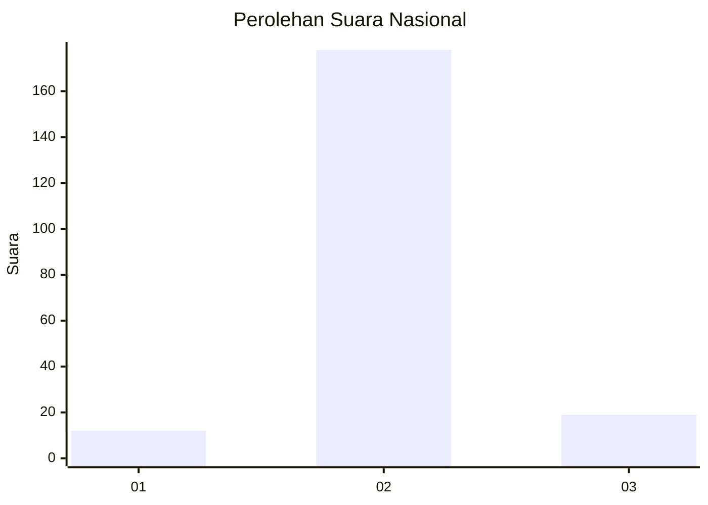
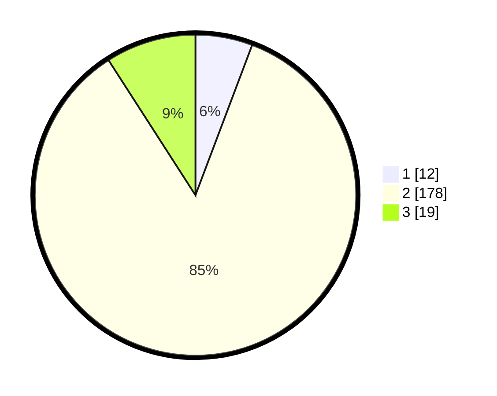

# Hasil

## Grafik

## Tabel

| No. | Nama Paslon    | Suara | Suara (raw) | Persentase |
|:--- |:-------------- | -----:| -----------:| ----------:|
| 1   | ANIES MUHAIMIN | 12    | [12][p-1]   | 5,74       |
| 2   | PRABOWO GIBRAN | 178   | [178][p-2]  | 85,17      |
| 3   | GANJAR MAHFUD  | 19    | [19][p-3]   | 9,09       |

[p-1]: https://github.com/gigit-pemilu/pemilu-2024/blob/main/pilpres/hitung-suara/sub/52-nusa-tenggara-barat/sub/02-lombok-tengah/sub/06-praya-timur/sub/2001-sukaraja/sub/002-tps/sub/paslon-1.txt
[p-2]: https://github.com/gigit-pemilu/pemilu-2024/blob/main/pilpres/hitung-suara/sub/52-nusa-tenggara-barat/sub/02-lombok-tengah/sub/06-praya-timur/sub/2001-sukaraja/sub/002-tps/sub/paslon-2.txt
[p-3]: https://github.com/gigit-pemilu/pemilu-2024/blob/main/pilpres/hitung-suara/sub/52-nusa-tenggara-barat/sub/02-lombok-tengah/sub/06-praya-timur/sub/2001-sukaraja/sub/002-tps/sub/paslon-3.txt

## Foto C Plano

https://sirekap-obj-formc.kpu.go.id/061c/pemilu/ppwp/52/02/06/20/01/5202062001002-20240215-064734--2d413fe6-dc1d-44f4-b33b-2d2f054c9f36.jpg

https://sirekap-obj-formc.kpu.go.id/061c/pemilu/ppwp/52/02/06/20/01/5202062001002-20240215-064746--fd212045-5e4b-4f24-9c69-d77aca3d7f1e.jpg

https://sirekap-obj-formc.kpu.go.id/061c/pemilu/ppwp/52/02/06/20/01/5202062001002-20240215-075022--aa966166-26c0-4a9b-999c-e5c8c65e2bb3.jpg

## Metadata

| Key        | Value               |
| ---------- | ------------------- |
| Time Stamp | 2024-02-19 06:16:00 |

