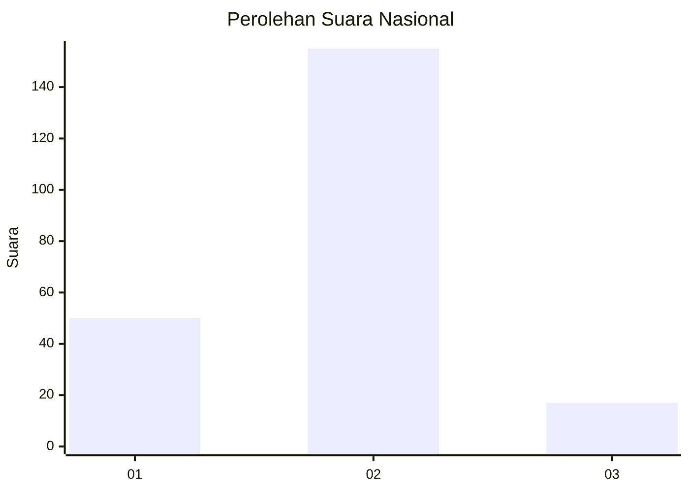
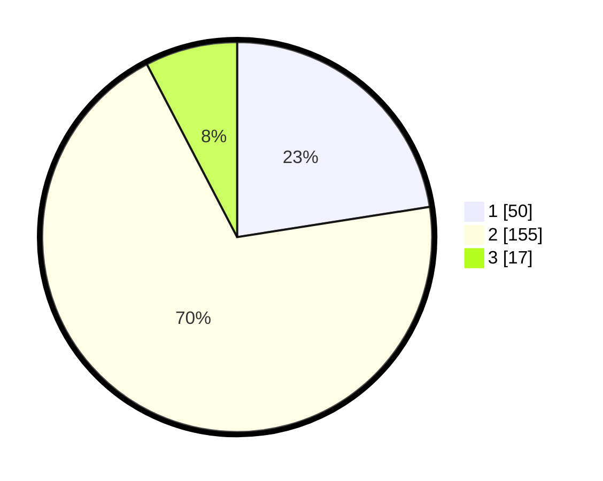

# Hasil

## Grafik

## Tabel

| No. | Nama Paslon    | Suara | Suara (raw) | Persentase |
|:--- |:-------------- | -----:| -----------:| ----------:|
| 1   | ANIES MUHAIMIN | 50    | [50][p-1]   | 22,52      |
| 2   | PRABOWO GIBRAN | 155   | [155][p-2]  | 69,82      |
| 3   | GANJAR MAHFUD  | 17    | [17][p-3]   | 7,66       |

[p-1]: https://github.com/gigit-pemilu/pemilu-2024/blob/main/pilpres/hitung-suara/sub/52-nusa-tenggara-barat/sub/02-lombok-tengah/sub/06-praya-timur/sub/2001-sukaraja/sub/005-tps/sub/paslon-1.txt
[p-2]: https://github.com/gigit-pemilu/pemilu-2024/blob/main/pilpres/hitung-suara/sub/52-nusa-tenggara-barat/sub/02-lombok-tengah/sub/06-praya-timur/sub/2001-sukaraja/sub/005-tps/sub/paslon-2.txt
[p-3]: https://github.com/gigit-pemilu/pemilu-2024/blob/main/pilpres/hitung-suara/sub/52-nusa-tenggara-barat/sub/02-lombok-tengah/sub/06-praya-timur/sub/2001-sukaraja/sub/005-tps/sub/paslon-3.txt

## Foto C Plano

https://sirekap-obj-formc.kpu.go.id/0754/pemilu/ppwp/52/02/06/20/01/5202062001005-20240215-055335--f2a15358-5bb3-4d26-b892-db6bfd14b225.jpg

https://sirekap-obj-formc.kpu.go.id/0754/pemilu/ppwp/52/02/06/20/01/5202062001005-20240215-074933--78fdac75-d4d4-47f8-9bef-252473ca5e7b.jpg

https://sirekap-obj-formc.kpu.go.id/0754/pemilu/ppwp/52/02/06/20/01/5202062001005-20240215-060012--c7ba84bd-ab0d-4983-b666-f17ec9e58897.jpg

## Metadata

| Key        | Value               |
| ---------- | ------------------- |
| Time Stamp | 2024-02-15 15:00:29 |

